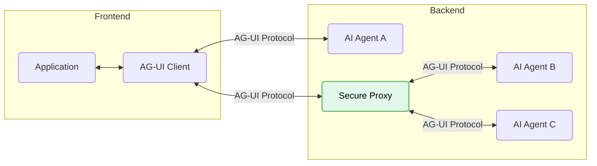
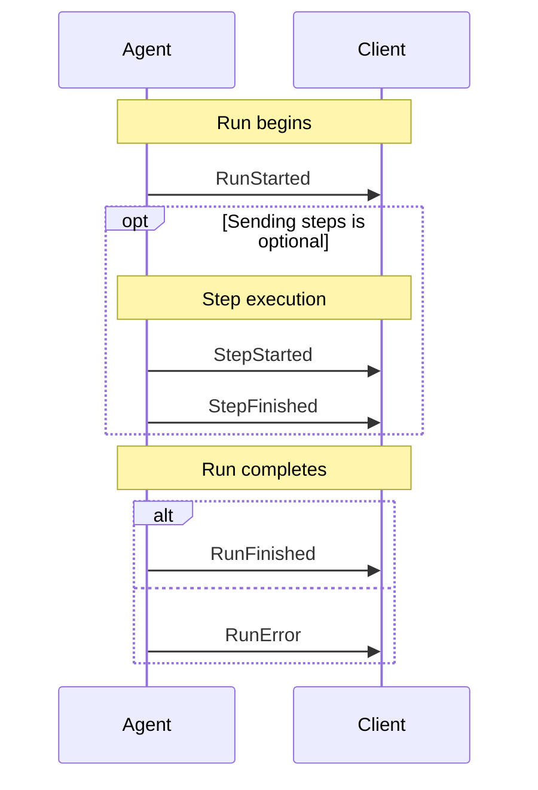
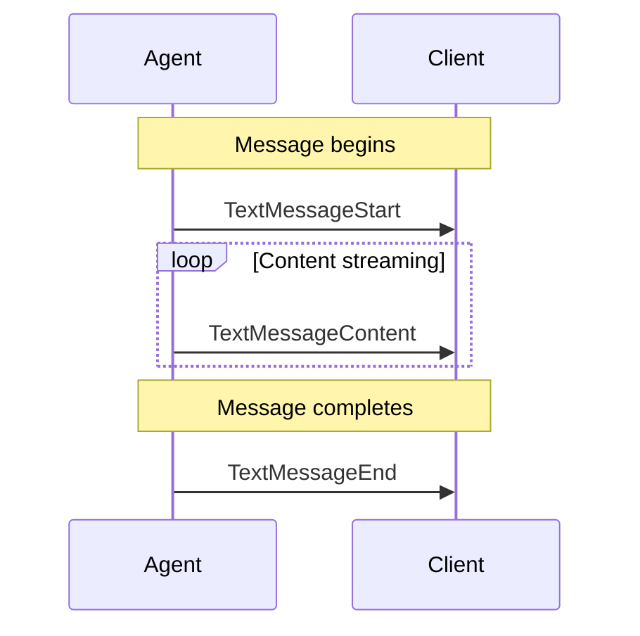
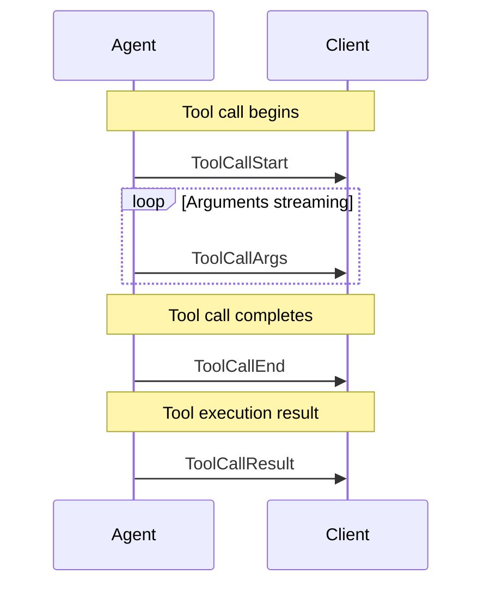
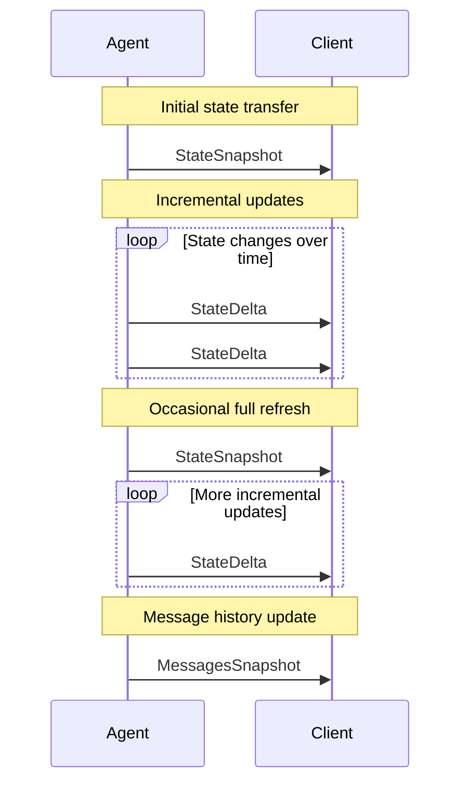
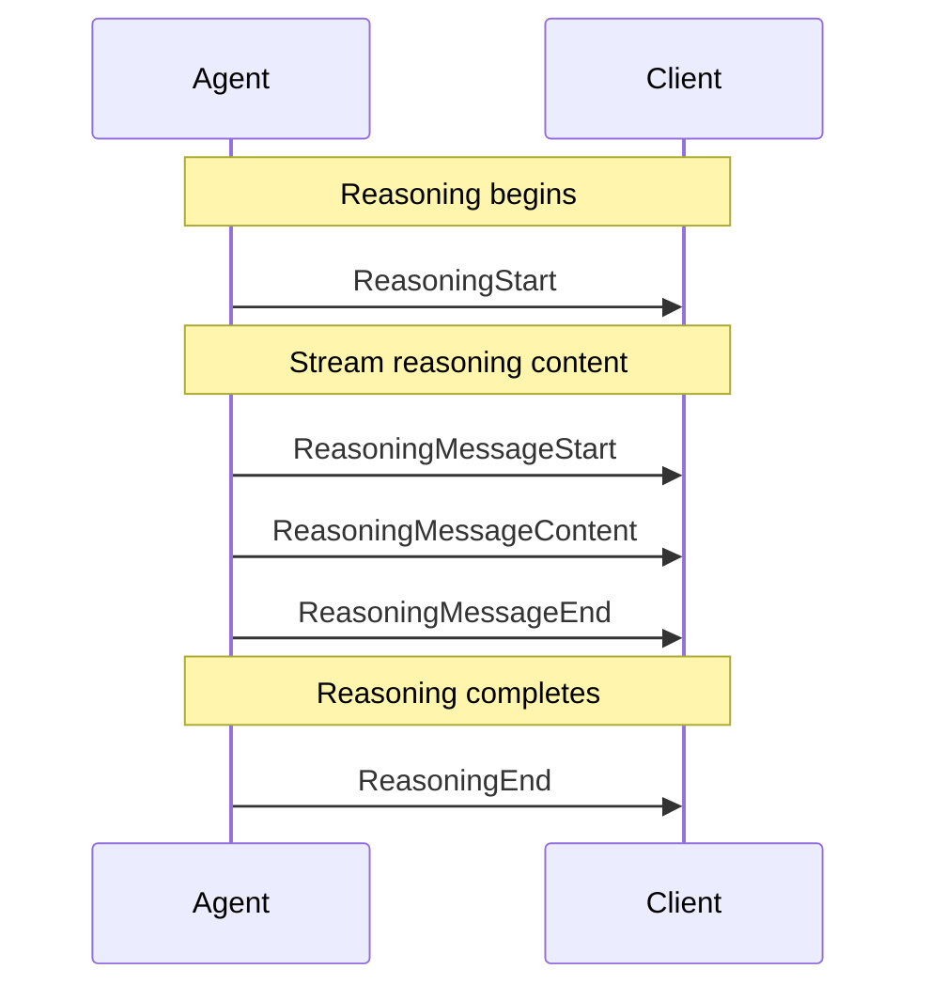
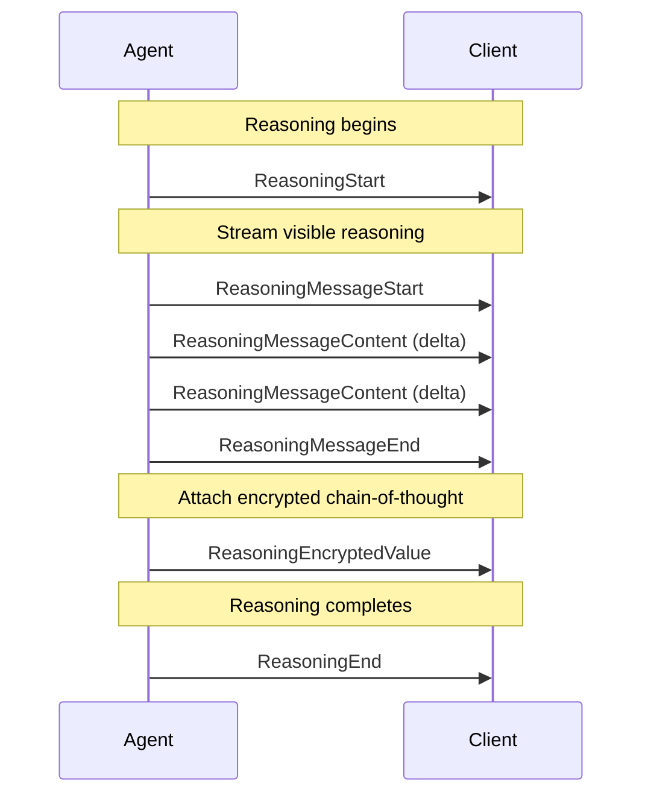
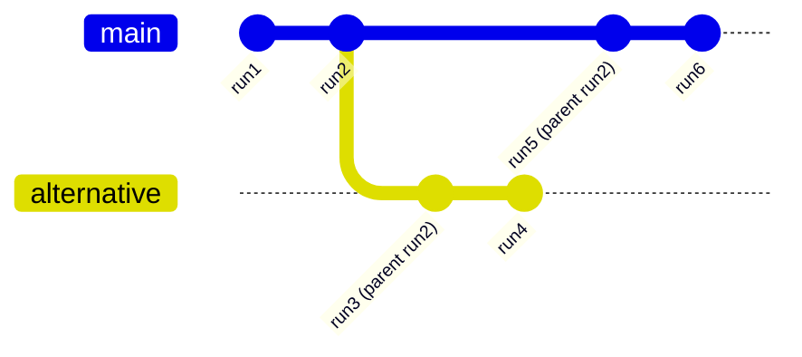
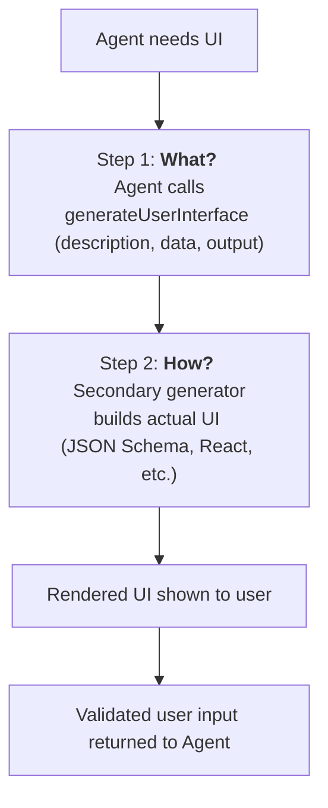
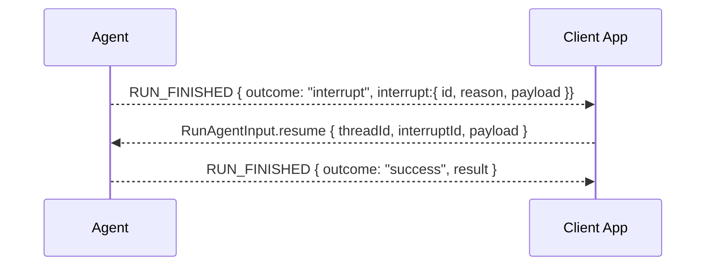

# MCP, A2A, and AG-UI
Source: https://docs.ag-ui.com/agentic-protocols

Understanding how AG-UI complements and works with MCP and A2A

## Agentic Protocols

The agentic ecosystem is rapidly organizing around a family of open, complementary protocols — each addressing a distinct layer of interaction.  AG-UI has emerged as the 3rd leg of the AI protocol landscape:

<div>
  
</div>

You can connect your application to agents directly via **AG-UI**, **MCP**, and **A2A**.

* **MCP** (Model Context Protocol) Connects agents to tools and to context — but those tools are themselves becoming agentic.
* **A2A** (Agent to Agent) Connects agents to other agents.
* **AG-UI (Agent–User Interaction)** Connects agents to users (through user-facing applications).

  You can think of AG-UI as the **"kitchen sink" protocol** — informed by bottom-up, real-world needs for building best-in-class agentic applications.

These three agentic protocols are complementary and have distinct technical goals; a single agent can and often does use all 3 simultaneously.

## AG-UI Handshakes with MCP and A2A

AG-UI contributors have recently added handshakes, allowing AG-UI to "front for" agents through MCP and A2A protocols, which allows AG-UI client apps and libraries to seamlessly use MCP and A2A supporting agents.

AG-UI's mandate is to support the full set of building blocks required by modern agentic applications.

## Generative UI Specs

Recently several [generative ui specs](./concepts/generative-ui-specs) (including MCP-UI, Open JSON UI, and A2UI) have been released which allow agents to deliver UI widgets through the interaction protocols.  AG-UI works with all of these.  Visit our [generative ui specs page](./concepts/generative-ui-specs) to lern more.


# Agents
Source: https://docs.ag-ui.com/concepts/agents

Learn about agents in the Agent User Interaction Protocol

# Agents

Agents are the core components in the AG-UI protocol that process requests and
generate responses. They establish a standardized way for front-end applications
to communicate with AI services through a consistent interface, regardless of
the underlying implementation.

## What is an Agent?

In AG-UI, an agent is a class that:

1. Manages conversation state and message history
2. Processes incoming messages and context
3. Generates responses through an event-driven streaming interface
4. Follows a standardized protocol for communication

Agents can be implemented to connect with any AI service, including:

* Large language models (LLMs) like GPT-4 or Claude
* Custom AI systems
* Retrieval augmented generation (RAG) systems
* Multi-agent systems

## Agent Architecture

All agents in AG-UI extend the `AbstractAgent` class, which provides the
foundation for:

* State management
* Message history tracking
* Event stream processing
* Tool usage

```typescript theme={null}
import { AbstractAgent } from "@ag-ui/client"

class MyAgent extends AbstractAgent {
  run(input: RunAgentInput): RunAgent {
    // Implementation details
  }
}
```

### Core Components

AG-UI agents have several key components:

1. **Configuration**: Agent ID, thread ID, and initial state
2. **Messages**: Conversation history with user and assistant messages
3. **State**: Structured data that persists across interactions
4. **Events**: Standardized messages for communication with clients
5. **Tools**: Functions that agents can use to interact with external systems

## Agent Types

AG-UI provides different agent implementations to suit various needs:

### AbstractAgent

The base class that all agents extend. It handles core event processing, state
management, and message history.

### HttpAgent

A concrete implementation that connects to remote AI services via HTTP:

```typescript theme={null}
import { HttpAgent } from "@ag-ui/client"

const agent = new HttpAgent({
  url: "https://your-agent-endpoint.com/agent",
  headers: {
    Authorization: "Bearer your-api-key",
  },
})
```

### Custom Agents

You can create custom agents to integrate with any AI service by extending
`AbstractAgent`:

```typescript theme={null}
class CustomAgent extends AbstractAgent {
  // Custom properties and methods

  run(input: RunAgentInput): RunAgent {
    // Implement the agent's logic
  }
}
```

## Implementing Agents

### Basic Implementation

To create a custom agent, extend the `AbstractAgent` class and implement the
required `run` method:

```typescript theme={null}
import {
  AbstractAgent,
  RunAgent,
  RunAgentInput,
  EventType,
  BaseEvent,
} from "@ag-ui/client"
import { Observable } from "rxjs"

class SimpleAgent extends AbstractAgent {
  run(input: RunAgentInput): RunAgent {
    const { threadId, runId } = input

    return () =>
      new Observable<BaseEvent>((observer) => {
        // Emit RUN_STARTED event
        observer.next({
          type: EventType.RUN_STARTED,
          threadId,
          runId,
        })

        // Send a message
        const messageId = Date.now().toString()

        // Message start
        observer.next({
          type: EventType.TEXT_MESSAGE_START,
          messageId,
          role: "assistant",
        })

        // Message content
        observer.next({
          type: EventType.TEXT_MESSAGE_CONTENT,
          messageId,
          delta: "Hello, world!",
        })

        // Message end
        observer.next({
          type: EventType.TEXT_MESSAGE_END,
          messageId,
        })

        // Emit RUN_FINISHED event
        observer.next({
          type: EventType.RUN_FINISHED,
          threadId,
          runId,
        })

        // Complete the observable
        observer.complete()
      })
  }
}
```

## Agent Capabilities

Agents in the AG-UI protocol provide a rich set of capabilities that enable
sophisticated AI interactions:

### Interactive Communication

Agents establish bi-directional communication channels with front-end
applications through event streams. This enables:

* Real-time streaming responses character-by-character
* Immediate feedback loops between user and AI
* Progress indicators for long-running operations
* Structured data exchange in both directions

### Tool Usage

Agents can use tools to perform actions and access external resources.
Importantly, tools are defined and passed in from the front-end application to
the agent, allowing for a flexible and extensible system:

```typescript theme={null}
// Tool definition
const confirmAction = {
  name: "confirmAction",
  description: "Ask the user to confirm a specific action before proceeding",
  parameters: {
    type: "object",
    properties: {
      action: {
        type: "string",
        description: "The action that needs user confirmation",
      },
      importance: {
        type: "string",
        enum: ["low", "medium", "high", "critical"],
        description: "The importance level of the action",
      },
      details: {
        type: "string",
        description: "Additional details about the action",
      },
    },
    required: ["action"],
  },
}

// Running an agent with tools from the frontend
agent.runAgent({
  tools: [confirmAction], // Frontend-defined tools passed to the agent
  // other parameters
})
```

Tools are invoked through a sequence of events:

1. `TOOL_CALL_START`: Indicates the beginning of a tool call
2. `TOOL_CALL_ARGS`: Streams the arguments for the tool call
3. `TOOL_CALL_END`: Marks the completion of the tool call

Front-end applications can then execute the tool and provide results back to the
agent. This bidirectional flow enables sophisticated human-in-the-loop workflows
where:

* The agent can request specific actions be performed
* Humans can execute those actions with appropriate judgment
* Results are fed back to the agent for continued reasoning
* The agent maintains awareness of all decisions made in the process

This mechanism is particularly powerful for implementing interfaces where AI and
humans collaborate. For example, [CopilotKit](https://docs.copilotkit.ai/)
leverages this exact pattern with their
[`useCopilotAction`](https://docs.copilotkit.ai/guides/frontend-actions) hook,
which provides a simplified way to define and handle tools in React
applications.

By keeping the AI informed about human decisions through the tool mechanism,
applications can maintain context and create more natural collaborative
experiences between users and AI assistants.

### State Management

Agents maintain a structured state that persists across interactions. This state
can be:

* Updated incrementally through `STATE_DELTA` events
* Completely refreshed with `STATE_SNAPSHOT` events
* Accessed by both the agent and front-end
* Used to store user preferences, conversation context, or application state

```typescript theme={null}
// Accessing agent state
console.log(agent.state.preferences)

// State is automatically updated during agent runs
agent.runAgent().subscribe((event) => {
  if (event.type === EventType.STATE_DELTA) {
    // State has been updated
    console.log("New state:", agent.state)
  }
})
```

### Multi-Agent Collaboration

AG-UI supports agent-to-agent handoff and collaboration:

* Agents can delegate tasks to other specialized agents
* Multiple agents can work together in a coordinated workflow
* State and context can be transferred between agents
* The front-end maintains a consistent experience across agent transitions

For example, a general assistant agent might hand off to a specialized coding
agent when programming help is needed, passing along the conversation context
and specific requirements.

### Human-in-the-Loop Workflows

Agents support human intervention and assistance:

* Agents can request human input on specific decisions
* Front-ends can pause agent execution and resume it after human feedback
* Human experts can review and modify agent outputs before they're finalized
* Hybrid workflows combine AI efficiency with human judgment

This enables applications where the agent acts as a collaborative partner rather
than an autonomous system.

### Conversational Memory

Agents maintain a complete history of conversation messages:

* Past interactions inform future responses
* Message history is synchronized between client and server
* Messages can include rich content (text, structured data, references)
* The context window can be managed to focus on relevant information

```typescript theme={null}
// Accessing message history
console.log(agent.messages)

// Adding a new user message
agent.messages.push({
  id: "msg_123",
  role: "user",
  content: "Can you explain that in more detail?",
})
```

### Metadata and Instrumentation

Agents can emit metadata about their internal processes:

* Reasoning steps through custom events
* Performance metrics and timing information
* Source citations and reference tracking
* Confidence scores for different response options

This allows front-ends to provide transparency into the agent's decision-making
process and help users understand how conclusions were reached.

## Using Agents

Once you've implemented or instantiated an agent, you can use it like this:

```typescript theme={null}
// Create an agent instance
const agent = new HttpAgent({
  url: "https://your-agent-endpoint.com/agent",
})

// Add initial messages if needed
agent.messages = [
  {
    id: "1",
    role: "user",
    content: "Hello, how can you help me today?",
  },
]

// Run the agent
agent
  .runAgent({
    runId: "run_123",
    tools: [], // Optional tools
    context: [], // Optional context
  })
  .subscribe({
    next: (event) => {
      // Handle different event types
      switch (event.type) {
        case EventType.TEXT_MESSAGE_CONTENT:
          console.log("Content:", event.delta)
          break
        // Handle other events
      }
    },
    error: (error) => console.error("Error:", error),
    complete: () => console.log("Run complete"),
  })
```

## Agent Configuration

Agents accept configuration through the constructor:

```typescript theme={null}
interface AgentConfig {
  agentId?: string // Unique identifier for the agent
  description?: string // Human-readable description
  threadId?: string // Conversation thread identifier
  initialMessages?: Message[] // Initial messages
  initialState?: State // Initial state object
}

// Using the configuration
const agent = new HttpAgent({
  agentId: "my-agent-123",
  description: "A helpful assistant",
  threadId: "thread-456",
  initialMessages: [
    { id: "1", role: "system", content: "You are a helpful assistant." },
  ],
  initialState: { preferredLanguage: "English" },
})
```

## Agent State Management

AG-UI agents maintain state across interactions:

```typescript theme={null}
// Access current state
console.log(agent.state)

// Access messages
console.log(agent.messages)

// Clone an agent with its state
const clonedAgent = agent.clone()
```

## Conclusion

Agents are the foundation of the AG-UI protocol, providing a standardized way to
connect front-end applications with AI services. By implementing the
`AbstractAgent` class, you can create custom integrations with any AI service
while maintaining a consistent interface for your applications.

The event-driven architecture enables real-time, streaming interactions that are
essential for modern AI applications, and the standardized protocol ensures
compatibility across different implementations.


# Core architecture
Source: https://docs.ag-ui.com/concepts/architecture

Understand how AG-UI connects front-end applications to AI agents

Agent User Interaction Protocol (AG-UI) is built on a flexible, event-driven
architecture that enables seamless, efficient communication between front-end
applications and AI agents. This document covers the core architectural
components and concepts.

## Design Principles

AG-UI is designed to be lightweight and minimally opinionated, making it easy to
integrate with a wide range of agent implementations. The protocol's flexibility
comes from its simple requirements:

1. **Event-Driven Communication**: Agents need to emit any of the 16
   standardized event types during execution, creating a stream of updates that
   clients can process.

2. **Bidirectional Interaction**: Agents accept input from users, enabling
   collaborative workflows where humans and AI work together seamlessly.

The protocol includes a built-in middleware layer that maximizes compatibility
in two key ways:

* **Flexible Event Structure**: Events don't need to match AG-UI's format
  exactly—they just need to be AG-UI-compatible. This allows existing agent
  frameworks to adapt their native event formats with minimal effort.

* **Transport Agnostic**: AG-UI doesn't mandate how events are delivered,
  supporting various transport mechanisms including Server-Sent Events (SSE),
  webhooks, WebSockets, and more. This flexibility lets developers choose the
  transport that best fits their architecture.

This pragmatic approach makes AG-UI easy to adopt without requiring major
changes to existing agent implementations or frontend applications.

## Architectural Overview

AG-UI follows a client-server architecture that standardizes communication
between agents and applications:



* **Application**: User-facing apps (i.e. chat or any AI-enabled application).
* **AG-UI Client**: Generic communication clients like `HttpAgent` or
  specialized clients for connecting to existing protocols.
* **Agents**: Backend AI agents that process requests and generate streaming
  responses.
* **Secure Proxy**: Backend services that provide additional capabilities and
  act as a secure proxy.

## Core components

### Protocol layer

AG-UI's protocol layer provides a flexible foundation for agent communication.

* **Universal compatibility**: Connect to any protocol by implementing
  `run(input: RunAgentInput) -> Observable<BaseEvent>`

The protocol's primary abstraction enables applications to run agents and
receive a stream of events:

```typescript theme={null}
// Core agent execution interface
type RunAgent = () => Observable<BaseEvent>

class MyAgent extends AbstractAgent {
  run(input: RunAgentInput): RunAgent {
    const { threadId, runId } = input
    return () =>
      from([
        { type: EventType.RUN_STARTED, threadId, runId },
        {
          type: EventType.MESSAGES_SNAPSHOT,
          messages: [
            { id: "msg_1", role: "assistant", content: "Hello, world!" }
          ],
        },
        { type: EventType.RUN_FINISHED, threadId, runId },
      ])
  }
}
```

### Standard HTTP client

AG-UI offers a standard HTTP client `HttpAgent` that can be used to connect to
any endpoint that accepts POST requests with a body of type `RunAgentInput` and
sends a stream of `BaseEvent` objects.

`HttpAgent` supports the following transports:

* **HTTP SSE (Server-Sent Events)**

  * Text-based streaming for wide compatibility
  * Easy to read and debug

* **HTTP binary protocol**
  * Highly performant and space-efficient custom transport
  * Robust binary serialization for production environments

### Message types

AG-UI defines several event categories for different aspects of agent
communication:

* **Lifecycle events**

  * `RUN_STARTED`, `RUN_FINISHED`, `RUN_ERROR`
  * `STEP_STARTED`, `STEP_FINISHED`

* **Text message events**

  * `TEXT_MESSAGE_START`, `TEXT_MESSAGE_CONTENT`, `TEXT_MESSAGE_END`

* **Tool call events**

  * `TOOL_CALL_START`, `TOOL_CALL_ARGS`, `TOOL_CALL_END`

* **State management events**

  * `STATE_SNAPSHOT`, `STATE_DELTA`, `MESSAGES_SNAPSHOT`

* **Special events**
  * `RAW`, `CUSTOM`

## Running Agents

To run an agent, you create a client instance and execute it:

```typescript theme={null}
// Create an HTTP agent client
const agent = new HttpAgent({
  url: "https://your-agent-endpoint.com/agent",
  agentId: "unique-agent-id",
  threadId: "conversation-thread"
});

// Start the agent and handle events
agent.runAgent({
  tools: [...],
  context: [...]
}).subscribe({
  next: (event) => {
    // Handle different event types
    switch(event.type) {
      case EventType.TEXT_MESSAGE_CONTENT:
        // Update UI with new content
        break;
      // Handle other event types
    }
  },
  error: (error) => console.error("Agent error:", error),
  complete: () => console.log("Agent run complete")
});
```

## State Management

AG-UI provides efficient state management through specialized events:

* `STATE_SNAPSHOT`: Complete state representation at a point in time
* `STATE_DELTA`: Incremental state changes using JSON Patch format (RFC 6902)
* `MESSAGES_SNAPSHOT`: Complete conversation history

These events enable efficient client-side state management with minimal data
transfer.

## Tools and Handoff

AG-UI supports agent-to-agent handoff and tool usage through standardized
events:

* Tool definitions are passed in the `runAgent` parameters
* Tool calls are streamed as sequences of `TOOL_CALL_START` → `TOOL_CALL_ARGS` →
  `TOOL_CALL_END` events
* Agents can hand off to other agents, maintaining context continuity

## Events

All communication in AG-UI is based on typed events. Every event inherits from
`BaseEvent`:

```typescript theme={null}
interface BaseEvent {
  type: EventType
  timestamp?: number
  rawEvent?: any
}
```

Events are strictly typed and validated, ensuring reliable communication between
components.


# Events
Source: https://docs.ag-ui.com/concepts/events

Understanding events in the Agent User Interaction Protocol

# Events

The Agent User Interaction Protocol uses a streaming event-based architecture.
Events are the fundamental units of communication between agents and frontends,
enabling real-time, structured interaction.

## Event Types Overview

Events in the protocol are categorized by their purpose:

| Category                | Description                             |
| ----------------------- | --------------------------------------- |
| Lifecycle Events        | Monitor the progression of agent runs   |
| Text Message Events     | Handle streaming textual content        |
| Tool Call Events        | Manage tool executions by agents        |
| State Management Events | Synchronize state between agents and UI |
| Activity Events         | Represent ongoing activity progress     |
| Special Events          | Support custom functionality            |
| Draft Events            | Proposed events under development       |

## Base Event Properties

All events share a common set of base properties:

| Property    | Description                                                      |
| ----------- | ---------------------------------------------------------------- |
| `type`      | The specific event type identifier                               |
| `timestamp` | Optional timestamp indicating when the event was created         |
| `rawEvent`  | Optional field containing the original event data if transformed |

## Lifecycle Events

These events represent the lifecycle of an agent run. A typical agent run
follows a predictable pattern: it begins with a `RunStarted` event, may contain
multiple optional `StepStarted`/`StepFinished` pairs, and concludes with either
a `RunFinished` event (success) or a `RunError` event (failure).

Lifecycle events provide crucial structure to agent runs, enabling frontends to
track progress, manage UI states appropriately, and handle errors gracefully.
They create a consistent framework for understanding when operations begin and
end, making it possible to implement features like loading indicators, progress
tracking, and error recovery mechanisms.



The `RunStarted` and either `RunFinished` or `RunError` events are mandatory,
forming the boundaries of an agent run. Step events are optional and may occur
multiple times within a run, allowing for structured, observable progress
tracking.

### RunStarted

Signals the start of an agent run.

The `RunStarted` event is the first event emitted when an agent begins
processing a request. It establishes a new execution context identified by a
unique `runId`. This event serves as a marker for frontends to initialize UI
elements such as progress indicators or loading states. It also provides crucial
identifiers that can be used to associate subsequent events with this specific
run.

| Property      | Description                                                                                                                                                    |
| ------------- | -------------------------------------------------------------------------------------------------------------------------------------------------------------- |
| `threadId`    | ID of the conversation thread                                                                                                                                  |
| `runId`       | ID of the agent run                                                                                                                                            |
| `parentRunId` | (Optional) Lineage pointer for branching/time travel. If present, refers to a prior run within the same thread, creating a git-like append-only log            |
| `input`       | (Optional) The exact agent input payload that was sent to the agent for this run. May omit messages already present in history; compactEvents() will normalize |

### RunFinished

Signals the successful completion of an agent run.

The `RunFinished` event indicates that an agent has successfully completed all
its work for the current run. Upon receiving this event, frontends should
finalize any UI states that were waiting on the agent's completion. This event
marks a clean termination point and indicates that no further processing will
occur in this run unless explicitly requested. The optional `result` field can
contain any output data produced by the agent run.

| Property   | Description                   |
| ---------- | ----------------------------- |
| `threadId` | ID of the conversation thread |
| `runId`    | ID of the agent run           |
| `result`   | Optional result data from run |

### RunError

Signals an error during an agent run.

The `RunError` event indicates that the agent encountered an error it could not
recover from, causing the run to terminate prematurely. This event provides
information about what went wrong, allowing frontends to display appropriate
error messages and potentially offer recovery options. After a `RunError` event,
no further processing will occur in this run.

| Property  | Description         |
| --------- | ------------------- |
| `message` | Error message       |
| `code`    | Optional error code |

### StepStarted

Signals the start of a step within an agent run.

The `StepStarted` event indicates that the agent is beginning a specific subtask
or phase of its processing. Steps provide granular visibility into the agent's
progress, enabling more precise tracking and feedback in the UI. Steps are
optional but highly recommended for complex operations that benefit from being
broken down into observable stages. The `stepName` could be the name of a node
or function that is currently executing.

| Property   | Description      |
| ---------- | ---------------- |
| `stepName` | Name of the step |

### StepFinished

Signals the completion of a step within an agent run.

The `StepFinished` event indicates that the agent has completed a specific
subtask or phase. When paired with a corresponding `StepStarted` event, it
creates a bounded context for a discrete unit of work. Frontends can use these
events to update progress indicators, show completion animations, or reveal
results specific to that step. The `stepName` must match the corresponding
`StepStarted` event to properly pair the beginning and end of the step.

| Property   | Description      |
| ---------- | ---------------- |
| `stepName` | Name of the step |

## Text Message Events

These events represent the lifecycle of text messages in a conversation. Text
message events follow a streaming pattern, where content is delivered
incrementally. A message begins with a `TextMessageStart` event, followed by one
or more `TextMessageContent` events that deliver chunks of text as they become
available, and concludes with a `TextMessageEnd` event.

This streaming approach enables real-time display of message content as it's
generated, creating a more responsive user experience compared to waiting for
the entire message to be complete before showing anything.



The `TextMessageContent` events each contain a `delta` field with a chunk of
text. Frontends should concatenate these deltas in the order received to
construct the complete message. The `messageId` property links all related
events, allowing the frontend to associate content chunks with the correct
message.

### TextMessageStart

Signals the start of a text message.

The `TextMessageStart` event initializes a new text message in the conversation.
It establishes a unique `messageId` that will be referenced by subsequent
content chunks and the end event. This event allows frontends to prepare the UI
for an incoming message, such as creating a new message bubble with a loading
indicator. The `role` property identifies whether the message is coming from the
assistant or potentially another participant in the conversation.

| Property    | Description                                                                     |
| ----------- | ------------------------------------------------------------------------------- |
| `messageId` | Unique identifier for the message                                               |
| `role`      | Role of the message sender ("developer", "system", "assistant", "user", "tool") |

### TextMessageContent

Represents a chunk of content in a streaming text message.

The `TextMessageContent` event delivers incremental parts of the message text as
they become available. Each event contains a small chunk of text in the `delta`
property that should be appended to previously received chunks. The streaming
nature of these events enables real-time display of content, creating a more
responsive and engaging user experience. Implementations should handle these
events efficiently to ensure smooth text rendering without visible delays or
flickering.

| Property    | Description                            |
| ----------- | -------------------------------------- |
| `messageId` | Matches the ID from `TextMessageStart` |
| `delta`     | Text content chunk (non-empty)         |

### TextMessageEnd

Signals the end of a text message.

The `TextMessageEnd` event marks the completion of a streaming text message.
After receiving this event, the frontend knows that the message is complete and
no further content will be added. This allows the UI to finalize rendering,
remove any loading indicators, and potentially trigger actions that should occur
after message completion, such as enabling reply controls or performing
automatic scrolling to ensure the full message is visible.

| Property    | Description                            |
| ----------- | -------------------------------------- |
| `messageId` | Matches the ID from `TextMessageStart` |

### TextMessageChunk

Convenience event that expands to Start → Content → End automatically.

The `TextMessageChunk` event lets you omit explicit `TextMessageStart` and
`TextMessageEnd` events. The client stream transformer expands chunks into the
standard triad:

* First chunk for a message must include `messageId` and will emit
  `TextMessageStart` (role defaults to `assistant` when not provided).
* Each chunk with a `delta` emits a `TextMessageContent` for the current
  `messageId`.
* `TextMessageEnd` is emitted automatically when the stream switches to a new
  message ID or when the stream completes.

| Property    | Description                                                                          |
| ----------- | ------------------------------------------------------------------------------------ |
| `messageId` | Optional unique identifier for the message; required on the first chunk of a message |
| `role`      | Optional role of the sender ("developer", "system", "assistant", "user")             |
| `delta`     | Optional text content of the message                                                 |

## Tool Call Events

These events represent the lifecycle of tool calls made by agents. Tool calls
follow a streaming pattern similar to text messages. When an agent needs to use
a tool, it emits a `ToolCallStart` event, followed by one or more `ToolCallArgs`
events that stream the arguments being passed to the tool, and concludes with a
`ToolCallEnd` event.

This streaming approach allows frontends to show tool executions in real-time,
making the agent's actions transparent and providing immediate feedback about
what tools are being invoked and with what parameters.



The `ToolCallArgs` events each contain a `delta` field with a chunk of the
arguments. Frontends should concatenate these deltas in the order received to
construct the complete arguments object. The `toolCallId` property links all
related events, allowing the frontend to associate argument chunks with the
correct tool call.

### ToolCallStart

Signals the start of a tool call.

The `ToolCallStart` event indicates that the agent is invoking a tool to perform
a specific function. This event provides the name of the tool being called and
establishes a unique `toolCallId` that will be referenced by subsequent events
in this tool call. Frontends can use this event to display tool usage to users,
such as showing a notification that a specific operation is in progress. The
optional `parentMessageId` allows linking the tool call to a specific message in
the conversation, providing context for why the tool is being used.

| Property          | Description                         |
| ----------------- | ----------------------------------- |
| `toolCallId`      | Unique identifier for the tool call |
| `toolCallName`    | Name of the tool being called       |
| `parentMessageId` | Optional ID of the parent message   |

### ToolCallArgs

Represents a chunk of argument data for a tool call.

The `ToolCallArgs` event delivers incremental parts of the tool's arguments as
they become available. Each event contains a segment of the argument data in the
`delta` property. These deltas are often JSON fragments that, when combined,
form the complete arguments object for the tool. Streaming the arguments is
particularly valuable for complex tool calls where constructing the full
arguments may take time. Frontends can progressively reveal these arguments to
users, providing insight into exactly what parameters are being passed to tools.

| Property     | Description                         |
| ------------ | ----------------------------------- |
| `toolCallId` | Matches the ID from `ToolCallStart` |
| `delta`      | Argument data chunk                 |

### ToolCallEnd

Signals the end of a tool call.

The `ToolCallEnd` event marks the completion of a tool call. After receiving
this event, the frontend knows that all arguments have been transmitted and the
tool execution is underway or completed. This allows the UI to finalize the tool
call display and prepare for potential results. In systems where tool execution
results are returned separately, this event indicates that the agent has
finished specifying the tool and its arguments, and is now waiting for or has
received the results.

| Property     | Description                         |
| ------------ | ----------------------------------- |
| `toolCallId` | Matches the ID from `ToolCallStart` |

### ToolCallResult

Provides the result of a tool call execution.

The `ToolCallResult` event delivers the output or result from a tool that was
previously invoked by the agent. This event is sent after the tool has been
executed by the system and contains the actual output generated by the tool.
Unlike the streaming pattern of tool call specification (start, args, end), the
result is delivered as a complete unit since tool execution typically produces a
complete output. Frontends can use this event to display tool results to users,
append them to the conversation history, or trigger follow-up actions based on
the tool's output.

| Property     | Description                                                 |
| ------------ | ----------------------------------------------------------- |
| `messageId`  | ID of the conversation message this result belongs to       |
| `toolCallId` | Matches the ID from the corresponding `ToolCallStart` event |
| `content`    | The actual result/output content from the tool execution    |
| `role`       | Optional role identifier, typically "tool" for tool results |

### ToolCallChunk

Convenience event that expands to Start → Args → End automatically.

The `ToolCallChunk` event lets you omit explicit `ToolCallStart` and
`ToolCallEnd` events. The client stream transformer expands chunks into the
standard tool-call triad:

* First chunk for a tool call must include `toolCallId` and `toolCallName` and
  will emit `ToolCallStart` (propagating any `parentMessageId`).
* Each chunk with a `delta` emits a `ToolCallArgs` for the current `toolCallId`.
* `ToolCallEnd` is emitted automatically when the stream switches to a new
  `toolCallId` or when the stream completes.

| Property          | Description                                                          |
| ----------------- | -------------------------------------------------------------------- |
| `toolCallId`      | Optional on later chunks; required on the first chunk of a tool call |
| `toolCallName`    | Optional on later chunks; required on the first chunk of a tool call |
| `parentMessageId` | Optional ID of the parent message                                    |
| `delta`           | Optional argument data chunk (often a JSON fragment)                 |

## State Management Events

These events are used to manage and synchronize the agent's state with the
frontend. State management in the protocol follows an efficient snapshot-delta
pattern where complete state snapshots are sent initially or infrequently, while
incremental updates (deltas) are used for ongoing changes.

This approach optimizes for both completeness and efficiency: snapshots ensure
the frontend has the full state context, while deltas minimize data transfer for
frequent updates. Together, they enable frontends to maintain an accurate
representation of agent state without unnecessary data transmission.



The combination of snapshots and deltas allows frontends to efficiently track
changes to agent state while ensuring consistency. Snapshots serve as
synchronization points that reset the state to a known baseline, while deltas
provide lightweight updates between snapshots.

### StateSnapshot

Provides a complete snapshot of an agent's state.

The `StateSnapshot` event delivers a comprehensive representation of the agent's
current state. This event is typically sent at the beginning of an interaction
or when synchronization is needed. It contains all state variables relevant to
the frontend, allowing it to completely rebuild its internal representation.
Frontends should replace their existing state model with the contents of this
snapshot rather than trying to merge it with previous state.

| Property   | Description             |
| ---------- | ----------------------- |
| `snapshot` | Complete state snapshot |

### StateDelta

Provides a partial update to an agent's state using JSON Patch.

The `StateDelta` event contains incremental updates to the agent's state in the
form of JSON Patch operations (as defined in RFC 6902). Each delta represents
specific changes to apply to the current state model. This approach is
bandwidth-efficient, sending only what has changed rather than the entire state.
Frontends should apply these patches in sequence to maintain an accurate state
representation. If a frontend detects inconsistencies after applying patches, it
may request a fresh `StateSnapshot`.

| Property | Description                               |
| -------- | ----------------------------------------- |
| `delta`  | Array of JSON Patch operations (RFC 6902) |

### MessagesSnapshot

Provides a snapshot of all messages in a conversation.

The `MessagesSnapshot` event delivers a complete history of messages in the
current conversation. Unlike the general state snapshot, this focuses
specifically on the conversation transcript. This event is useful for
initializing the chat history, synchronizing after connection interruptions, or
providing a comprehensive view when a user joins an ongoing conversation.
Frontends should use this to establish or refresh the conversational context
displayed to users.

| Property   | Description              |
| ---------- | ------------------------ |
| `messages` | Array of message objects |

## Activity Events

Activity Events expose structured, in-progress activity updates that occur
between chat messages. They follow the same snapshot/delta pattern as the state
system so that UIs can render a complete activity view immediately and then
incrementally update it as new information arrives.

### ActivitySnapshot

Delivers a complete snapshot of an activity message.

| Property       | Description                                                                                   |
| -------------- | --------------------------------------------------------------------------------------------- |
| `messageId`    | Identifier for the `ActivityMessage` this event updates                                       |
| `activityType` | Activity discriminator (for example `"PLAN"`, `"SEARCH"`)                                     |
| `content`      | Structured JSON payload representing the full activity state                                  |
| `replace`      | Optional. Defaults to `true`. When `false`, ignore the snapshot if the message already exists |

Frontends should either create a new `ActivityMessage` or replace the existing
one with the payload supplied by the snapshot.

### ActivityDelta

Applies incremental updates to an existing activity using JSON Patch operations.

| Property       | Description                                                              |
| -------------- | ------------------------------------------------------------------------ |
| `messageId`    | Identifier for the target activity message                               |
| `activityType` | Activity discriminator (mirrors the value from the most recent snapshot) |
| `patch`        | Array of RFC 6902 JSON Patch operations to apply to the activity data    |

Activity deltas should be applied in order to the previously synchronized
activity content. If an application detects divergence, it can request or emit a
fresh `ActivitySnapshot` to resynchronize.

## Special Events

Special events provide flexibility in the protocol by allowing for
system-specific functionality and integration with external systems. These
events don't follow the standard lifecycle or streaming patterns of other event
types but instead serve specialized purposes.

### Raw

Used to pass through events from external systems.

The `Raw` event acts as a container for events originating from external systems
or sources that don't natively follow the Agent UI Protocol. This event type
enables interoperability with other event-based systems by wrapping their events
in a standardized format. The enclosed event data is preserved in its original
form inside the `event` property, while the optional `source` property
identifies the system it came from. Frontends can use this information to handle
external events appropriately, either by processing them directly or by
delegating them to system-specific handlers.

| Property | Description                |
| -------- | -------------------------- |
| `event`  | Original event data        |
| `source` | Optional source identifier |

### Custom

Used for application-specific custom events.

The `Custom` event provides an extension mechanism for implementing features not
covered by the standard event types. Unlike `Raw` events which act as
passthrough containers, `Custom` events are explicitly part of the protocol but
with application-defined semantics. The `name` property identifies the specific
custom event type, while the `value` property contains the associated data. This
mechanism allows for protocol extensions without requiring formal specification
changes. Teams should document their custom events to ensure consistent
implementation across frontends and agents.

| Property | Description                     |
| -------- | ------------------------------- |
| `name`   | Name of the custom event        |
| `value`  | Value associated with the event |

## Reasoning Events

Reasoning events support LLM reasoning visibility and continuity, enabling
chain-of-thought reasoning while maintaining privacy. These events allow agents
to surface reasoning signals (e.g., summaries) and support encrypted reasoning
items for state carry-over across turns—especially under `store:false` or zero
data retention policies—without exposing raw chain-of-thought.

See
[OpenAI ZTR documentation](https://developers.openai.com/cookbook/examples/responses_api/reasoning_items/#encrypted-reasoning-items),
[OpenAI store parameter documentation](https://platform.openai.com/docs/api-reference/responses/create#responses_create-store),
and
[Gemini Thought Signatures](https://ai.google.dev/gemini-api/docs/thought-signatures)
for the underlying concept of encrypted reasoning items, which inspired this
design.

See [Reasoning](/concepts/reasoning) for comprehensive documentation including
privacy considerations, compliance guidance, and implementation examples.



### ReasoningStart

Marks the start of reasoning.

The `ReasoningStart` event signals that the agent is beginning a reasoning
process. It establishes a reasoning context identified by a unique `messageId`.

| Property    | Description                         |
| ----------- | ----------------------------------- |
| `messageId` | Unique identifier of this reasoning |

### ReasoningMessageStart

Signals the start of a reasoning message.

The `ReasoningMessageStart` event begins a streaming reasoning message. This
message will contain the visible portion of the agent's reasoning that should be
displayed to users (e.g., a summary or partial chain-of-thought).

| Property    | Description                                   |
| ----------- | --------------------------------------------- |
| `messageId` | Unique identifier of the message              |
| `role`      | Role of the reasoning message (`"assistant"`) |

### ReasoningMessageContent

Represents a chunk of content in a streaming reasoning message.

The `ReasoningMessageContent` event delivers incremental reasoning content to
the client. Multiple content events with the same `messageId` should be
concatenated to form the complete visible reasoning.

| Property    | Description                                |
| ----------- | ------------------------------------------ |
| `messageId` | Matches ID from ReasoningMessageStart      |
| `delta`     | Reasoning content chunk (non-empty string) |

### ReasoningMessageEnd

Signals the end of a reasoning message.

The `ReasoningMessageEnd` event indicates that all content for the specified
reasoning message has been sent. Clients should finalize any UI representing
this reasoning message.

| Property    | Description                           |
| ----------- | ------------------------------------- |
| `messageId` | Matches ID from ReasoningMessageStart |

### ReasoningMessageChunk

A convenience event to auto start/close reasoning messages.

The `ReasoningMessageChunk` event simplifies implementation by automatically
managing message lifecycle. The first chunk with a `messageId` implicitly starts
the message. An empty `delta` or the next non-reasoning event implicitly closes
the message.

| Property    | Description                                               |
| ----------- | --------------------------------------------------------- |
| `messageId` | Message ID (first event must be non-empty)                |
| `delta`     | Reasoning content chunk (empty string closes the message) |

### ReasoningEnd

Marks the end of reasoning.

The `ReasoningEnd` event signals that the agent has completed its reasoning
process for the given context. No further reasoning events with the same
`messageId` should be expected after this event.

| Property    | Description                         |
| ----------- | ----------------------------------- |
| `messageId` | Unique identifier of this reasoning |

### ReasoningEncryptedValue

Attaches encrypted chain-of-thought reasoning to a message or tool call.

The `ReasoningEncryptedValue` event carries encrypted reasoning content that
represents the LLM's internal chain-of-thought related to a specific entity.
This allows the agent to preserve reasoning state across conversation turns
without exposing the raw content to the client. The client stores and forwards
these encrypted values opaquely—only the agent (or authorized backend) can
decrypt them.

| Property         | Description                                              |
| ---------------- | -------------------------------------------------------- |
| `subtype`        | Entity type: `"message"` or `"tool-call"`                |
| `entityId`       | ID of the message or tool call this reasoning belongs to |
| `encryptedValue` | Encrypted chain-of-thought content blob                  |

Use cases:

* **Message reasoning**: Attach encrypted reasoning to an `AssistantMessage` or
  `ReasoningMessage` to preserve context for follow-up turns
* **Tool call reasoning**: Attach encrypted reasoning to a tool call to capture
  why the agent chose specific arguments or how it interpreted results

## Deprecated Events

<Warning>
  The following events are deprecated and will be removed in version 1.0.0. Use
  the corresponding Reasoning events instead.
</Warning>

### Thinking Events (Deprecated)

The `THINKING_*` events have been replaced by `REASONING_*` events:

| Deprecated Event                | Replacement                 |
| ------------------------------- | --------------------------- |
| `THINKING_START`                | `REASONING_START`           |
| `THINKING_END`                  | `REASONING_END`             |
| `THINKING_TEXT_MESSAGE_START`   | `REASONING_MESSAGE_START`   |
| `THINKING_TEXT_MESSAGE_CONTENT` | `REASONING_MESSAGE_CONTENT` |
| `THINKING_TEXT_MESSAGE_END`     | `REASONING_MESSAGE_END`     |

See [Reasoning Migration](/concepts/reasoning#migration-from-thinking-events)
for detailed migration guidance.

## Draft Events

These events are currently in draft status and may change before finalization.
They represent proposed extensions to the protocol that are under active
development and discussion.

### Meta Events

<span>
  DRAFT
</span>

[View Proposal](/drafts/meta-events)

Meta events provide annotations and signals independent of agent runs, such as
user feedback or external system events.

#### MetaEvent

A side-band annotation event that can occur anywhere in the stream.

| Property   | Description                                          |
| ---------- | ---------------------------------------------------- |
| `metaType` | Application-defined type (e.g., "thumbs\_up", "tag") |
| `payload`  | Application-defined payload                          |

### Modified Lifecycle Events

<span>
  DRAFT
</span>

[View Proposal](/drafts/interrupts)

Extensions to existing lifecycle events to support interrupts and branching.

#### RunFinished (Extended)

The `RunFinished` event gains new fields to support interrupt-aware workflows.

| Property    | Description                                      |
| ----------- | ------------------------------------------------ |
| `outcome`   | Optional: "success" or "interrupt"               |
| `interrupt` | Optional: Contains interrupt details when paused |

See [Serialization](/concepts/serialization) for lineage and input capture.

#### RunStarted (Extended)

The `RunStarted` event gains new fields to support branching and input tracking.

| Property      | Description                                       |
| ------------- | ------------------------------------------------- |
| `parentRunId` | Optional: Parent run ID for branching/time travel |
| `input`       | Optional: The exact agent input for this run      |

## Event Flow Patterns

Events in the protocol typically follow specific patterns:

1. **Start-Content-End Pattern**: Used for streaming content (text messages,
   tool calls)
   * `Start` event initiates the stream
   * `Content` events deliver data chunks
   * `End` event signals completion

2. **Snapshot-Delta Pattern**: Used for state synchronization
   * `Snapshot` provides complete state
   * `Delta` events provide incremental updates

3. **Lifecycle Pattern**: Used for monitoring agent runs
   * `Started` events signal beginnings
   * `Finished`/`Error` events signal endings

## Implementation Considerations

When implementing event handlers:

* Events should be processed in the order they are received
* Events with the same ID (e.g., `messageId`, `toolCallId`) belong to the same
  logical stream
* Implementations should be resilient to out-of-order delivery
* Custom events should follow the established patterns for consistency


# Generative UI
Source: https://docs.ag-ui.com/concepts/generative-ui-specs

Understanding AG-UI's relationship with generative UI specifications

## **AG-UI and Generative UI Specs**

Several recently released specs have enabled agents to return generative UI, increasing the power and flexibility of the Agent\<->User conversation.

A2UI, MCP-UI, and Open-JSON-UI are all **generative UI specifications.** Generative UIs allow agents to respond to users not only with text but also with dynamic UI components.

| **Specification** | **Origin / Maintainer** | **Purpose**                                                                                                          |
| ----------------- | ----------------------- | -------------------------------------------------------------------------------------------------------------------- |
| **A2UI**          | Google                  | A declarative, LLM-friendly Generative UI spec. JSONL-based and streaming, designed for platform-agnostic rendering. |
| **Open-JSON-UI**  | OpenAI                  | An open standardization of OpenAI's internal declarative Generative UI schema.                                       |
| **MCP-UI**        | Microsoft + Shopify     | A fully open, iframe-based Generative UI standard extending MCP for user-facing experiences.                         |

Despite the naming similarities, **AG-UI is not a generative UI specification** — it's a **User Interaction protocol** that provides the **bi-directional runtime connection** between the agent and the application.

AG-UI natively supports all of the above generative UI specs and allows developers to define **their own custom generative UI standards** as well.


# Messages
Source: https://docs.ag-ui.com/concepts/messages

Understanding message structure and communication in AG-UI

# Messages

Messages form the backbone of communication in the AG-UI protocol. They
represent the conversation history between users and AI agents, and provide a
standardized way to exchange information regardless of the underlying AI service
being used.

## Message Structure

AG-UI messages follow a vendor-neutral format, ensuring compatibility across
different AI providers while maintaining a consistent structure. This allows
applications to switch between AI services (like OpenAI, Anthropic, or custom
models) without changing the client-side implementation.

The basic message structure includes:

```typescript theme={null}
interface BaseMessage {
  id: string // Unique identifier for the message
  role: string // The role of the sender (user, assistant, system, tool, reasoning)
  content?: string // Optional text content of the message
  name?: string // Optional name of the sender
  encryptedContent?: string // Optional encrypted content for privacy-preserving state continuity
}
```

The `role` discriminator can be `"user"`, `"assistant"`, `"system"`, `"tool"`,
`"developer"`, `"activity"`, or `"reasoning"`. Concrete message types extend
this shape with the fields they need.

> The `encryptedContent` field enables privacy-preserving workflows where
> sensitive content (such as reasoning chains) can be passed across turns
> without exposing the raw content. This is particularly useful for zero data
> retention (ZDR) compliance and `store:false` scenarios.

## Message Types

AG-UI supports several message types to accommodate different participants in a
conversation:

### User Messages

Messages from the end user to the agent:

```typescript theme={null}
interface UserMessage {
  id: string
  role: "user"
  content: string | InputContent[] // Text or multimodal input from the user
  name?: string // Optional user identifier
}

type InputContent = TextInputContent | BinaryInputContent

interface TextInputContent {
  type: "text"
  text: string
}

interface BinaryInputContent {
  type: "binary"
  mimeType: string
  id?: string
  url?: string
  data?: string
  filename?: string
}
```

> For `BinaryInputContent`, provide at least one of `id`, `url`, or `data` to
> reference the payload.

This structure keeps traditional plain-text inputs working while enabling richer
payloads such as images, audio clips, or uploaded files in the same message.

### Assistant Messages

Messages from the AI assistant to the user:

```typescript theme={null}
interface AssistantMessage {
  id: string
  role: "assistant"
  content?: string // Text response from the assistant (optional if using tool calls)
  name?: string // Optional assistant identifier
  toolCalls?: ToolCall[] // Optional tool calls made by the assistant
  encryptedContent?: string // Optional encrypted content for state continuity
}
```

### System Messages

Instructions or context provided to the agent:

```typescript theme={null}
interface SystemMessage {
  id: string
  role: "system"
  content: string // Instructions or context for the agent
  name?: string // Optional identifier
}
```

### Tool Messages

Results from tool executions:

```typescript theme={null}
interface ToolMessage {
  id: string
  role: "tool"
  content: string // Result from the tool execution
  toolCallId: string // ID of the tool call this message responds to
  error?: string // Optional error message if the tool execution failed
  encryptedValue?: string // Optional encrypted reasoning for state continuity
}
```

Key points:

* The `toolCallId` links the result back to the original tool call
* Use `error` to indicate tool execution failures
* Use `encryptedValue` to attach encrypted chain-of-thought related to how the
  agent interpreted or processed the tool result

### Activity Messages

Structured UI messages that exist only on the frontend.  Used for progress,
status, or any custom visual element that shouldn’t be sent to the model:

```typescript theme={null}
interface ActivityMessage {
  id: string
  role: "activity"
  activityType: string // e.g. "PLAN", "SEARCH", "SCRAPE"
  content: Record<string, any> // Structured payload rendered by the frontend
}
```

Key points

* Emitted via `ACTIVITY_SNAPSHOT` and `ACTIVITY_DELTA` to support live,
  updateable UI (checklists, steps, search-in-progress, etc.).
* **Frontend-only:** never forwarded to the agent, so no filtering and no LLM
  confusion.
* **Customizable:** define your own `activityType` and `content` and render a
  matching UI component.
* **Streamable:** can be updated over time for long-running operations.
* Helps persist/restore custom events by turning them into durable message
  objects.

### Developer Messages

Internal messages used for development or debugging:

```typescript theme={null}
interface DeveloperMessage {
  id: string
  role: "developer"
  content: string
  name?: string
}
```

### Reasoning Messages

Messages representing the agent's internal reasoning or chain-of-thought
process:

```typescript theme={null}
interface ReasoningMessage {
  id: string
  role: "reasoning"
  content: string // Reasoning content (visible to client)
  encryptedValue?: string // Optional encrypted reasoning for state continuity
}
```

<Tip>
  Unlike Activity messages, Reasoning messages are intended to represent the
  agent's internal thought process and may be encrypted for privacy and are
  meant to be sent back to the agent for further processing on subsequent turns.
</Tip>

Key points:

* Emitted via `REASONING_MESSAGE_START`, `REASONING_MESSAGE_CONTENT`, and
  `REASONING_MESSAGE_END` events.
* **Visibility control:** Content may be visible to users (as a summary) or
  fully encrypted.
* **Encrypted values:** Use `REASONING_ENCRYPTED_VALUE` events to attach
  encrypted chain-of-thought to messages or tool calls without exposing content.
* **State continuity:** Encrypted reasoning items can be passed across
  conversation turns without exposing raw chain-of-thought.
* **Privacy-first:** Supports `store:false` and zero data retention (ZDR)
  policies while preserving reasoning capabilities.
* **Separate from assistant messages:** Reasoning is kept distinct from final
  responses to avoid polluting the conversation history.

See [Reasoning Events](/concepts/events#reasoning-events) for the streaming
event lifecycle.

## Vendor Neutrality

AG-UI messages are designed to be vendor-neutral, meaning they can be easily
mapped to and from proprietary formats used by various AI providers:

```typescript theme={null}
// Example: Converting AG-UI messages to OpenAI format
const openaiMessages = agUiMessages
  .filter((msg) => ["user", "system", "assistant"].includes(msg.role))
  .map((msg) => ({
    role: msg.role as "user" | "system" | "assistant",
    content: msg.content || "",
    // Map tool calls if present
    ...(msg.role === "assistant" && msg.toolCalls
      ? {
          tool_calls: msg.toolCalls.map((tc) => ({
            id: tc.id,
            type: tc.type,
            function: {
              name: tc.function.name,
              arguments: tc.function.arguments,
            },
          })),
        }
      : {}),
  }))
```

This abstraction allows AG-UI to serve as a common interface regardless of the
underlying AI service.

## Message Synchronization

Messages can be synchronized between client and server through two primary
mechanisms:

### Complete Snapshots

The `MESSAGES_SNAPSHOT` event provides a complete view of all messages in a
conversation:

```typescript theme={null}
interface MessagesSnapshotEvent {
  type: EventType.MESSAGES_SNAPSHOT
  messages: Message[] // Complete array of all messages
}
```

This is typically used:

* When initializing a conversation
* After connection interruptions
* When major state changes occur
* To ensure client-server synchronization

### Streaming Messages

For real-time interactions, new messages can be streamed as they're generated:

1. **Start a message**: Indicate a new message is being created

   ```typescript theme={null}
   interface TextMessageStartEvent {
     type: EventType.TEXT_MESSAGE_START
     messageId: string
     role: string
   }
   ```

2. **Stream content**: Send content chunks as they become available

   ```typescript theme={null}
   interface TextMessageContentEvent {
     type: EventType.TEXT_MESSAGE_CONTENT
     messageId: string
     delta: string // Text chunk to append
   }
   ```

3. **End a message**: Signal the message is complete
   ```typescript theme={null}
   interface TextMessageEndEvent {
     type: EventType.TEXT_MESSAGE_END
     messageId: string
   }
   ```

This streaming approach provides a responsive user experience with immediate
feedback.

## Tool Integration in Messages

AG-UI messages elegantly integrate tool usage, allowing agents to perform
actions and process their results:

### Tool Calls

Tool calls are embedded within assistant messages:

```typescript theme={null}
interface ToolCall {
  id: string // Unique ID for this tool call
  type: "function" // Type of tool call
  function: {
    name: string // Name of the function to call
    arguments: string // JSON-encoded string of arguments
  }
}
```

Example assistant message with tool calls:

```typescript theme={null}
{
  id: "msg_123",
  role: "assistant",
  content: "I'll help you with that calculation.",
  toolCalls: [
    {
      id: "call_456",
      type: "function",
      function: {
        name: "calculate",
        arguments: '{"expression": "24 * 7"}'
      }
    }
  ]
}
```

### Tool Results

Results from tool executions are represented as tool messages:

```typescript theme={null}
{
  id: "result_789",
  role: "tool",
  content: "168",
  toolCallId: "call_456" // References the original tool call
}
```

This creates a clear chain of tool usage:

1. Assistant requests a tool call
2. Tool executes and returns a result
3. Assistant can reference and respond to the result

## Streaming Tool Calls

Similar to text messages, tool calls can be streamed to provide real-time
visibility into the agent's actions:

1. **Start a tool call**:

   ```typescript theme={null}
   interface ToolCallStartEvent {
     type: EventType.TOOL_CALL_START
     toolCallId: string
     toolCallName: string
     parentMessageId?: string // Optional link to parent message
   }
   ```

2. **Stream arguments**:

   ```typescript theme={null}
   interface ToolCallArgsEvent {
     type: EventType.TOOL_CALL_ARGS
     toolCallId: string
     delta: string // JSON fragment to append to arguments
   }
   ```

3. **End a tool call**:
   ```typescript theme={null}
   interface ToolCallEndEvent {
     type: EventType.TOOL_CALL_END
     toolCallId: string
   }
   ```

This allows frontends to show tools being invoked progressively as the agent
constructs its reasoning.

## Practical Example

Here's a complete example of a conversation with tool usage:

```typescript theme={null}
// Conversation history
;[
  // User query
  {
    id: "msg_1",
    role: "user",
    content: "What's the weather in New York?",
  },

  // Assistant response with tool call
  {
    id: "msg_2",
    role: "assistant",
    content: "Let me check the weather for you.",
    toolCalls: [
      {
        id: "call_1",
        type: "function",
        function: {
          name: "get_weather",
          arguments: '{"location": "New York", "unit": "celsius"}',
        },
      },
    ],
  },

  // Tool result
  {
    id: "result_1",
    role: "tool",
    content:
      '{"temperature": 22, "condition": "Partly Cloudy", "humidity": 65}',
    toolCallId: "call_1",
  },

  // Assistant's final response using tool results
  {
    id: "msg_3",
    role: "assistant",
    content:
      "The weather in New York is partly cloudy with a temperature of 22°C and 65% humidity.",
  },
]
```

## Conclusion

The message structure in AG-UI enables sophisticated conversational AI
experiences while maintaining vendor neutrality. By standardizing how messages
are represented, synchronized, and streamed, AG-UI provides a consistent way to
implement interactive human-agent communication regardless of the underlying AI
service.

This system supports everything from simple text exchanges to complex tool-based
workflows, all while optimizing for both real-time responsiveness and efficient
data transfer.


# Middleware
Source: https://docs.ag-ui.com/concepts/middleware

Transform and intercept events in AG-UI agents

# Middleware

Middleware in AG-UI provides a powerful way to transform, filter, and augment the event streams that flow through agents. It enables you to add cross-cutting concerns like logging, authentication, rate limiting, and event filtering without modifying the core agent logic.

Examples below assume the relevant RxJS operators/utilities (`map`, `tap`, `catchError`, `switchMap`, `timer`, etc.) are imported.

## What is Middleware?

Middleware sits between the agent execution and the event consumer, allowing you to:

1. **Transform events** – Modify or enhance events as they flow through the pipeline
2. **Filter events** – Selectively allow or block certain events
3. **Add metadata** – Inject additional context or tracking information
4. **Handle errors** – Implement custom error recovery strategies
5. **Monitor execution** – Add logging, metrics, or debugging capabilities

## How Middleware Works

Middleware forms a chain where each middleware wraps the next, creating layers of functionality. When an agent runs, the event stream flows through each middleware in sequence.

```typescript theme={null}
import { AbstractAgent } from "@ag-ui/client"

const agent = new MyAgent()

// Middleware chain: logging -> auth -> filter -> agent
agent.use(loggingMiddleware, authMiddleware, filterMiddleware)

// When agent runs, events flow through all middleware
await agent.runAgent()
```

Middleware added with `agent.use(...)` is applied in `runAgent()`. `connectAgent()` currently calls `connect()` directly and does not run middleware.

## Function-Based Middleware

For simple transformations, you can use function-based middleware. This is the most concise way to add middleware:

```typescript theme={null}
import { MiddlewareFunction } from "@ag-ui/client"
import { EventType } from "@ag-ui/core"

const prefixMiddleware: MiddlewareFunction = (input, next) => {
  return next.run(input).pipe(
    map(event => {
      if (
        event.type === EventType.TEXT_MESSAGE_CHUNK ||
        event.type === EventType.TEXT_MESSAGE_CONTENT
      ) {
        return {
          ...event,
          delta: `[AI]: ${event.delta}`
        }
      }
      return event
    })
  )
}

agent.use(prefixMiddleware)
```

## Class-Based Middleware

For more complex scenarios requiring state or configuration, use class-based middleware:

```typescript theme={null}
import { Middleware } from "@ag-ui/client"
import { Observable } from "rxjs"
import { tap } from "rxjs/operators"

class MetricsMiddleware extends Middleware {
  private eventCount = 0

  constructor(private metricsService: MetricsService) {
    super()
  }

  run(input: RunAgentInput, next: AbstractAgent): Observable<BaseEvent> {
    const startTime = Date.now()

    return this.runNext(input, next).pipe(
      tap(event => {
        this.eventCount++
        this.metricsService.recordEvent(event.type)
      }),
      finalize(() => {
        const duration = Date.now() - startTime
        this.metricsService.recordDuration(duration)
        this.metricsService.recordEventCount(this.eventCount)
      })
    )
  }
}

agent.use(new MetricsMiddleware(metricsService))
```

If you are writing class middleware, prefer the helper methods:

* `runNext(input, next)` normalizes chunk events into full `TEXT_MESSAGE_*`/`TOOL_CALL_*` sequences.
* `runNextWithState(input, next)` also provides accumulated `messages` and `state` after each event.

## Built-in Middleware

AG-UI provides several built-in middleware components for common use cases:

### FilterToolCallsMiddleware

Filter tool calls based on allowed or disallowed lists:

```typescript theme={null}
import { FilterToolCallsMiddleware } from "@ag-ui/client"

// Only allow specific tools
const allowedFilter = new FilterToolCallsMiddleware({
  allowedToolCalls: ["search", "calculate"]
})

// Or block specific tools
const blockedFilter = new FilterToolCallsMiddleware({
  disallowedToolCalls: ["delete", "modify"]
})

agent.use(allowedFilter)
```

`FilterToolCallsMiddleware` filters emitted `TOOL_CALL_*` events. It does not block tool execution in the upstream model/runtime.

## Middleware Patterns

Common patterns include logging, auth via `forwardedProps`, and rate limiting. See the [JS middleware reference](/sdk/js/client/middleware) for concrete implementations.

## Combining Middleware

You can combine multiple middleware to create sophisticated processing pipelines:

```typescript theme={null}
const logMiddleware: MiddlewareFunction = (input, next) => next.run(input)
const metricsMiddleware = new MetricsMiddleware(metricsService)
const filterMiddleware = new FilterToolCallsMiddleware({ allowedToolCalls: ["search"] })

agent.use(logMiddleware, metricsMiddleware, filterMiddleware)
```

## Execution Order

Middleware executes in the order it's added, with each middleware wrapping the next:

1. First middleware receives the original input
2. It can modify the input before passing to the next middleware
3. Each middleware processes events from the next in the chain
4. The final middleware calls the actual agent

```typescript theme={null}
agent.use(middleware1, middleware2, middleware3)

// Execution flow:
// → middleware1
//   → middleware2
//     → middleware3
//       → agent.run()
//     ← events flow back through middleware3
//   ← events flow back through middleware2
// ← events flow back through middleware1
```

## Best Practices

1. **Keep middleware focused** – Each middleware should have a single responsibility
2. **Handle errors gracefully** – Use RxJS error handling operators
3. **Avoid blocking operations** – Use async patterns for I/O operations
4. **Document side effects** – Clearly indicate if middleware modifies state
5. **Test middleware independently** – Write unit tests for each middleware
6. **Consider performance** – Be mindful of processing overhead in the event stream

## Advanced Use Cases

### Conditional Middleware

Apply middleware based on runtime conditions:

```typescript theme={null}
const conditionalMiddleware: MiddlewareFunction = (input, next) => {
  if (input.forwardedProps?.debug === true) {
    // Apply debug logging
    return next.run(input).pipe(
      tap(event => console.debug(event))
    )
  }
  return next.run(input)
}
```

For event transformation and stream-control variants, see the [JS middleware reference](/sdk/js/client/middleware).

## Conclusion

Middleware provides a flexible and powerful way to extend AG-UI agents without modifying their core logic. Whether you need simple event transformation or complex stateful processing, the middleware system offers the tools to build robust, maintainable agent applications.


# Reasoning
Source: https://docs.ag-ui.com/concepts/reasoning

Support for LLM reasoning visibility and continuity in AG-UI

# Reasoning

AG-UI provides first-class support for LLM reasoning, enabling chain-of-thought
visibility while maintaining privacy and state continuity across conversation
turns.

## Overview

Modern LLMs increasingly use chain-of-thought reasoning to improve response
quality. AG-UI's reasoning support addresses three key challenges:

* **Reasoning visibility**: Surface reasoning signals (e.g., summaries) to users
  without exposing raw chain-of-thought
* **State continuity**: Maintain reasoning context across turns using encrypted
  reasoning items, even under `store:false` or zero data retention (ZDR)
  policies
* **Privacy compliance**: Support enterprise privacy requirements while
  preserving reasoning capabilities

<Tip>
  Unlike Activity messages, Reasoning messages are intended to represent the
  agent's internal thought process and may be encrypted for privacy and are
  meant to be sent back to the agent for further processing on subsequent turns.
</Tip>

## ReasoningMessage

The `ReasoningMessage` type represents reasoning content in the message history:

```typescript theme={null}
interface ReasoningMessage {
  id: string
  role: "reasoning"
  content: string // Reasoning content (visible to client)
  encryptedValue?: string // Optional encrypted reasoning for state continuity
}
```

| Property         | Type          | Description                                          |
| ---------------- | ------------- | ---------------------------------------------------- |
| `id`             | `string`      | Unique identifier for the reasoning message          |
| `role`           | `"reasoning"` | Message role discriminator                           |
| `content`        | `string`      | Reasoning content visible to the client              |
| `encryptedValue` | `string?`     | Encrypted chain-of-thought blob for state continuity |

Key characteristics:

* **Separate from assistant messages**: Reasoning is kept distinct from final
  responses to avoid polluting conversation history
* **Streamable**: Content arrives via streaming events
* **Optional encryption**: When `encryptedValue` is present, it represents
  encrypted chain-of-thought that the client stores and forwards opaquely

## Reasoning Events

Reasoning events manage the lifecycle of reasoning messages. See
[Events](/concepts/events#reasoning-events) for the complete event reference.

### Event Flow

A typical reasoning flow follows this pattern:



### Event Types

| Event                     | Purpose                                                       |
| ------------------------- | ------------------------------------------------------------- |
| `ReasoningStart`          | Marks beginning of reasoning phase                            |
| `ReasoningMessageStart`   | Begins a streaming reasoning message                          |
| `ReasoningMessageContent` | Delivers reasoning content chunks                             |
| `ReasoningMessageEnd`     | Completes a reasoning message                                 |
| `ReasoningMessageChunk`   | Convenience event that auto-manages message lifecycle         |
| `ReasoningEnd`            | Marks completion of reasoning                                 |
| `ReasoningEncryptedValue` | Attaches encrypted chain-of-thought to a message or tool call |

## Privacy and Compliance

AG-UI reasoning is designed with privacy-first principles:

### Zero Data Retention (ZDR)

For deployments requiring zero data retention:

1. **Encrypted reasoning values** can carry state across turns without storing
   decryptable content on the client
2. The client receives and forwards `encryptedValue` blobs opaquely via
   `ReasoningEncryptedValue` events
3. Only the agent (or authorized backend) can decrypt the reasoning content

### Visibility Control

Agents control what reasoning is visible to users:

* **Full visibility**: Stream the complete chain-of-thought via
  `ReasoningMessageContent` events
* **Summary only**: Emit a condensed summary while attaching detailed reasoning
  as encrypted values
* **Hidden**: Use only `ReasoningEncryptedValue` events with no visible
  streaming

### Compliance Considerations

| Requirement             | Solution                                                                            |
| ----------------------- | ----------------------------------------------------------------------------------- |
| GDPR right to erasure   | Encrypted content can be discarded without losing reasoning capability              |
| SOC 2 data handling     | Reasoning content never stored in plaintext on client                               |
| HIPAA minimum necessary | Only summaries exposed; detailed reasoning stays encrypted                          |
| Audit logging           | `ReasoningStart`/`ReasoningEnd` events provide audit trail without content exposure |

## Example Implementations

### Basic Reasoning Flow

A simple implementation showing visible reasoning:

```typescript theme={null}
// Agent emits reasoning start
yield {
  type: "REASONING_START",
  messageId: "reasoning-001",
}

// Stream visible reasoning content
yield {
  type: "REASONING_MESSAGE_START",
  messageId: "msg-123",
  role: "assistant",
}

yield {
  type: "REASONING_MESSAGE_CONTENT",
  messageId: "msg-123",
  delta: "Let me ",
}

yield {
  type: "REASONING_MESSAGE_CONTENT",
  messageId: "msg-123",
  delta: "think through ",
}

yield {
  type: "REASONING_MESSAGE_CONTENT",
  messageId: "msg-123",
  delta: "this step ",
}

yield {
  type: "REASONING_MESSAGE_CONTENT",
  messageId: "msg-123",
  delta: "by step...",
}

yield {
  type: "REASONING_MESSAGE_END",
  messageId: "msg-123",
}

// End reasoning
yield {
  type: "REASONING_END",
  messageId: "reasoning-001",
}
```

### Encrypted Content for State Continuity

When maintaining reasoning state across turns without exposing content, use the
`ReasoningEncryptedValue` event to attach encrypted chain-of-thought to messages
or tool calls:

```typescript theme={null}
// Agent emits reasoning start
yield {
  type: "REASONING_START",
  messageId: "reasoning-002",
}

// Stream a visible summary for the user
yield {
  type: "REASONING_MESSAGE_START",
  messageId: "msg-456",
  role: "assistant",
}

yield {
  type: "REASONING_MESSAGE_CONTENT",
  messageId: "msg-456",
  delta: "Analyzing your request...",
}

yield {
  type: "REASONING_MESSAGE_END",
  messageId: "msg-456",
}

// Attach encrypted chain-of-thought to the reasoning message
yield {
  type: "REASONING_ENCRYPTED_VALUE",
  subtype: "message",
  entityId: "msg-456",
  encryptedValue: "eyJhbGciOiJBMjU2R0NNIiwiZW5jIjoiQTI1NkdDTSJ9...",
}

yield {
  type: "REASONING_END",
  messageId: "reasoning-002",
}

// On subsequent turns, client sends back the message with encryptedValue
// which the agent can decrypt to restore reasoning context
```

### Attaching Encrypted Reasoning to Tool Calls

You can also attach encrypted reasoning to tool calls to capture why the agent
chose specific arguments or how it interpreted results:

```typescript theme={null}
// Tool call with encrypted reasoning
yield {
  type: "TOOL_CALL_START",
  toolCallId: "tool-123",
  toolCallName: "search_database",
  parentMessageId: "msg-789",
}

yield {
  type: "TOOL_CALL_ARGS",
  toolCallId: "tool-123",
  delta: '{"query": "user preferences"}',
}

yield {
  type: "TOOL_CALL_END",
  toolCallId: "tool-123",
}

// Attach encrypted reasoning explaining why this tool was called
yield {
  type: "REASONING_ENCRYPTED_VALUE",
  subtype: "tool-call",
  entityId: "tool-123",
  encryptedValue: "encrypted-reasoning-about-tool-selection...",
}
```

### ZDR-Compliant Implementation

For zero data retention scenarios:

```typescript theme={null}
// Server-side: encrypt reasoning before sending
const encryptedReasoning = await encrypt(detailedChainOfThought, secretKey)

yield {
  type: "REASONING_START",
  messageId: "reasoning-003",
}

// Only emit a high-level summary to the client
yield {
  type: "REASONING_MESSAGE_CHUNK",
  messageId: "summary-001",
  delta: "Processing your request securely...",
}

yield {
  type: "REASONING_MESSAGE_CHUNK",
  messageId: "summary-001",
  delta: "", // Empty delta closes the message
}

// Attach the encrypted chain-of-thought
yield {
  type: "REASONING_ENCRYPTED_VALUE",
  subtype: "message",
  entityId: "summary-001",
  encryptedValue: encryptedReasoning,
}

yield {
  type: "REASONING_END",
  messageId: "reasoning-003",
}

// Client stores only:
// - The encrypted blob (cannot decrypt)
// - The summary text (no sensitive details)
// Full reasoning is never persisted in plaintext
```

### Using the Convenience Chunk Event

The `ReasoningMessageChunk` event simplifies implementation by auto-managing
message lifecycle:

```typescript theme={null}
// First chunk with messageId starts the message automatically
yield {
  type: "REASONING_MESSAGE_CHUNK",
  messageId: "msg-789",
  delta: "Analyzing the problem space...",
}

// Subsequent chunks continue the stream
yield {
  type: "REASONING_MESSAGE_CHUNK",
  messageId: "msg-789",
  delta: " Considering multiple approaches...",
}

// Empty delta (or next non-reasoning event) closes automatically
yield {
  type: "REASONING_MESSAGE_CHUNK",
  messageId: "msg-789",
  delta: "",
}
```

## Client Integration

### Handling Reasoning Events

```typescript theme={null}
import { EventType, type BaseEvent } from "@ag-ui/core"

function handleEvent(event: BaseEvent) {
  switch (event.type) {
    case EventType.REASONING_START:
      // Initialize reasoning UI (e.g., "thinking" indicator)
      console.log("Agent is reasoning...")
      break

    case EventType.REASONING_MESSAGE_CONTENT:
      // Append visible reasoning to UI
      appendReasoningText(event.messageId, event.delta)
      break

    case EventType.REASONING_ENCRYPTED_VALUE:
      // Store encrypted value for the referenced entity
      if (event.subtype === "message") {
        storeMessageEncryptedValue(event.entityId, event.encryptedValue)
      } else if (event.subtype === "tool-call") {
        storeToolCallEncryptedValue(event.entityId, event.encryptedValue)
      }
      break

    case EventType.REASONING_END:
      // Finalize reasoning UI
      console.log("Reasoning complete")
      break
  }
}
```

### Passing Encrypted Reasoning Back

When making subsequent requests, include stored encrypted values:

```typescript theme={null}
const response = await agent.run({
  threadId: "thread-123",
  messages: [
    ...previousMessages,
    {
      id: "reasoning-002",
      role: "reasoning",
      content: "Analyzing your request...", // Visible summary
      encryptedValue: storedEncryptedBlob, // Opaque to client
    },
    {
      id: "user-msg-001",
      role: "user",
      content: "Follow up question...",
    },
  ],
})
```

## Migration from Thinking Events

<Warning>
  The `THINKING_*` events are deprecated and will be removed in version 1.0.0.
  New implementations should use `REASONING_*` events.
</Warning>

### Deprecated Events

The following events are deprecated:

| Deprecated Event                | Replacement                 |
| ------------------------------- | --------------------------- |
| `THINKING_START`                | `REASONING_START`           |
| `THINKING_END`                  | `REASONING_END`             |
| `THINKING_TEXT_MESSAGE_START`   | `REASONING_MESSAGE_START`   |
| `THINKING_TEXT_MESSAGE_CONTENT` | `REASONING_MESSAGE_CONTENT` |
| `THINKING_TEXT_MESSAGE_END`     | `REASONING_MESSAGE_END`     |

### Migration Steps

1. **Update event types**: Replace all `THINKING_*` event types with their
   `REASONING_*` equivalents
2. **Update message types**: Use `ReasoningMessage` with `role: "reasoning"`
   instead of any thinking-specific message types
3. **Add encrypted value support**: Consider using `ReasoningEncryptedValue`
   events for improved privacy compliance
4. **Test thoroughly**: Ensure existing functionality works with the new event
   types

### Example Migration

Before (deprecated):

```typescript theme={null}
// ❌ Deprecated - do not use
yield { type: "THINKING_START", messageId: "think-001" }
yield { type: "THINKING_TEXT_MESSAGE_START", messageId: "msg-001" }
yield { type: "THINKING_TEXT_MESSAGE_CONTENT", messageId: "msg-001", delta: "..." }
yield { type: "THINKING_TEXT_MESSAGE_END", messageId: "msg-001" }
yield { type: "THINKING_END", messageId: "think-001" }
```

After (current):

```typescript theme={null}
// ✅ Current implementation
yield { type: "REASONING_START", messageId: "reasoning-001" }
yield { type: "REASONING_MESSAGE_START", messageId: "msg-001", role: "assistant" }
yield { type: "REASONING_MESSAGE_CONTENT", messageId: "msg-001", delta: "..." }
yield { type: "REASONING_MESSAGE_END", messageId: "msg-001" }
yield { type: "REASONING_END", messageId: "reasoning-001" }
```

## Best Practices

1. **Always pair start/end events**: Every `ReasoningStart` should have a
   corresponding `ReasoningEnd`
2. **Use encrypted values for sensitive reasoning**: When chain-of-thought
   contains sensitive information, use `ReasoningEncryptedValue` to attach
   encrypted content to messages or tool calls
3. **Provide user feedback**: Even with encrypted reasoning, emit visible
   summaries so users know the agent is working
4. **Handle missing events gracefully**: Clients should be resilient to
   incomplete event streams
5. **Consider bandwidth**: For very long reasoning chains, consider emitting
   only summaries to reduce data transfer

## Related Documentation

* [Events](/concepts/events#reasoning-events) - Complete event type reference
* [Messages](/concepts/messages#reasoning-messages) - Message type documentation
* [Serialization](/concepts/serialization) - State continuity and lineage


# Serialization
Source: https://docs.ag-ui.com/concepts/serialization

Serialize event streams for history restore, branching, and compaction in AG-UI

# Serialization

Serialization in AG-UI provides a standard way to persist and restore the event
stream that drives an agent–UI session. With a serialized stream you can:

* Restore chat history and UI state after reloads or reconnects
* Attach to running agents and continue receiving events
* Create branches (time travel) from any prior run
* Compact stored history to reduce size without losing meaning

This page explains the model, the updated event fields, and practical usage
patterns with examples.

## Core Concepts

* Stream serialization – Convert the full event history to and from a portable
  representation (e.g., JSON) for storage in databases, files, or logs.
* Event compaction – Reduce verbose streams to snapshots while preserving
  semantics (e.g., merge content chunks, collapse deltas into snapshots).
* Run lineage – Track branches of conversation using a `parentRunId`, forming
  a git‑like append‑only log that enables time travel and alternative paths.

## Updated Event Fields

The `RunStarted` event includes additional optional fields:

```ts theme={null}
type RunStartedEvent = BaseEvent & {
  type: EventType.RUN_STARTED
  threadId: string
  runId: string
  /** Parent for branching/time travel within the same thread */
  parentRunId?: string
  /** Exact agent input for this run (may omit messages already in history) */
  input?: AgentInput
}
```

These fields enable lineage tracking and let implementations record precisely
what was passed to the agent, independent of previously recorded messages.

## Event Compaction

Compaction reduces noise in an event stream while keeping the same observable
outcome. A typical implementation provides a utility:

```ts theme={null}
declare function compactEvents(events: BaseEvent[]): BaseEvent[]
```

Common compaction rules include:

* Message streams – Combine `TEXT_MESSAGE_*` sequences into a single message
  snapshot; concatenate adjacent `TEXT_MESSAGE_CONTENT` for the same message.
* Tool calls – Collapse tool call start/content/end into a compact record.
* State – Merge consecutive `STATE_DELTA` events into a single final
  `STATE_SNAPSHOT` and discard superseded updates.
* Run input normalization – Remove from `RunStarted.input.messages` any
  messages already present earlier in the stream.

## Branching and Time Travel

Setting `parentRunId` on a `RunStarted` event creates a git‑like lineage. The
stream becomes an immutable append‑only log where each run can branch from any
previous run.



Benefits:

* Multiple branches in the same serialized log
* Immutable history (append‑only)
* Deterministic time travel to any point

## Examples

### Basic Serialization

```ts theme={null}
// Serialize event stream
const events: BaseEvent[] = [...];
const serialized = JSON.stringify(events);

await storage.save(threadId, serialized);

// Restore and compact later
const restored = JSON.parse(await storage.load(threadId));
const compacted = compactEvents(restored);
```

### Event Compaction

Before:

```ts theme={null}
[
  { type: "TEXT_MESSAGE_START", messageId: "msg1", role: "user" },
  { type: "TEXT_MESSAGE_CONTENT", messageId: "msg1", delta: "Hello " },
  { type: "TEXT_MESSAGE_CONTENT", messageId: "msg1", delta: "world" },
  { type: "TEXT_MESSAGE_END", messageId: "msg1" },
  { type: "STATE_DELTA", patch: { op: "add", path: "/foo", value: 1 } },
  { type: "STATE_DELTA", patch: { op: "replace", path: "/foo", value: 2 } },
]
```

After:

```ts theme={null}
[
  {
    type: "MESSAGES_SNAPSHOT",
    messages: [{ id: "msg1", role: "user", content: "Hello world" }],
  },
  {
    type: "STATE_SNAPSHOT",
    state: { foo: 2 },
  },
]
```

### Branching With `parentRunId`

```ts theme={null}
// Original run
{
  type: "RUN_STARTED",
  threadId: "thread1",
  runId: "run1",
  input: { messages: ["Tell me about Paris"] },
}

// Branch from run1
{
  type: "RUN_STARTED",
  threadId: "thread1",
  runId: "run2",
  parentRunId: "run1",
  input: { messages: ["Actually, tell me about London instead"] },
}
```

### Normalized Input

```ts theme={null}
// First run includes full message
{
  type: "RUN_STARTED",
  runId: "run1",
  input: { messages: [{ id: "msg1", role: "user", content: "Hello" }] },
}

// Second run omits already‑present message
{
  type: "RUN_STARTED",
  runId: "run2",
  input: { messages: [{ id: "msg2", role: "user", content: "How are you?" }] },
  // msg1 omitted; it already exists in history
}
```

## Implementation Notes

* Provide SDK helpers for compaction and (de)serialization.
* Store streams append‑only; prefer incremental writes when possible.
* Consider compression when persisting long histories.
* Add indexes by `threadId`, `runId`, and timestamps for fast retrieval.

## See Also

* Concepts: [Events](/concepts/events), [State Management](/concepts/state)
* SDKs: TypeScript encoder and core event types


# State Management
Source: https://docs.ag-ui.com/concepts/state

Understanding state synchronization between agents and frontends in AG-UI

# State Management

State management is a core feature of the AG-UI protocol that enables real-time
synchronization between agents and frontend applications. By providing efficient
mechanisms for sharing and updating state, AG-UI creates a foundation for
collaborative experiences where both AI agents and human users can work together
seamlessly.

## Shared State Architecture

In AG-UI, state is a structured data object that:

1. Persists across interactions with an agent
2. Can be accessed by both the agent and the frontend
3. Updates in real-time as the interaction progresses
4. Provides context for decision-making on both sides

This shared state architecture creates a bidirectional communication channel
where:

* Agents can access the application's current state to make informed decisions
* Frontends can observe and react to changes in the agent's internal state
* Both sides can modify the state, creating a collaborative workflow

## State Synchronization Methods

AG-UI provides two complementary methods for state synchronization:

### State Snapshots

The `STATE_SNAPSHOT` event delivers a complete representation of an agent's
current state:

```typescript theme={null}
interface StateSnapshotEvent {
  type: EventType.STATE_SNAPSHOT
  snapshot: any // Complete state object
}
```

Snapshots are typically used:

* At the beginning of an interaction to establish the initial state
* After connection interruptions to ensure synchronization
* When major state changes occur that require a complete refresh
* To establish a new baseline for future delta updates

When a frontend receives a `STATE_SNAPSHOT` event, it should replace its
existing state model entirely with the contents of the snapshot.

### State Deltas

The `STATE_DELTA` event delivers incremental updates to the state using JSON
Patch format (RFC 6902):

```typescript theme={null}
interface StateDeltaEvent {
  type: EventType.STATE_DELTA
  delta: JsonPatchOperation[] // Array of JSON Patch operations
}
```

Deltas are bandwidth-efficient, sending only what has changed rather than the
entire state. This approach is particularly valuable for:

* Frequent small updates during streaming interactions
* Large state objects where most properties remain unchanged
* High-frequency updates that would be inefficient to send as full snapshots

## JSON Patch Format

AG-UI uses the JSON Patch format (RFC 6902) for state deltas, which defines a
standardized way to express changes to a JSON document:

```typescript theme={null}
interface JsonPatchOperation {
  op: "add" | "remove" | "replace" | "move" | "copy" | "test"
  path: string // JSON Pointer (RFC 6901) to the target location
  value?: any // The value to apply (for add, replace)
  from?: string // Source path (for move, copy)
}
```

Common operations include:

1. **add**: Adds a value to an object or array

   ```json theme={null}
   { "op": "add", "path": "/user/preferences", "value": { "theme": "dark" } }
   ```

2. **replace**: Replaces a value

   ```json theme={null}
   { "op": "replace", "path": "/conversation_state", "value": "paused" }
   ```

3. **remove**: Removes a value

   ```json theme={null}
   { "op": "remove", "path": "/temporary_data" }
   ```

4. **move**: Moves a value from one location to another
   ```json theme={null}
   { "op": "move", "path": "/completed_items", "from": "/pending_items/0" }
   ```

Frontends should apply these patches in sequence to maintain an accurate state
representation. If inconsistencies are detected after applying patches, the
frontend can request a fresh `STATE_SNAPSHOT`.

## State Processing in AG-UI

In the AG-UI implementation, state deltas are applied using the
`fast-json-patch` library:

```typescript theme={null}
case EventType.STATE_DELTA: {
  const { delta } = event as StateDeltaEvent;

  try {
    // Apply the JSON Patch operations to the current state without mutating the original
    const result = applyPatch(state, delta, true, false);
    state = result.newDocument;
    return emitUpdate({ state });
  } catch (error: unknown) {
    console.warn(
      `Failed to apply state patch:\n` +
      `Current state: ${JSON.stringify(state, null, 2)}\n` +
      `Patch operations: ${JSON.stringify(delta, null, 2)}\n` +
      `Error: ${errorMessage}`
    );
    return emitNoUpdate();
  }
}
```

This implementation ensures that:

* Patches are applied atomically (all or none)
* The original state is not mutated during the application process
* Errors are caught and handled gracefully

## Human-in-the-Loop Collaboration

The shared state system is fundamental to human-in-the-loop workflows in AG-UI.
It enables:

1. **Real-time visibility**: Users can observe the agent's thought process and
   current status
2. **Contextual awareness**: The agent can access user actions, preferences, and
   application state
3. **Collaborative decision-making**: Both human and AI can contribute to the
   evolving state
4. **Feedback loops**: Humans can correct or guide the agent by modifying state
   properties

For example, an agent might update its state with a proposed action:

```json theme={null}
{
  "proposal": {
    "action": "send_email",
    "recipient": "client@example.com",
    "content": "Draft email content..."
  }
}
```

The frontend can display this proposal to the user, who can then approve,
reject, or modify it before execution.

## CopilotKit Implementation

[CopilotKit](https://docs.copilotkit.ai), a popular framework for building AI
assistants, leverages AG-UI's state management system through its "shared state"
feature. This implementation enables bidirectional state synchronization between
agents (particularly LangGraph agents) and frontend applications.

CopilotKit's shared state system is implemented through:

```jsx theme={null}
// In the frontend React application
const { state: agentState, setState: setAgentState } = useCoAgent({
  name: "agent",
  initialState: { someProperty: "initialValue" },
})
```

This hook creates a real-time connection to the agent's state, allowing:

1. Reading the agent's current state in the frontend
2. Updating the agent's state from the frontend
3. Rendering UI components based on the agent's state

On the backend, LangGraph agents can emit state updates using:

```python theme={null}
# In the LangGraph agent
async def tool_node(self, state: ResearchState, config: RunnableConfig):
    # Update state with new information
    tool_state = {
        "title": new_state.get("title", ""),
        "outline": new_state.get("outline", {}),
        "sections": new_state.get("sections", []),
        # Other state properties...
    }

    # Emit updated state to frontend
    await copilotkit_emit_state(config, tool_state)

    return tool_state
```

These state updates are transmitted using AG-UI's state snapshot and delta
mechanisms, creating a seamless shared context between agent and frontend.

## Best Practices

When implementing state management in AG-UI:

1. **Use snapshots judiciously**: Full snapshots should be sent only when
   necessary to establish a baseline.
2. **Prefer deltas for incremental changes**: Small state updates should use
   deltas to minimize data transfer.
3. **Structure state thoughtfully**: Design state objects to support partial
   updates and minimize patch complexity.
4. **Handle state conflicts**: Implement strategies for resolving conflicting
   updates from agent and frontend.
5. **Include error recovery**: Provide mechanisms to resynchronize state if
   inconsistencies are detected.
6. **Consider security implications**: Avoid storing sensitive information in
   shared state.

## Conclusion

AG-UI's state management system provides a powerful foundation for building
collaborative applications where humans and AI agents work together. By
efficiently synchronizing state between frontend and backend through snapshots
and JSON Patch deltas, AG-UI enables sophisticated human-in-the-loop workflows
that combine the strengths of both human intuition and AI capabilities.

The implementation in frameworks like CopilotKit demonstrates how this shared
state approach can create collaborative experiences that are more effective than
either fully autonomous systems or traditional user interfaces.


# Tools
Source: https://docs.ag-ui.com/concepts/tools

Understanding tools and how they enable human-in-the-loop AI workflows

# Tools

Tools are a fundamental concept in the AG-UI protocol that enable AI agents to
interact with external systems and incorporate human judgment into their
workflows. By defining tools in the frontend and passing them to agents,
developers can create sophisticated human-in-the-loop experiences that combine
AI capabilities with human expertise.

## What Are Tools?

In AG-UI, tools are functions that agents can call to:

1. Request specific information
2. Perform actions in external systems
3. Ask for human input or confirmation
4. Access specialized capabilities

Tools bridge the gap between AI reasoning and real-world actions, allowing
agents to accomplish tasks that would be impossible through conversation alone.

## Tool Structure

Tools follow a consistent structure that defines their name, purpose, and
expected parameters:

```typescript theme={null}
interface Tool {
  name: string // Unique identifier for the tool
  description: string // Human-readable explanation of what the tool does
  parameters: {
    // JSON Schema defining the tool's parameters
    type: "object"
    properties: {
      // Tool-specific parameters
    }
    required: string[] // Array of required parameter names
  }
}
```

The `parameters` field uses [JSON Schema](https://json-schema.org/) to define
the structure of arguments that the tool accepts. This schema is used by both
the agent (to generate valid tool calls) and the frontend (to validate and parse
tool arguments).

## Frontend-Defined Tools

A key aspect of AG-UI's tool system is that tools are defined in the frontend
and passed to the agent during execution:

```typescript theme={null}
// Define tools in the frontend
const userConfirmationTool = {
  name: "confirmAction",
  description: "Ask the user to confirm a specific action before proceeding",
  parameters: {
    type: "object",
    properties: {
      action: {
        type: "string",
        description: "The action that needs user confirmation",
      },
      importance: {
        type: "string",
        enum: ["low", "medium", "high", "critical"],
        description: "The importance level of the action",
      },
    },
    required: ["action"],
  },
}

// Pass tools to the agent during execution
agent.runAgent({
  tools: [userConfirmationTool],
  // Other parameters...
})
```

This approach has several advantages:

1. **Frontend control**: The frontend determines what capabilities are available
   to the agent
2. **Dynamic capabilities**: Tools can be added or removed based on user
   permissions, context, or application state
3. **Separation of concerns**: Agents focus on reasoning while frontends handle
   tool implementation
4. **Security**: Sensitive operations are controlled by the application, not the
   agent

## Tool Call Lifecycle

When an agent needs to use a tool, it follows a standardized sequence of events:

1. **ToolCallStart**: Indicates the beginning of a tool call with a unique ID
   and tool name

   ```typescript theme={null}
   {
     type: EventType.TOOL_CALL_START,
     toolCallId: "tool-123",
     toolCallName: "confirmAction",
     parentMessageId: "msg-456" // Optional reference to a message
   }
   ```

2. **ToolCallArgs**: Streams the tool arguments as they're generated

   ```typescript theme={null}
   {
     type: EventType.TOOL_CALL_ARGS,
     toolCallId: "tool-123",
     delta: '{"act' // Partial JSON being streamed
   }
   ```

   ```typescript theme={null}
   {
     type: EventType.TOOL_CALL_ARGS,
     toolCallId: "tool-123",
     delta: 'ion":"Depl' // More JSON being streamed
   }
   ```

   ```typescript theme={null}
   {
     type: EventType.TOOL_CALL_ARGS,
     toolCallId: "tool-123",
     delta: 'oy the application to production"}' // Final JSON fragment
   }
   ```

3. **ToolCallEnd**: Marks the completion of the tool call
   ```typescript theme={null}
   {
     type: EventType.TOOL_CALL_END,
     toolCallId: "tool-123"
   }
   ```

The frontend accumulates these deltas to construct the complete tool call
arguments. Once the tool call is complete, the frontend can execute the tool and
provide results back to the agent.

## Tool Results

After a tool has been executed, the result is sent back to the agent as a "tool
message":

```typescript theme={null}
{
  id: "result-789",
  role: "tool",
  content: "true", // Tool result as a string
  toolCallId: "tool-123" // References the original tool call
}
```

This message becomes part of the conversation history, allowing the agent to
reference and incorporate the tool's result in subsequent responses.

## Human-in-the-Loop Workflows

The AG-UI tool system is especially powerful for implementing human-in-the-loop
workflows. By defining tools that request human input or confirmation,
developers can create AI experiences that seamlessly blend autonomous operation
with human judgment.

For example:

1. Agent needs to make an important decision
2. Agent calls the `confirmAction` tool with details about the decision
3. Frontend displays a confirmation dialog to the user
4. User provides their input
5. Frontend sends the user's decision back to the agent
6. Agent continues processing with awareness of the user's choice

This pattern enables use cases like:

* **Approval workflows**: AI suggests actions that require human approval
* **Data verification**: Humans verify or correct AI-generated data
* **Collaborative decision-making**: AI and humans jointly solve complex
  problems
* **Supervised learning**: Human feedback improves future AI decisions

## CopilotKit Integration

[CopilotKit](https://docs.copilotkit.ai/) provides a simplified way to work with
AG-UI tools in React applications through its
[`useCopilotAction`](https://docs.copilotkit.ai/guides/frontend-actions) hook:

```tsx theme={null}
import { useCopilotAction } from "@copilotkit/react-core"

// Define a tool for user confirmation
useCopilotAction({
  name: "confirmAction",
  description: "Ask the user to confirm an action",
  parameters: {
    type: "object",
    properties: {
      action: {
        type: "string",
        description: "The action to confirm",
      },
    },
    required: ["action"],
  },
  handler: async ({ action }) => {
    // Show a confirmation dialog
    const confirmed = await showConfirmDialog(action)
    return confirmed ? "approved" : "rejected"
  },
})
```

This approach makes it easy to define tools that integrate with your React
components and handle the tool execution logic in a clean, declarative way.

## Tool Examples

Here are some common types of tools used in AG-UI applications:

### User Confirmation

```typescript theme={null}
{
  name: "confirmAction",
  description: "Ask the user to confirm an action",
  parameters: {
    type: "object",
    properties: {
      action: {
        type: "string",
        description: "The action to confirm"
      },
      importance: {
        type: "string",
        enum: ["low", "medium", "high", "critical"],
        description: "The importance level"
      }
    },
    required: ["action"]
  }
}
```

### Data Retrieval

```typescript theme={null}
{
  name: "fetchUserData",
  description: "Retrieve data about a specific user",
  parameters: {
    type: "object",
    properties: {
      userId: {
        type: "string",
        description: "ID of the user"
      },
      fields: {
        type: "array",
        items: {
          type: "string"
        },
        description: "Fields to retrieve"
      }
    },
    required: ["userId"]
  }
}
```

### User Interface Control

```typescript theme={null}
{
  name: "navigateTo",
  description: "Navigate to a different page or view",
  parameters: {
    type: "object",
    properties: {
      destination: {
        type: "string",
        description: "Destination page or view"
      },
      params: {
        type: "object",
        description: "Optional parameters for the navigation"
      }
    },
    required: ["destination"]
  }
}
```

### Content Generation

```typescript theme={null}
{
  name: "generateImage",
  description: "Generate an image based on a description",
  parameters: {
    type: "object",
    properties: {
      prompt: {
        type: "string",
        description: "Description of the image to generate"
      },
      style: {
        type: "string",
        description: "Visual style for the image"
      },
      dimensions: {
        type: "object",
        properties: {
          width: { type: "number" },
          height: { type: "number" }
        },
        description: "Dimensions of the image"
      }
    },
    required: ["prompt"]
  }
}
```

## Best Practices

When designing tools for AG-UI:

1. **Clear naming**: Use descriptive, action-oriented names
2. **Detailed descriptions**: Include thorough descriptions to help the agent
   understand when and how to use the tool
3. **Structured parameters**: Define precise parameter schemas with descriptive
   field names and constraints
4. **Required fields**: Only mark parameters as required if they're truly
   necessary
5. **Error handling**: Implement robust error handling in tool execution code
6. **User experience**: Design tool UIs that provide appropriate context for
   human decision-making

## Conclusion

Tools in AG-UI bridge the gap between AI reasoning and real-world actions,
enabling sophisticated workflows that combine the strengths of AI and human
intelligence. By defining tools in the frontend and passing them to agents,
developers can create interactive experiences where AI and humans collaborate
efficiently.

The tool system is particularly powerful for implementing human-in-the-loop
workflows, where AI can suggest actions but defer critical decisions to humans.
This balances automation with human judgment, creating AI experiences that are
both powerful and trustworthy.


# Contributing
Source: https://docs.ag-ui.com/development/contributing

How to participate in Agent User Interaction Protocol development

# Naming conventions

Add your package under `integrations/` with docs and tests.

If your integration is work in progress, you can still add it to main branch.
You can prefix it with `wip-`, i.e.
(`integrations/wip-your-integration`) or if you're a third party
contributor use the `community` prefix, i.e.
(`integrations/community/your-integration`).

For questions and discussions, please use
[GitHub Discussions](https://github.com/ag-ui-protocol/ag-ui/discussions).


# Roadmap
Source: https://docs.ag-ui.com/development/roadmap

Our plans for evolving Agent User Interaction Protocol

You can follow the progress of the AG-UI Protocol on our
[public roadmap](https://github.com/orgs/ag-ui-protocol/projects/1).

## Get Involved

If you’d like to contribute ideas, feature requests, or bug reports to
the roadmap, please see the [Contributing Guide](https://github.com/ag-ui-protocol/ag-ui/blob/main/CONTRIBUTING.md)
for details on how to get involved.


# What's New
Source: https://docs.ag-ui.com/development/updates

The latest updates and improvements to AG-UI

<Update label="2025-04-09" description="AG-UI repositories are now public">
  * Initial release of the Agent User Interaction Protocol
</Update>


# Generative User Interfaces
Source: https://docs.ag-ui.com/drafts/generative-ui

AI-generated interfaces without custom tool renderers

# Generative User Interfaces

## Summary

### Problem Statement

Currently, creating custom user interfaces for agent interactions requires
programmers to define specific tool renderers. This limits the flexibility and
adaptability of agent-driven applications.

### Motivation

This draft describes an AG-UI extension that addresses **generative user
interfaces**—interfaces produced directly by artificial intelligence without
requiring a programmer to define custom tool renderers. The key idea is to
leverage our ability to send client-side tools to the agent, thereby enabling
this capability across all agent frameworks supported by AG-UI.

## Status

* **Status**: Draft
* **Author(s)**: Markus Ecker ([mail@mme.xyz](mailto:mail@mme.xyz))

## Challenges and Limitations

### Tool Description Length

OpenAI enforces a limit of 1024 characters for tool descriptions. Gemini and
Anthropic impose no such limit.

### Arguments JSON Schema Constraints

Classes, nesting, `$ref`, and `oneOf` are not reliably supported across LLM
providers.

### Context Window Considerations

Injecting a large UI description language into an agent may reduce its
performance. Agents dedicated solely to UI generation perform better than agents
combining UI generation with other tasks.

## Detailed Specification

### Two-Step Generation Process



### Step 1: What to Generate?

Inject a lightweight tool into the agent:

**Tool Definition:**

* **Name:** `generateUserInterface`
* **Arguments:**
  * **description**: A high-level description of the UI (e.g., *"A form for
    entering the user's address"*)
  * **data**: Arbitrary pre-populated data for the generated UI
  * **output**: A description or schema of the data the agent expects the user
    to submit back (fields, required/optional, types, constraints)

**Example Tool Call:**

```json theme={null}
{
  "tool": "generateUserInterface",
  "arguments": {
    "description": "A form that collects a user's shipping address.",
    "data": {
      "firstName": "Ada",
      "lastName": "Lovelace",
      "city": "London"
    },
    "output": {
      "type": "object",
      "required": [
        "firstName",
        "lastName",
        "street",
        "city",
        "postalCode",
        "country"
      ],
      "properties": {
        "firstName": { "type": "string", "title": "First Name" },
        "lastName": { "type": "string", "title": "Last Name" },
        "street": { "type": "string", "title": "Street Address" },
        "city": { "type": "string", "title": "City" },
        "postalCode": { "type": "string", "title": "Postal Code" },
        "country": {
          "type": "string",
          "title": "Country",
          "enum": ["GB", "US", "DE", "AT"]
        }
      }
    }
  }
}
```

### Step 2: How to Generate?

Delegate UI generation to a secondary LLM or agent:

* The CopilotKit user stays in control: Can make their own generators, add
  custom libraries, include additional prompts etc.
* On tool invocation, the secondary model consumes `description`, `data`, and
  `output` to generate the user interface
* This model is focused solely on UI generation, ensuring maximum fidelity and
  consistency
* The generation method can be swapped as needed (e.g., JSON, HTML, or other
  renderable formats)
* The UI format description is not subject to structural or length constraints,
  allowing arbitrarily complex specifications

## Implementation Examples

### Example Output: UISchemaGenerator

```json theme={null}
{
  "jsonSchema": {
    "title": "Shipping Address",
    "type": "object",
    "required": [
      "firstName",
      "lastName",
      "street",
      "city",
      "postalCode",
      "country"
    ],
    "properties": {
      "firstName": { "type": "string", "title": "First name" },
      "lastName": { "type": "string", "title": "Last name" },
      "street": { "type": "string", "title": "Street address" },
      "city": { "type": "string", "title": "City" },
      "postalCode": { "type": "string", "title": "Postal code" },
      "country": {
        "type": "string",
        "title": "Country",
        "enum": ["GB", "US", "DE", "AT"]
      }
    }
  },
  "uiSchema": {
    "type": "VerticalLayout",
    "elements": [
      {
        "type": "Group",
        "label": "Personal Information",
        "elements": [
          { "type": "Control", "scope": "#/properties/firstName" },
          { "type": "Control", "scope": "#/properties/lastName" }
        ]
      },
      {
        "type": "Group",
        "label": "Address",
        "elements": [
          { "type": "Control", "scope": "#/properties/street" },
          { "type": "Control", "scope": "#/properties/city" },
          { "type": "Control", "scope": "#/properties/postalCode" },
          { "type": "Control", "scope": "#/properties/country" }
        ]
      }
    ]
  },
  "initialData": {
    "firstName": "Ada",
    "lastName": "Lovelace",
    "city": "London",
    "country": "GB"
  }
}
```

### Example Output: ReactFormHookGenerator

```tsx theme={null}
import React from "react"
import { useForm } from "react-hook-form"
import { z } from "zod"
import { zodResolver } from "@hookform/resolvers/zod"

// ----- Schema (contract) -----
const AddressSchema = z.object({
  firstName: z.string().min(1, "Required"),
  lastName: z.string().min(1, "Required"),
  street: z.string().min(1, "Required"),
  city: z.string().min(1, "Required"),
  postalCode: z.string().regex(/^[A-Za-z0-9\\-\\s]{3,10}$/, "3–10 chars"),
  country: z.enum(["GB", "US", "DE", "AT", "FR", "IT", "ES"]),
})
export type Address = z.infer<typeof AddressSchema>

type Props = {
  initialData?: Partial<Address>
  meta?: { title?: string; submitLabel?: string }
  respond: (data: Address) => void // <-- called on successful submit
}

const COUNTRIES: Address["country"][] = [
  "GB",
  "US",
  "DE",
  "AT",
  "FR",
  "IT",
  "ES",
]

export default function AddressForm({ initialData, meta, respond }: Props) {
  const {
    register,
    handleSubmit,
    formState: { errors },
  } = useForm<Address>({
    resolver: zodResolver(AddressSchema),
    defaultValues: {
      firstName: "",
      lastName: "",
      street: "",
      city: "",
      postalCode: "",
      country: "GB",
      ...initialData,
    },
  })

  const onSubmit = (data: Address) => {
    // Guaranteed to match AddressSchema
    respond(data)
  }

  return (
    <form onSubmit={handleSubmit(onSubmit)}>
      {meta?.title && <h2>{meta.title}</h2>}

      {/* Section: Personal Information */}
      <fieldset>
        <legend>Personal Information</legend>

        <div>
          <label>First name</label>
          <input {...register("firstName")} placeholder="Ada" autoFocus />
          {errors.firstName && <small>{errors.firstName.message}</small>}
        </div>

        <div>
          <label>Last name</label>
          <input {...register("lastName")} placeholder="Lovelace" />
          {errors.lastName && <small>{errors.lastName.message}</small>}
        </div>
      </fieldset>

      {/* Section: Address */}
      <fieldset>
        <legend>Address</legend>

        <div>
          <label>Street address</label>
          <input {...register("street")} />
          {errors.street && <small>{errors.street.message}</small>}
        </div>

        <div>
          <label>City</label>
          <input {...register("city")} />
          {errors.city && <small>{errors.city.message}</small>}
        </div>

        <div>
          <label>Postal code</label>
          <input {...register("postalCode")} />
          {errors.postalCode && <small>{errors.postalCode.message}</small>}
        </div>

        <div>
          <label>Country</label>
          <select {...register("country")}>
            {COUNTRIES.map((c) => (
              <option key={c} value={c}>
                {c}
              </option>
            ))}
          </select>
          {errors.country && <small>{errors.country.message}</small>}
        </div>
      </fieldset>

      <div>
        <button type="submit">{meta?.submitLabel ?? "Submit"}</button>
      </div>
    </form>
  )
}
```

## Implementation Considerations

### Client SDK Changes

TypeScript SDK additions:

* New `generateUserInterface` tool type
* UI generator registry for pluggable generators
* Validation layer for generated UI schemas
* Response handler for user-submitted data

Python SDK additions:

* Support for UI generation tool invocation
* Schema validation utilities
* Serialization for UI definitions

### Integration Impact

* All AG-UI integrations can leverage this capability without modification
* Frameworks emit standard tool calls; client handles UI generation
* Backward compatible with existing tool-based UI approaches

## Use Cases

### Dynamic Forms

Agents can generate forms on-the-fly based on conversation context without
pre-defined schemas.

### Data Visualization

Generate charts, graphs, or tables appropriate to the data being discussed.

### Interactive Workflows

Create multi-step wizards or guided processes tailored to user needs.

### Adaptive Interfaces

Generate different UI layouts based on user preferences or device capabilities.

## Testing Strategy

* Unit tests for tool injection and invocation
* Integration tests with multiple UI generators
* E2E tests demonstrating various UI types
* Performance benchmarks comparing single vs. two-step generation
* Cross-provider compatibility testing

## References

* [AG-UI Tools Documentation](/concepts/tools)
* [JSON Schema](https://json-schema.org/)
* [React Hook Form](https://react-hook-form.com/)
* [JSON Forms](https://jsonforms.io/)


# Interrupt-Aware Run Lifecycle
Source: https://docs.ag-ui.com/drafts/interrupts

Native support for human-in-the-loop pauses and interrupts

# Interrupt-Aware Run Lifecycle Proposal

## Summary

### Problem Statement

Agents often need to pause execution to request human approval, gather
additional input, or confirm potentially risky actions. Currently, there's no
standardized way to handle these interruptions across different agent
frameworks.

### Motivation

Support **human-in-the-loop pauses** (and related mechanisms) natively in AG-UI
and CopilotKit. This enables compatibility with various framework interrupts,
workflow suspend/resume, and other framework-specific pause mechanisms.

## Status

* **Status**: Draft
* **Author(s)**: Markus Ecker ([mail@mme.xyz](mailto:mail@mme.xyz))

## Overview

This proposal introduces a standardized interrupt/resume pattern:



## Detailed Specification

### Updates to RUN\_FINISHED Event

```typescript theme={null}
type RunFinishedOutcome = "success" | "interrupt"

type RunFinished = {
  type: "RUN_FINISHED"

  // ... existing fields

  outcome?: RunFinishedOutcome // optional for back-compat (see rules below)

  // Present when outcome === "success" (or when outcome omitted and interrupt is absent)
  result?: any

  // Present when outcome === "interrupt" (or when outcome omitted and interrupt is present)
  interrupt?: {
    id?: string // id can be set when needed
    reason?: string // e.g. "human_approval" | "upload_required" | "policy_hold"
    payload?: any // arbitrary JSON for UI (forms, proposals, diffs, etc.)
  }
}
```

When a run finishes with `outcome == "interrupt"`, the agent indicates that on
the next run, a value needs to be provided to continue.

### Updates to RunAgentInput

```typescript theme={null}
type RunAgentInput = {
  // ... existing fields

  // NEW: resume channel for continuing a suspension
  resume?: {
    interruptId?: string // echo back if one was provided
    payload?: any // arbitrary JSON: approvals, edits, files-as-refs, etc.
  }
}
```

### Contract Rules

* Resume requests **must** use the same `threadId`
* When given in the `interrupt`, the `interruptId` must be provided via
  `RunAgentInput`
* Agents should handle missing or invalid resume payloads gracefully

## Implementation Examples

### Minimal Interrupt/Resume

**Agent sends interrupt:**

```json theme={null}
{
  "type": "RUN_FINISHED",
  "threadId": "t1",
  "runId": "r1",
  "outcome": "interrupt",
  "interrupt": {
    "id": "int-abc123",
    "reason": "human_approval",
    "payload": {
      "proposal": {
        "tool": "sendEmail",
        "args": { "to": "a@b.com", "subject": "Hi", "body": "…" }
      }
    }
  }
}
```

**User responds:**

```json theme={null}
{
  "threadId": "t1",
  "runId": "r2",
  "resume": {
    "interruptId": "int-abc123",
    "payload": { "approved": true }
  }
}
```

### Complex Approval Flow

**Agent requests approval with context:**

```json theme={null}
{
  "type": "RUN_FINISHED",
  "threadId": "thread-456",
  "runId": "run-789",
  "outcome": "interrupt",
  "interrupt": {
    "id": "approval-001",
    "reason": "database_modification",
    "payload": {
      "action": "DELETE",
      "table": "users",
      "affectedRows": 42,
      "query": "DELETE FROM users WHERE last_login < '2023-01-01'",
      "rollbackPlan": "Restore from backup snapshot-2025-01-23",
      "riskLevel": "high"
    }
  }
}
```

**User approves with modifications:**

```json theme={null}
{
  "threadId": "thread-456",
  "runId": "run-790",
  "resume": {
    "interruptId": "approval-001",
    "payload": {
      "approved": true,
      "modifications": {
        "batchSize": 10,
        "dryRun": true
      }
    }
  }
}
```

## Use Cases

### Human Approval

Agents pause before executing sensitive operations (sending emails, making
purchases, deleting data).

### Information Gathering

Agent requests additional context or files from the user mid-execution.

### Policy Enforcement

Automatic pauses triggered by organizational policies or compliance
requirements.

### Multi-Step Wizards

Complex workflows where each step requires user confirmation or input.

### Error Recovery

Agent pauses when encountering an error, allowing user to provide guidance.

## Implementation Considerations

### Client SDK Changes

TypeScript SDK:

* Extended `RunFinishedEvent` type with outcome and interrupt fields
* Updated `RunAgentInput` with resume field
* Helper methods for interrupt handling

Python SDK:

* Extended `RunFinishedEvent` class
* Updated `RunAgentInput` with resume support
* Interrupt state management utilities

### Framework Integration

**Planning Frameworks:**

* Map framework interrupts to AG-UI interrupt events
* Handle resume payloads in execution continuation

**Workflow Systems:**

* Convert workflow suspensions to AG-UI interrupts
* Resume workflow execution with provided payload

**Custom Frameworks:**

* Provide interrupt/resume adapter interface
* Documentation for integration patterns

### UI Considerations

* Standard components for common interrupt reasons
* Customizable interrupt UI based on payload
* Clear indication of pending interrupts
* History of interrupt/resume actions

## Testing Strategy

* Unit tests for interrupt/resume serialization
* Integration tests with multiple frameworks
* E2E tests demonstrating various interrupt scenarios
* State consistency tests across interrupt boundaries
* Performance tests for rapid interrupt/resume cycles

## References

* [AG-UI Events Documentation](/concepts/events)
* [AG-UI State Management](/concepts/state)


# Meta Events
Source: https://docs.ag-ui.com/drafts/meta-events

Annotations and signals independent of agent runs

# Meta Events Proposal

## Summary

### Problem Statement

Currently, AG-UI events are tightly coupled to agent runs. There's no
standardized way to attach user feedback, annotations, or external signals to
the event stream that are independent of the agent's execution lifecycle.

### Motivation

AG-UI is extended with **MetaEvents**, a new class of events that can occur at
any point in the event stream, independent of agent runs. MetaEvents provide a
way to attach annotations, signals, or feedback to a serialized stream. They may
originate from users, clients, or external systems rather than from agents.
Examples include reactions such as thumbs up/down on a message.

## Status

* **Status**: Draft
* **Author(s)**: Markus Ecker ([mail@mme.xyz](mailto:mail@mme.xyz))

## Detailed Specification

### Overview

This proposal introduces:

* A new **MetaEvent** type for side-band annotations
* Events that can appear anywhere in the stream
* Support for user feedback, tags, and external annotations
* Extensible payload structure for application-specific data

## New Type: MetaEvent

```typescript theme={null}
type MetaEvent = BaseEvent & {
  type: EventType.META
  /**
   * Application-defined type of the meta event.
   * Examples: "thumbs_up", "thumbs_down", "tag", "note"
   */
  metaType: string

  /**
   * Application-defined payload.
   * May reference other entities (e.g., messageId) or contain freeform data.
   */
  payload: Record<string, unknown>
}
```

### Key Characteristics

* **Run-independent**: MetaEvents are not tied to any specific run lifecycle
* **Position-flexible**: Can appear before, between, or after runs
* **Origin-diverse**: May come from users, clients, or external systems
* **Extensible**: Applications define their own metaType values and payload
  schemas

## Implementation Examples

### User Feedback

**Thumbs Up:**

```json theme={null}
{
  "id": "evt_123",
  "ts": 1714063982000,
  "type": "META",
  "metaType": "thumbs_up",
  "payload": {
    "messageId": "msg_456",
    "userId": "user_789"
  }
}
```

**Thumbs Down with Reason:**

```json theme={null}
{
  "id": "evt_124",
  "ts": 1714063985000,
  "type": "META",
  "metaType": "thumbs_down",
  "payload": {
    "messageId": "msg_456",
    "userId": "user_789",
    "reason": "inaccurate",
    "comment": "The calculation seems incorrect"
  }
}
```

### Annotations

**User Note:**

```json theme={null}
{
  "id": "evt_789",
  "ts": 1714064001000,
  "type": "META",
  "metaType": "note",
  "payload": {
    "text": "Important question to revisit",
    "relatedRunId": "run_001",
    "author": "user_123"
  }
}
```

**Tag Assignment:**

```json theme={null}
{
  "id": "evt_890",
  "ts": 1714064100000,
  "type": "META",
  "metaType": "tag",
  "payload": {
    "tags": ["important", "follow-up"],
    "threadId": "thread_001"
  }
}
```

### External System Events

**Analytics Event:**

```json theme={null}
{
  "id": "evt_901",
  "ts": 1714064200000,
  "type": "META",
  "metaType": "analytics",
  "payload": {
    "event": "conversation_shared",
    "properties": {
      "shareMethod": "link",
      "recipientCount": 3
    }
  }
}
```

**Moderation Flag:**

```json theme={null}
{
  "id": "evt_902",
  "ts": 1714064300000,
  "type": "META",
  "metaType": "moderation",
  "payload": {
    "action": "flag",
    "messageId": "msg_999",
    "category": "inappropriate_content",
    "confidence": 0.95
  }
}
```

## Common Meta Event Types

While applications can define their own types, these are commonly used:

| MetaType      | Description       | Typical Payload                    |
| ------------- | ----------------- | ---------------------------------- |
| `thumbs_up`   | Positive feedback | `{ messageId, userId }`            |
| `thumbs_down` | Negative feedback | `{ messageId, userId, reason? }`   |
| `note`        | User annotation   | `{ text, relatedId?, author }`     |
| `tag`         | Categorization    | `{ tags[], targetId }`             |
| `bookmark`    | Save for later    | `{ messageId, userId }`            |
| `copy`        | Content copied    | `{ messageId, content }`           |
| `share`       | Content shared    | `{ messageId, method }`            |
| `rating`      | Numeric rating    | `{ messageId, rating, maxRating }` |

## Use Cases

### User Feedback Collection

Capture user reactions to agent responses for quality improvement.

### Conversation Annotation

Allow users to add notes, tags, or bookmarks to important parts of
conversations.

### Analytics and Tracking

Record user interactions and behaviors without affecting agent execution.

### Content Moderation

Flag or mark content for review by external moderation systems.

### Collaborative Features

Enable multiple users to annotate or comment on shared conversations.

### Audit Trail

Create a complete record of all interactions, not just agent responses.

## Implementation Considerations

### Client SDK Changes

TypeScript SDK:

* New `MetaEvent` type in `@ag-ui/core`
* Helper functions for common meta event types
* MetaEvent filtering and querying utilities

Python SDK:

* `MetaEvent` class implementation
* Meta event builders for common types
* Event stream filtering capabilities

## Testing Strategy

* Unit tests for MetaEvent creation and validation
* Integration tests with mixed event streams
* Performance tests with high-volume meta events
* Security tests for payload validation

## References

* [AG-UI Events Documentation](/concepts/events)
* [Event Sourcing](https://martinfowler.com/eaaDev/EventSourcing.html)
* [CQRS Pattern](https://martinfowler.com/bliki/CQRS.html)


# Multi-modal Messages
Source: https://docs.ag-ui.com/drafts/multimodal-messages

Support for multimodal input messages including text, images, audio, video, and documents

# Multi-modal Messages Proposal

## Summary

### Problem Statement

Current AG-UI protocol only supports text-based user messages. As LLMs
increasingly support multimodal inputs (images, audio, files), the protocol
needs to evolve to handle these richer input types.

### Motivation

Evolve AG-UI to support **multimodal input messages** without breaking existing
apps. Inputs may include text, images, audio, video, and documents. Each
modality is represented as a distinct, typed content part with a clear source
discriminator (`data` for inline base64, `url` for references), making it
straightforward to map to any LLM provider's API.

## Status

* **Status**: Implemented — October 16, 2025
* **Author(s)**: Markus Ecker ([mail@mme.xyz](mailto:mail@mme.xyz)), Alem Tuzlak ([t.zlak97@gmail.com](mailto:t.zlak97@gmail.com))

## Detailed Specification

### Overview

Extend the `UserMessage` `content` property to be either a string or an array of
`InputContentPart` objects. Each modality (image, audio, video, document) has
its own dedicated part type with a typed `source` that is either inline `data`
or a `url` reference. This makes it trivial to map content parts to any LLM
provider's API.

```typescript theme={null}
/**
 * Supported input modality types for multimodal content.
 */
type Modality = "text" | "image" | "audio" | "video" | "document"

// ── Source types ──────────────────────────────────────────────

interface InputContentDataSource {
  /** Indicates this is inline data content. */
  type: "data"
  /** The base64-encoded content value. */
  value: string
  /** MIME type of the content (e.g., "image/png", "audio/wav"). Required. */
  mimeType: string
}

interface InputContentUrlSource {
  /** Indicates this is URL-referenced content. */
  type: "url"
  /** HTTP(S) URL or data URI pointing to the content. */
  value: string
  /** Optional MIME type hint for when it can't be inferred from the URL. */
  mimeType?: string
}

type InputContentSource = InputContentDataSource | InputContentUrlSource

// ── Content part types ────────────────────────────────────────

interface TextInputPart {
  type: "text"
  /** The text content. */
  text: string
}

interface ImageInputPart<TMetadata = unknown> {
  type: "image"
  /** Source of the image content. */
  source: InputContentSource
  /** Provider-specific metadata (e.g., OpenAI detail: "auto" | "low" | "high"). */
  metadata?: TMetadata
}

interface AudioInputPart<TMetadata = unknown> {
  type: "audio"
  /** Source of the audio content. */
  source: InputContentSource
  /** Provider-specific metadata (e.g., format, sample rate). */
  metadata?: TMetadata
}

interface VideoInputPart<TMetadata = unknown> {
  type: "video"
  /** Source of the video content. */
  source: InputContentSource
  /** Provider-specific metadata (e.g., duration, resolution). */
  metadata?: TMetadata
}

interface DocumentInputPart<TMetadata = unknown> {
  type: "document"
  /** Source of the document content. */
  source: InputContentSource
  /** Provider-specific metadata (e.g., Anthropic media_type for PDFs). */
  metadata?: TMetadata
}

type InputContentPart =
  | TextInputPart
  | ImageInputPart
  | AudioInputPart
  | VideoInputPart
  | DocumentInputPart

// ── Updated UserMessage ───────────────────────────────────────

type UserMessage = {
  id: string
  role: "user"
  content: string | InputContentPart[]
  name?: string
}
```

### Modality Type

The `Modality` type enumerates the supported content modalities:

| Value        | Description                                |
| ------------ | ------------------------------------------ |
| `"text"`     | Plain text content                         |
| `"image"`    | Image content (JPEG, PNG, GIF, WebP, etc.) |
| `"audio"`    | Audio content (WAV, MP3, OGG, etc.)        |
| `"video"`    | Video content (MP4, WebM, etc.)            |
| `"document"` | Document content (PDF, DOCX, XLSX, etc.)   |

### Source Types

Every non-text content part carries a `source` property that describes how the
content is delivered. The source is a discriminated union with two variants:

#### InputContentDataSource

Inline base64-encoded content.

| Property   | Type     | Required | Description                                     |
| ---------- | -------- | -------- | ----------------------------------------------- |
| `type`     | `"data"` | ✓        | Discriminator for inline data                   |
| `value`    | `string` | ✓        | Base64-encoded content                          |
| `mimeType` | `string` | ✓        | MIME type (required to ensure correct handling) |

#### InputContentUrlSource

URL-referenced content.

| Property   | Type      | Required | Description                     |
| ---------- | --------- | -------- | ------------------------------- |
| `type`     | `"url"`   | ✓        | Discriminator for URL reference |
| `value`    | `string`  | ✓        | HTTP(S) URL or data URI         |
| `mimeType` | `string?` |          | Optional MIME type hint         |

### Content Part Types

#### TextInputPart

Represents plain text content within a multimodal message.

| Property | Type     | Description                     |
| -------- | -------- | ------------------------------- |
| `type`   | `"text"` | Identifies this as text content |
| `text`   | `string` | The text content                |

#### ImageInputPart

Represents image content. Maps directly to provider image inputs (e.g., OpenAI
vision, Anthropic image blocks).

| Property   | Type                 | Description                                              |
| ---------- | -------------------- | -------------------------------------------------------- |
| `type`     | `"image"`            | Identifies this as image content                         |
| `source`   | `InputContentSource` | Either inline data or URL reference                      |
| `metadata` | `TMetadata?`         | Provider-specific metadata (e.g., OpenAI `detail` level) |

#### AudioInputPart

Represents audio content.

| Property   | Type                 | Description                                            |
| ---------- | -------------------- | ------------------------------------------------------ |
| `type`     | `"audio"`            | Identifies this as audio content                       |
| `source`   | `InputContentSource` | Either inline data or URL reference                    |
| `metadata` | `TMetadata?`         | Provider-specific metadata (e.g., format, sample rate) |

#### VideoInputPart

Represents video content.

| Property   | Type                 | Description                                             |
| ---------- | -------------------- | ------------------------------------------------------- |
| `type`     | `"video"`            | Identifies this as video content                        |
| `source`   | `InputContentSource` | Either inline data or URL reference                     |
| `metadata` | `TMetadata?`         | Provider-specific metadata (e.g., duration, resolution) |

#### DocumentInputPart

Represents document content such as PDFs, Word documents, or spreadsheets.

| Property   | Type                 | Description                                               |
| ---------- | -------------------- | --------------------------------------------------------- |
| `type`     | `"document"`         | Identifies this as document content                       |
| `source`   | `InputContentSource` | Either inline data or URL reference                       |
| `metadata` | `TMetadata?`         | Provider-specific metadata (e.g., Anthropic `media_type`) |

### Provider Metadata

The generic `metadata` field on each content part allows provider-specific
information to flow through the protocol without polluting the core schema.
Examples:

* **OpenAI**: `ImageInputPart<{ detail: 'auto' | 'low' | 'high' }>`
* **Anthropic**: `DocumentInputPart<{ media_type: 'application/pdf' }>`
* **Custom**: Any provider can define its own metadata shape

## Implementation Examples

### Simple Text Message (Backward Compatible)

```json theme={null}
{
  "id": "msg-001",
  "role": "user",
  "content": "What's in this image?"
}
```

### Image with Inline Data

```json theme={null}
{
  "id": "msg-002",
  "role": "user",
  "content": [
    {
      "type": "text",
      "text": "What's in this image?"
    },
    {
      "type": "image",
      "source": {
        "type": "data",
        "value": "/9j/4AAQSkZJRg...",
        "mimeType": "image/jpeg"
      }
    }
  ]
}
```

### Image with URL Reference

```json theme={null}
{
  "id": "msg-003",
  "role": "user",
  "content": [
    {
      "type": "text",
      "text": "What's in this image?"
    },
    {
      "type": "image",
      "source": {
        "type": "url",
        "value": "https://example.com/photo.png"
      },
      "metadata": {
        "detail": "high"
      }
    }
  ]
}
```

### Multiple Images with Question

```json theme={null}
{
  "id": "msg-004",
  "role": "user",
  "content": [
    {
      "type": "text",
      "text": "What are the differences between these images?"
    },
    {
      "type": "image",
      "source": {
        "type": "url",
        "value": "https://example.com/image1.png",
        "mimeType": "image/png"
      }
    },
    {
      "type": "image",
      "source": {
        "type": "url",
        "value": "https://example.com/image2.png",
        "mimeType": "image/png"
      }
    }
  ]
}
```

### Audio Transcription Request

```json theme={null}
{
  "id": "msg-005",
  "role": "user",
  "content": [
    {
      "type": "text",
      "text": "Please transcribe this audio recording"
    },
    {
      "type": "audio",
      "source": {
        "type": "url",
        "value": "https://example.com/meeting-recording.wav",
        "mimeType": "audio/wav"
      }
    }
  ]
}
```

### Document Analysis

```json theme={null}
{
  "id": "msg-006",
  "role": "user",
  "content": [
    {
      "type": "text",
      "text": "Summarize the key points from this PDF"
    },
    {
      "type": "document",
      "source": {
        "type": "url",
        "value": "https://example.com/reports/q4-2024.pdf",
        "mimeType": "application/pdf"
      }
    }
  ]
}
```

### Video Analysis

```json theme={null}
{
  "id": "msg-007",
  "role": "user",
  "content": [
    {
      "type": "text",
      "text": "Describe what happens in this video"
    },
    {
      "type": "video",
      "source": {
        "type": "url",
        "value": "https://example.com/demo.mp4",
        "mimeType": "video/mp4"
      },
      "metadata": {
        "duration": 120
      }
    }
  ]
}
```

### Mixed Modalities

```json theme={null}
{
  "id": "msg-008",
  "role": "user",
  "content": [
    {
      "type": "text",
      "text": "Compare the screenshot with the design spec"
    },
    {
      "type": "image",
      "source": {
        "type": "data",
        "value": "iVBORw0KGgo...",
        "mimeType": "image/png"
      }
    },
    {
      "type": "document",
      "source": {
        "type": "url",
        "value": "https://example.com/design-spec.pdf",
        "mimeType": "application/pdf"
      }
    }
  ]
}
```

## Implementation Considerations

### Client SDK Changes

TypeScript SDK:

* New `Modality` type and all `InputContentPart` types in `@ag-ui/core`
* `InputContentSource`, `InputContentDataSource`, `InputContentUrlSource` types
* Updated `UserMessage` with `content: string | InputContentPart[]`
* Helper methods for constructing typed content parts
* Provider-specific metadata generics on each content part type

Python SDK:

* Pydantic models for each content part type (`TextInputPart`, `ImageInputPart`,
  etc.)
* `InputContentSource` discriminated union
* Updated `UserMessage` model
* Provider-specific metadata support via generics

### Framework Integration

Frameworks need to:

* Parse typed `InputContentPart` parts and dispatch on `part.type`
* Map content parts to provider-specific formats (the typed structure makes this
  straightforward)
* Use `source.type` to determine whether to send inline data or a URL to the
  provider
* Forward `metadata` to providers that support it
* Handle fallbacks for models that don't support certain modalities
* Validate that `mimeType` is appropriate for the declared content part type

## Use Cases

### Visual Question Answering

Users can upload images (`ImageInputPart`) and ask questions about them.

### Document Processing

Upload PDFs, Word documents, or spreadsheets (`DocumentInputPart`) for analysis.

### Audio Transcription and Analysis

Process voice recordings, podcasts, or meeting audio (`AudioInputPart`).

### Video Understanding

Analyze video content (`VideoInputPart`) for summaries, descriptions, or content
moderation.

### Multi-modal Comparison

Compare multiple images, documents, or mixed media using different content part
types in a single message.

### Screenshot Analysis

Share screenshots (`ImageInputPart`) for UI/UX feedback or debugging assistance.

## Testing Strategy

* Unit tests for each `InputContentPart` type and `InputContentSource` variant
* Validate `source.type` discriminator correctly narrows the union
* Integration tests with multimodal LLMs (OpenAI, Anthropic, Google)
* Backward compatibility tests with plain `string` content
* Verify `metadata` passthrough for provider-specific fields
* Performance tests for large base64 payloads in `InputContentDataSource`
* Security tests for URL validation and content sanitization
* Type-safety tests ensuring generic `TMetadata` works across SDKs

## References

* [OpenAI Vision API](https://platform.openai.com/docs/guides/vision)
* [Anthropic Vision](https://docs.anthropic.com/en/docs/vision)
* [Vercel AI SDK — Multi-modal Content](https://sdk.vercel.ai/docs/ai-sdk-core/generating-text#multi-modal-content)
* [MIME Types](https://developer.mozilla.org/en-US/docs/Web/HTTP/Basics_of_HTTP/MIME_types)
* [Data URLs](https://developer.mozilla.org/en-US/docs/Web/HTTP/Basics_of_HTTP/Data_URLs)


# Overview
Source: https://docs.ag-ui.com/drafts/overview

Draft changes being considered for the AG-UI protocol

# Overview

This section contains draft changes being considered for the AG-UI protocol. These proposals are under internal review and may be modified or withdrawn before implementation.

## Current Drafts

<CardGroup>
  <Card title="Reasoning" href="/drafts/reasoning" icon="file-lines">
    Support for LLM reasoning visibility and continuity with encrypted content
  </Card>

  <Card title="Multi-modal Messages" href="/drafts/multimodal-messages" icon="file-lines">
    Support for multimodal input messages including images, audio, and files
  </Card>

  <Card title="Interrupt-Aware Run Lifecycle" href="/drafts/interrupts" icon="file-lines">
    Native support for agent pauses requiring human approval or input
  </Card>

  <Card title="Generative User Interfaces" href="/drafts/generative-ui" icon="file-lines">
    AI-generated interfaces without requiring custom tool renderers
  </Card>

  <Card title="Meta Events" href="/drafts/meta-events" icon="file-lines">
    Annotations and signals independent of agent runs
  </Card>
</CardGroup>

## Status Definitions

* **Draft** - Initial proposal under consideration
* **Under Review** - Active development and testing
* **Accepted** - Approved for implementation
* **Implemented** - Merged into the main protocol specification
* **Withdrawn** - Proposal has been withdrawn or superseded


# AG-UI Overview
Source: https://docs.ag-ui.com/introduction


# The Agent–User Interaction (AG-UI) Protocol

AG-UI is an <u><strong>open</strong></u>, <u><strong>lightweight</strong></u>, <u><strong>event-based</strong></u> protocol that standardizes how AI agents connect to user-facing applications.

AG-UI is designed to be the general-purpose, bi-directional connection between a user-facing application and any agentic backend.

Built for simplicity and flexibility, it standardizes how agent state, UI intents, and user interactions flow between your model/agent runtime and user-facing frontend applications—to allow application developers to ship reliable, debuggable, user‑friendly agentic features fast while focusing on application needs and avoiding complex ad-hoc wiring.

<div>
  

  
</div>

***

## Agentic Protocols

<Note>
  <strong>Confused about "A2UI" and "AG-UI"?</strong>  That's understandable!  Despite the naming similarities, they are quite different and work well together.  A2UI is a [generative UI specification](./concepts/generative-ui-specs) - allowing agents to deliver UI widgets, where AG-UI is the Agent↔User Interaction protocol - which connects an agentic frontend to any agentic backend.  [Learn more](https://copilotkit.ai/ag-ui-and-a2ui)
</Note>

AG-UI is one of three prominent open [agentic protocols](./agentic-protocols).

| **Layer**                    | **Protocol / Example**                           | **Purpose**                                                                                                                                |
| ---------------------------- | ------------------------------------------------ | ------------------------------------------------------------------------------------------------------------------------------------------ |
| **Agent ↔ User Interaction** | **AG-UI<br />(Agent–User Interaction Protocol)** | The open, event-based standard that connects agents to user-facing applications — enabling real-time, multimodal, interactive experiences. |
| **Agent ↔ Tools & Data**     | **MCP <br />(Model Context Protocol)**           | Open standard (originated by Anthropic) that lets agents securely connect to external systems — tools, workflows, and data sources.        |
| **Agent ↔ Agent**            | **A2A<br />(Agent to Agent)**                    | Open standard (originated by Google) which defines how agents coordinate and share work across distributed agentic systems.                |

***

## Building blocks (today & upcoming)

<div>
  <div>
    <div>
      Streaming chat
    </div>

    <div>
      <div>
        Live token and event streaming for responsive multi turn sessions, with cancel and resume.
      </div>
    </div>
  </div>

  <div>
    <div>
      Multimodality
    </div>

    <div>
      <div>
        Typed attachments and real time media (files, images, audio, transcripts); supports voice, previews, annotations, provenance.
      </div>
    </div>
  </div>

  <div>
    <div>
      Generative UI, static
    </div>

    <div>
      <div>
        Render model output as stable, typed components under app control.
      </div>
    </div>
  </div>

  <div>
    <div>
      Generative UI, declarative
    </div>

    <div>
      <div>
        Small declarative language for constrained yet open-ended agent UIs; agents propose trees and constraints, the app validates and mounts.
      </div>
    </div>
  </div>

  <div>
    <div>
      Shared state
    </div>

    <div>
      <div>
        (Read-only & read-write). Typed store shared between agent and app, with streamed event-sourced diffs and conflict resolution for snappy collaboration.
      </div>
    </div>
  </div>

  <div>
    <div>
      Thinking steps
    </div>

    <div>
      <div>
        Visualize intermediate reasoning from traces and tool events; no raw chain of thought.
      </div>
    </div>
  </div>

  <div>
    <div>
      Frontend tool calls
    </div>

    <div>
      <div>
        Typed handoffs from agent to frontend-executed actions, and back.
      </div>
    </div>
  </div>

  <div>
    <div>
      Backend tool rendering
    </div>

    <div>
      <div>
        Visualize backend tool outputs in app and chat, emit side effects as first-class events.
      </div>
    </div>
  </div>

  <div>
    <div>
      Interrupts (human in the loop)
    </div>

    <div>
      <div>
        Pause, approve, edit, retry, or escalate mid flow without losing state.
      </div>
    </div>
  </div>

  <div>
    <div>
      Sub-agents and composition
    </div>

    <div>
      <div>
        Nested delegation with scoped state, tracing, and cancellation.
      </div>
    </div>
  </div>

  <div>
    <div>
      Agent steering
    </div>

    <div>
      <div>
        Dynamically redirect agent execution with real-time user input to guide behavior and outcomes.
      </div>
    </div>
  </div>

  <div>
    <div>
      Tool output streaming
    </div>

    <div>
      <div>
        Stream tool results and logs so UIs can render long-running effects in real time.
      </div>
    </div>
  </div>

  <div>
    <div>
      Custom events
    </div>

    <div>
      <div>
        Open-ended data exchange for needs not covered by the protocol.
      </div>
    </div>
  </div>
</div>

***

## Why Agentic Apps need AG-UI

Agentic applications break the simple request/response model that dominated frontend-backend development in the pre-agentic era: a client makes a request, the server returns data, the client renders it, and the interaction ends.

#### The requirements of user‑facing agents

While agents are just software, they exhibit characteristics that make them challenging to serve behind traditional REST/GraphQL APIs:

* Agents are **long‑running** and **stream** intermediate work—often across multi‑turn sessions.
* Agents are **nondeterministic** and can **control application UI nondeterministically**.
* Agents simultanously mix **structured + unstructured IO** (e.g. text & voice, alongside tool calls and state updates).
* Agents need user-interactive **composition**: e.g. they may call sub‑agents, often recursively.
* And more...

AG-UI is an event-based protocol that enables dynamic communication between agentic frontends and backends. It builds on top of the foundational protocols of the web (HTTP, WebSockets) as an abstraction layer designed for the agentic age—bridging the gap between traditional client-server architectures and the dynamic, stateful nature of AI agents.

***

## AG-UI in Action

<div>
  <video>
    <source type="video/mp4" />

    Your browser does not support the video tag.
  </video>
</div>

<Callout type="info" icon="lightbulb">
  You can see demo apps of the AG-UI features with the framework of your choice, with preview, code, and walkthrough docs in the [AG-UI Dojo](https://dojo.ag-ui.com/)
</Callout>

***

## Supported Integrations

AG-UI was born from CopilotKit's initial **partnership** with LangGraph and CrewAI - and brings the incredibly popular agent-user-interactivity infrastructure to the wider agentic ecosystem.

**1st party** = the platforms that have AG‑UI built in and provide documentation for guidance.

### Direct to LLM

| Framework     | Status    | AG-UI Resources                                  |
| :------------ | --------- | ------------------------------------------------ |
| Direct to LLM | Supported | [Docs](https://docs.copilotkit.ai/direct-to-llm) |

### Agent Framework - Partnerships

| Framework                                        | Status    | AG-UI Resources                                                                                                       |
| :----------------------------------------------- | --------- | --------------------------------------------------------------------------------------------------------------------- |
| [LangGraph](https://www.langchain.com/langgraph) | Supported | [Docs](https://docs.copilotkit.ai/langgraph/), [Demos](https://dojo.ag-ui.com/langgraph-fastapi/feature/shared_state) |
| [CrewAI](https://crewai.com/)                    | Supported | [Docs](https://docs.copilotkit.ai/crewai-flows), [Demos](https://dojo.ag-ui.com/crewai/feature/shared_state)          |

### Agent Framework - 1st Party

| Framework                                                                                                  | Status      | AG-UI Resources                                                                                                                                     |
| :--------------------------------------------------------------------------------------------------------- | ----------- | --------------------------------------------------------------------------------------------------------------------------------------------------- |
| [Microsoft Agent Framework](https://azure.microsoft.com/en-us/blog/introducing-microsoft-agent-framework/) | Supported   | [Docs](https://docs.copilotkit.ai/microsoft-agent-framework), [Demos](https://dojo.ag-ui.com/microsoft-agent-framework-dotnet/feature/shared_state) |
| [Google ADK](https://google.github.io/adk-docs/get-started/)                                               | Supported   | [Docs](https://docs.copilotkit.ai/adk), [Demos](https://dojo.ag-ui.com/adk-middleware/feature/shared_state?openCopilot=true)                        |
| [AWS Strands Agents](https://github.com/strands-agents/sdk-python)                                         | Supported   | [Docs](https://docs.copilotkit.ai/aws-strands), [Demos](https://dojo.ag-ui.com/aws-strands/feature/shared_state)                                    |
| [Mastra](https://mastra.ai/)                                                                               | Supported   | [Docs](https://docs.copilotkit.ai/mastra/), [Demos](https://dojo.ag-ui.com/mastra/feature/tool_based_generative_ui)                                 |
| [Pydantic AI](https://github.com/pydantic/pydantic-ai)                                                     | Supported   | [Docs](https://docs.copilotkit.ai/pydantic-ai/), [Demos](https://dojo.ag-ui.com/pydantic-ai/feature/shared_state)                                   |
| [Agno](https://github.com/agno-agi/agno)                                                                   | Supported   | [Docs](https://docs.copilotkit.ai/agno/), [Demos](https://dojo.ag-ui.com/agno/feature/tool_based_generative_ui)                                     |
| [LlamaIndex](https://github.com/run-llama/llama_index)                                                     | Supported   | [Docs](https://docs.copilotkit.ai/llamaindex/), [Demos](https://dojo.ag-ui.com/llamaindex/feature/shared_state)                                     |
| [AG2](https://ag2.ai/)                                                                                     | Supported   | [Docs](https://docs.copilotkit.ai/ag2/) [Demos](https://dojo.ag-ui.com/ag2/feature/shared_state)                                                    |
| [AWS Bedrock Agents](https://aws.amazon.com/bedrock/agents/)                                               | In Progress | –                                                                                                                                                   |

### Agent Framework - Community

| Framework                                                          | Status      | AG-UI Resources |
| :----------------------------------------------------------------- | ----------- | --------------- |
| [OpenAI Agent SDK](https://openai.github.io/openai-agents-python/) | In Progress | –               |
| [Cloudflare Agents](https://developers.cloudflare.com/agents/)     | In Progress | –               |

### Agent Interaction Protocols

| Protocol                                    | Status    | AG-UI Resources                                 | Integrations |
| :------------------------------------------ | --------- | ----------------------------------------------- | ------------ |
| [A2A Middleware](https://a2a-protocol.org/) | Supported | [Docs](https://docs.copilotkit.ai/a2a-protocol) | Partnership  |

### Specification (standard)

| Framework                                                | Status    | AG-UI Resources                                                                                                                                |
| :------------------------------------------------------- | --------- | ---------------------------------------------------------------------------------------------------------------------------------------------- |
| [Oracle Agent Spec](http://oracle.github.io/agent-spec/) | Supported | [Docs](https://go.copilotkit.ai/copilotkit-oracle-docs), [Demos](https://dojo.ag-ui.com/agent-spec-langgraph/feature/tool_based_generative_ui) |

### SDKs

| SDK          | Status      | AG-UI Resources                                                                                              | Integrations |
| :----------- | ----------- | ------------------------------------------------------------------------------------------------------------ | ------------ |
| [Kotlin]()   | Supported   | [Getting Started](https://github.com/ag-ui-protocol/ag-ui/blob/main/docs/sdk/kotlin/overview.mdx)            | Community    |
| [Golang]()   | Supported   | [Getting Started](https://github.com/ag-ui-protocol/ag-ui/blob/main/docs/sdk/go/overview.mdx)                | Community    |
| [Dart]()     | Supported   | [Getting Started](https://github.com/ag-ui-protocol/ag-ui/tree/main/sdks/community/dart)                     | Community    |
| [Java]()     | Supported   | [Getting Started](https://github.com/ag-ui-protocol/ag-ui/blob/main/docs/sdk/java/overview.mdx)              | Community    |
| [Rust]()     | Supported   | [Getting Started](https://github.com/ag-ui-protocol/ag-ui/tree/main/sdks/community/rust/crates/ag-ui-client) | Community    |
| [.NET]()     | In Progress | [PR](https://github.com/ag-ui-protocol/ag-ui/pull/38)                                                        | Community    |
| [Nim]()      | In Progress | [PR](https://github.com/ag-ui-protocol/ag-ui/pull/29)                                                        | Community    |
| [Flowise]()  | In Progress | [GitHub Source](https://github.com/ag-ui-protocol/ag-ui/issues/367)                                          | Community    |
| [Langflow]() | In Progress | [GitHub Source](https://github.com/ag-ui-protocol/ag-ui/issues/366)                                          | Community    |

### Clients

| Client                                                 | Status      | AG-UI Resources                                                               | Integrations |
| :----------------------------------------------------- | ----------- | ----------------------------------------------------------------------------- | ------------ |
| [CopilotKit](https://github.com/CopilotKit/CopilotKit) | Supported   | [Getting Started](https://docs.copilotkit.ai/direct-to-llm/guides/quickstart) | 1st Party    |
| [Terminal + Agent]()                                   | Supported   | [Getting Started](https://docs.ag-ui.com/quickstart/clients)                  | Community    |
| [React Native](https://reactnative.dev/)               | Help Wanted | [GitHub Source](https://github.com/ag-ui-protocol/ag-ui/issues/510)           | Community    |

***

## Quick Start

Choose the path that fits your needs:

<CardGroup>
  <Card title="Build agentic applications" icon="rocket" href="/quickstart/applications">
    Build agentic applications powered by AG-UI compatible agents.
  </Card>

  <Card title="Build new AG-UI integrations" icon="plug" href="/quickstart/introduction">
    Build integrations for new agent frameworks, custom in-house solutions, or use AG-UI without any agent framework.
  </Card>

  <Card title="Build AG-UI compatible clients" icon="desktop" href="/quickstart/clients">
    Build new clients for AG-UI-compatible agents (web, mobile, slack, messaging, etc.)
  </Card>
</CardGroup>

## Explore AG-UI

Dive deeper into AG-UI's core concepts and capabilities:

<CardGroup>
  <Card title="Core architecture" icon="sitemap" href="/concepts/architecture">
    Understand how AG-UI connects agents, protocols, and front-ends
  </Card>

  <Card title="Events" icon="bolt" href="/concepts/events">
    Learn about AG-UI's event-driven protocol
  </Card>
</CardGroup>

## Resources

Explore guides, tools, and integrations to help you build, optimize, and extend
your AG-UI implementation. These resources cover everything from practical
development workflows to debugging techniques.

<CardGroup>
  <Card title="Developing with Cursor" icon="rocket" href="/tutorials/cursor">
    Use Cursor to build AG-UI implementations faster
  </Card>

  <Card title="Troubleshooting AG-UI" icon="bug" href="/tutorials/debugging">
    Fix common issues when working with AG-UI servers and clients
  </Card>
</CardGroup>

## Contributing

Want to contribute? Check out our
[Contributing Guide](/development/contributing) to learn how you can help
improve AG-UI.

## Support and Feedback

Here's how to get help or provide feedback:

* For bug reports and feature requests related to the AG-UI specification, SDKs,
  or documentation (open source), please
  [create a GitHub issue](https://github.com/ag-ui-protocol/ag-ui/issues)
* For discussions or Q\&A about AG-UI, please join the [Discord community](https://discord.gg/Jd3FzfdJa8)


# Build applications
Source: https://docs.ag-ui.com/quickstart/applications

Build agentic applications utilizing compatible event AG-UI event streams

# Introduction

AG-UI provides a concise, event-driven protocol that lets any agent stream rich,
structured output to any client. It can be used to connect any agentic system to
any client.

A client is defined as any system that can receieve, display, and respond to
AG-UI events. For more information on existing clients and integrations, see
the [integrations](/integrations) page.

# Automatic Setup

AG-UI provides a CLI tool to automatically create or scaffold a new application with any client and server.

```sh theme={null}
npx create-ag-ui-app@latest
```


Once the setup is done, start the server with

```sh theme={null}
npm run dev
```

For the copilotkit example you can head to [http://localhost:3000/copilotkit](http://localhost:3000/copilotkit) to see the app in action.


# Build clients
Source: https://docs.ag-ui.com/quickstart/clients

Showcase: build a conversational CLI agent from scratch using AG-UI and Mastra

# Introduction

A client implementation allows you to **build conversational applications that
leverage AG-UI's event-driven protocol**. This approach creates a direct
interface between your users and AI agents, demonstrating direct access to the
AG-UI protocol.

## When to use a client implementation

Building your own client is useful if you want to explore/hack on the AG-UI
protocol. For production use, use a full-featured client like
[CopilotKit](https://copilotkit.ai).

## What you'll build

In this guide, we'll create a CLI client that:

1. Uses the `MastraAgent` from `@ag-ui/mastra`
2. Connects to OpenAI's GPT-4o model
3. Implements a weather tool for real-world functionality
4. Provides an interactive chat interface in the terminal

Let's get started!

## Prerequisites

Before we begin, make sure you have:

* [Node.js](https://nodejs.org/) **22.13.0 or later**
* An **OpenAI API key**
* [pnpm](https://pnpm.io/) package manager

### 1. Provide your OpenAI API key

First, let's set up your API key:

```bash theme={null}
# Set your OpenAI API key
export OPENAI_API_KEY=your-api-key-here
```

### 2. Install pnpm

If you don't have pnpm installed:

```bash theme={null}
# Install pnpm
npm install -g pnpm
```

## Step 1 – Initialize your project

Create a new directory for your AG-UI client:

```bash theme={null}
mkdir my-ag-ui-client
cd my-ag-ui-client
```

Initialize a new Node.js project:

```bash theme={null}
pnpm init
```

### Set up TypeScript and basic configuration

Install TypeScript and essential development dependencies:

```bash theme={null}
pnpm add -D typescript @types/node tsx
```

Create a `tsconfig.json` file:

```json theme={null}
{
  "compilerOptions": {
    "target": "ES2022",
    "module": "commonjs",
    "lib": ["ES2022"],
    "outDir": "./dist",
    "rootDir": "./src",
    "strict": true,
    "esModuleInterop": true,
    "skipLibCheck": true,
    "forceConsistentCasingInFileNames": true,
    "resolveJsonModule": true
  },
  "include": ["src/**/*"],
  "exclude": ["node_modules", "dist"]
}
```

Update your `package.json` scripts:

```json theme={null}
{
  "scripts": {
    "start": "tsx src/index.ts",
    "dev": "tsx --watch src/index.ts",
    "build": "tsc",
    "clean": "rm -rf dist"
  }
}
```

## Step 2 – Install AG-UI and dependencies

Install the core AG-UI packages and dependencies:

```bash theme={null}
# Core AG-UI packages
pnpm add @ag-ui/client @ag-ui/core @ag-ui/mastra

# Mastra ecosystem packages
pnpm add @mastra/core @mastra/client-js @mastra/memory @mastra/libsql

# Mastra peer dependencies
pnpm add zod
```

## Step 3 – Create your agent

Let's create a basic conversational agent. Create `src/agent.ts`:

```typescript theme={null}
import { Agent } from "@mastra/core/agent"
import { MastraAgent } from "@ag-ui/mastra"
import { Memory } from "@mastra/memory"
import { LibSQLStore } from "@mastra/libsql"

export const agent = new MastraAgent({
  resourceId: "cliExample",
  agent: new Agent({
    id: "ag-ui-assistant",
    name: "AG-UI Assistant",
    instructions: `
      You are a helpful AI assistant. Be friendly, conversational, and helpful.
      Answer questions to the best of your ability and engage in natural conversation.
    `,
    model: "openai/gpt-4o",
    memory: new Memory({
      storage: new LibSQLStore({
        id: "storage-memory",
        url: "file:./assistant.db",
      }),
    }),
  }),
  threadId: "main-conversation",
})
```

### What's happening in the agent?

1. **MastraAgent** – We wrap a Mastra Agent with the AG-UI protocol adapter
2. **Model Configuration** – We use OpenAI's GPT-4o for high-quality responses
3. **Memory Setup** – We configure persistent memory using LibSQL for
   conversation context
4. **Instructions** – We give the agent basic guidelines for helpful
   conversation

## Step 4 – Create the CLI interface

Now let's create the interactive chat interface. Create `src/index.ts`:

```typescript theme={null}
import * as readline from "readline"
import { agent } from "./agent"
import { randomUUID } from "@ag-ui/client"

const rl = readline.createInterface({
  input: process.stdin,
  output: process.stdout,
})

async function chatLoop() {
  console.log("🤖 AG-UI Assistant started!")
  console.log("Type your messages and press Enter. Press Ctrl+D to quit.\n")

  return new Promise<void>((resolve) => {
    const promptUser = () => {
      rl.question("> ", async (input) => {
        if (input.trim() === "") {
          promptUser()
          return
        }
        console.log("")

        // Pause input while processing
        rl.pause()

        // Add user message to conversation
        agent.messages.push({
          id: randomUUID(),
          role: "user",
          content: input.trim(),
        })

        try {
          // Run the agent with event handlers
          await agent.runAgent(
            {}, // No additional configuration needed
            {
              onTextMessageStartEvent() {
                process.stdout.write("🤖 Assistant: ")
              },
              onTextMessageContentEvent({ event }) {
                process.stdout.write(event.delta)
              },
              onTextMessageEndEvent() {
                console.log("\n")
              },
            }
          )
        } catch (error) {
          console.error("❌ Error:", error)
        }

        // Resume input
        rl.resume()
        promptUser()
      })
    }

    // Handle Ctrl+D to quit
    rl.on("close", () => {
      console.log("\n👋 Thanks for using AG-UI Assistant!")
      resolve()
    })

    promptUser()
  })
}

async function main() {
  await chatLoop()
}

main().catch(console.error)
```

### What's happening in the CLI interface?

1. **Readline Interface** – We create an interactive prompt for user input
2. **Message Management** – We add each user input to the agent's conversation
   history
3. **Event Handling** – We listen to AG-UI events to provide real-time feedback
4. **Streaming Display** – We show the agent's response as it's being generated

## Step 5 – Test your assistant

Let's run your new AG-UI client:

```bash theme={null}
pnpm dev
```

You should see:

```
🤖 AG-UI Assistant started!
Type your messages and press Enter. Press Ctrl+D to quit.

>
```

Try asking questions like:

* "Hello! How are you?"
* "What can you help me with?"
* "Tell me a joke"
* "Explain quantum computing in simple terms"

You'll see the agent respond with streaming text in real-time!

## Step 6 – Understanding the AG-UI event flow

Let's break down what happens when you send a message:

1. **User Input** – You type a question and press Enter
2. **Message Added** – Your input is added to the conversation history
3. **Agent Processing** – The agent analyzes your request and formulates a
   response
4. **Response Generation** – The agent streams its response back
5. **Streaming Output** – You see the response appear word by word

### Event types you're handling:

* `onTextMessageStartEvent` – Agent starts responding
* `onTextMessageContentEvent` – Each chunk of the response
* `onTextMessageEndEvent` – Response is complete

## Step 7 – Add tool functionality

Now that you have a working chat interface, let's add some real-world
capabilities by creating tools. We'll start with a weather tool.

### Create your first tool

Let's create a weather tool that your agent can use. Create the directory
structure:

```bash theme={null}
mkdir -p src/tools
```

Create `src/tools/weather.tool.ts`:

```typescript theme={null}
import { createTool } from "@mastra/core/tools"
import { z } from "zod"

interface GeocodingResponse {
  results: {
    latitude: number
    longitude: number
    name: string
  }[]
}

interface WeatherResponse {
  current: {
    time: string
    temperature_2m: number
    apparent_temperature: number
    relative_humidity_2m: number
    wind_speed_10m: number
    wind_gusts_10m: number
    weather_code: number
  }
}

export const weatherTool = createTool({
  id: "get-weather",
  description: "Get current weather for a location",
  inputSchema: z.object({
    location: z.string().describe("City name"),
  }),
  outputSchema: z.object({
    temperature: z.number(),
    feelsLike: z.number(),
    humidity: z.number(),
    windSpeed: z.number(),
    windGust: z.number(),
    conditions: z.string(),
    location: z.string(),
  }),
  execute: async (inputData) => {
    return await getWeather(inputData.location)
  },
})

const getWeather = async (location: string) => {
  const geocodingUrl = `https://geocoding-api.open-meteo.com/v1/search?name=${encodeURIComponent(
    location
  )}&count=1`
  const geocodingResponse = await fetch(geocodingUrl)
  const geocodingData = (await geocodingResponse.json()) as GeocodingResponse

  if (!geocodingData.results?.[0]) {
    throw new Error(`Location '${location}' not found`)
  }

  const { latitude, longitude, name } = geocodingData.results[0]

  const weatherUrl = `https://api.open-meteo.com/v1/forecast?latitude=${latitude}&longitude=${longitude}&current=temperature_2m,apparent_temperature,relative_humidity_2m,wind_speed_10m,wind_gusts_10m,weather_code`

  const response = await fetch(weatherUrl)
  const data = (await response.json()) as WeatherResponse

  return {
    temperature: data.current.temperature_2m,
    feelsLike: data.current.apparent_temperature,
    humidity: data.current.relative_humidity_2m,
    windSpeed: data.current.wind_speed_10m,
    windGust: data.current.wind_gusts_10m,
    conditions: getWeatherCondition(data.current.weather_code),
    location: name,
  }
}

function getWeatherCondition(code: number): string {
  const conditions: Record<number, string> = {
    0: "Clear sky",
    1: "Mainly clear",
    2: "Partly cloudy",
    3: "Overcast",
    45: "Foggy",
    48: "Depositing rime fog",
    51: "Light drizzle",
    53: "Moderate drizzle",
    55: "Dense drizzle",
    56: "Light freezing drizzle",
    57: "Dense freezing drizzle",
    61: "Slight rain",
    63: "Moderate rain",
    65: "Heavy rain",
    66: "Light freezing rain",
    67: "Heavy freezing rain",
    71: "Slight snow fall",
    73: "Moderate snow fall",
    75: "Heavy snow fall",
    77: "Snow grains",
    80: "Slight rain showers",
    81: "Moderate rain showers",
    82: "Violent rain showers",
    85: "Slight snow showers",
    86: "Heavy snow showers",
    95: "Thunderstorm",
    96: "Thunderstorm with slight hail",
    99: "Thunderstorm with heavy hail",
  }
  return conditions[code] || "Unknown"
}
```

### What's happening in the weather tool?

1. **Tool Definition** – We use `createTool` from Mastra to define the tool's
   interface
2. **Input Schema** – We specify that the tool accepts a location string
3. **Output Schema** – We define the structure of the weather data returned
4. **API Integration** – We fetch data from Open-Meteo's free weather API
5. **Data Processing** – We convert weather codes to human-readable conditions

### Update your agent

Now let's update our agent to use the weather tool. Update `src/agent.ts`:

```typescript theme={null}
import { weatherTool } from "./tools/weather.tool" // <--- Import the tool

export const agent = new MastraAgent({
  agent: new Agent({
    // ...

    tools: { weatherTool }, // <--- Add the tool to the agent

    // ...
  }),
  threadId: "main-conversation",
})
```

### Update your CLI to handle tools

Update your CLI interface in `src/index.ts` to handle tool events:

```typescript theme={null}
// Add these new event handlers to your agent.runAgent call:
await agent.runAgent(
  {}, // No additional configuration needed
  {
    // ... existing event handlers ...

    onToolCallStartEvent({ event }) {
      console.log("🔧 Tool call:", event.toolCallName)
    },
    onToolCallArgsEvent({ event }) {
      process.stdout.write(event.delta)
    },
    onToolCallEndEvent() {
      console.log("")
    },
    onToolCallResultEvent({ event }) {
      if (event.content) {
        console.log("🔍 Tool call result:", event.content)
      }
    },
  }
)
```

### Test your weather tool

Now restart your application and try asking about weather:

```bash theme={null}
pnpm dev
```

Try questions like:

* "What's the weather like in London?"
* "How's the weather in Tokyo today?"
* "Is it raining in Seattle?"

You'll see the agent use the weather tool to fetch real data and provide
detailed responses!

## Step 8 – Add more functionality

### Create a browser tool

Let's add a web browsing capability. First install the `open` package:

```bash theme={null}
pnpm add open
```

Create `src/tools/browser.tool.ts`:

```typescript theme={null}
import { createTool } from "@mastra/core/tools"
import { z } from "zod"
import { open } from "open"

export const browserTool = createTool({
  id: "open-browser",
  description: "Open a URL in the default web browser",
  inputSchema: z.object({
    url: z.url().describe("The URL to open"),
  }),
  outputSchema: z.object({
    success: z.boolean(),
    message: z.string(),
  }),
  execute: async (inputData) => {
    try {
      await open(inputData.url)
      return {
        success: true,
        message: `Opened ${inputData.url} in your default browser`,
      }
    } catch (error) {
      return {
        success: false,
        message: `Failed to open browser: ${error}`,
      }
    }
  },
})
```

### Update your agent with both tools

Update `src/agent.ts` to include both tools:

```typescript theme={null}
import { Agent } from "@mastra/core/agent"
import { MastraAgent } from "@ag-ui/mastra"
import { Memory } from "@mastra/memory"
import { LibSQLStore } from "@mastra/libsql"
import { weatherTool } from "./tools/weather.tool"
import { browserTool } from "./tools/browser.tool"

export const agent = new MastraAgent({
  resourceId: "cliExample",
  agent: new Agent({
    id: "ag-ui-assistant",
    name: "AG-UI Assistant",
    instructions: `
      You are a helpful assistant with weather and web browsing capabilities.

      For weather queries:
      - Always ask for a location if none is provided
      - Use the weatherTool to fetch current weather data

      For web browsing:
      - Always use full URLs (e.g., "https://www.google.com")
      - Use the browserTool to open web pages

      Be friendly and helpful in all interactions!
    `,
    model: "openai/gpt-4o",
    tools: { weatherTool, browserTool }, // Add both tools
    memory: new Memory({
      storage: new LibSQLStore({
        id: "storage-memory",
        url: "file:./assistant.db",
      }),
    }),
  }),
  threadId: "main-conversation",
})
```

Now you can ask your assistant to open websites: "Open Google for me" or "Show
me the weather website".

## Step 9 – Deploy your client

### Building your client

Create a production build:

```bash theme={null}
pnpm build
```

### Create a startup script

Add to your `package.json`:

```json theme={null}
{
  "bin": {
    "weather-assistant": "./dist/index.js"
  }
}
```

Add a shebang to your built `dist/index.js`:

```javascript theme={null}
#!/usr/bin/env node
// ... rest of your compiled code
```

Make it executable:

```bash theme={null}
chmod +x dist/index.js
```

### Link globally

Install your CLI globally:

```bash theme={null}
pnpm link --global
```

Now you can run `weather-assistant` from anywhere!

## Extending your client

Your AG-UI client is now a solid foundation. Here are some ideas for
enhancement:

### Add more tools

* **Calculator tool** – For mathematical operations
* **File system tool** – For reading/writing files
* **API tools** – For connecting to other services
* **Database tools** – For querying data

### Improve the interface

* **Rich formatting** – Use libraries like `chalk` for colored output
* **Progress indicators** – Show loading states for long operations
* **Configuration files** – Allow users to customize settings
* **Command-line arguments** – Support different modes and options

### Add persistence

* **Conversation history** – Save and restore chat sessions
* **User preferences** – Remember user settings
* **Tool results caching** – Cache expensive API calls

## Share your client

Built something useful? Consider sharing it with the community:

1. **Open source it** – Publish your code on GitHub
2. **Publish to npm** – Make it installable via `npm install`
3. **Create documentation** – Help others understand and extend your work
4. **Join discussions** – Share your experience in the
   [AG-UI GitHub Discussions](https://github.com/orgs/ag-ui-protocol/discussions)

## Conclusion

You've built a complete AG-UI client from scratch! Your weather assistant
demonstrates the core concepts:

* **Event-driven architecture** with real-time streaming
* **Tool integration** for real-world functionality
* **Conversation memory** for context retention
* **Interactive CLI interface** for user engagement

From here, you can extend your client to support any use case – from simple CLI
tools to complex conversational applications. The AG-UI protocol provides the
foundation, and your creativity provides the possibilities.

Happy building! 🚀


# Introduction
Source: https://docs.ag-ui.com/quickstart/introduction

Learn how to get started building an AG-UI integration

<video />

# What is an Integration?

An AG-UI integration makes your agent speak the AG-UI protocol. This means your agent can work with any AG-UI compatible client application - like chat interfaces, copilots, or custom AI tools.

Think of it like adding a universal translator to your agent. Instead of building custom APIs for each client, you implement AG-UI once and instantly work with any compatible application.

Agents integrating with AG-UI can:

* **Stream responses** - Real-time text that appears as it's generated
* **Call client-side tools** - Your agent can use functions and services defined by clients
* **Share state** - Your agent's state is bidirectional shared state
* **Execute universally** - Integrate with any AG-UI compatible client application
* **And much more!** - Check out the full specification [here](/concepts/events).

### When should I make any integration?

If the integration you're looking for is not listed on our [integrations page](/integrations), you'll need to make an integration. We've got a few guides on this below!

However, if you're looking to utilize an existing integration (like LangGraph, CrewAI, Mastra, etc.), you can skip this step and go straight to [building an application](/quickstart/applications).

# Types of Integrations

So you've decided you need an integration! Great, there are **two main ways** to implement an AG-UI integration:

<CardGroup>
  <Card icon="server" title="Server Implementation" href="/quickstart/server">
    Emit AG-UI events **directly from your agent** or server.
  </Card>

  <Card icon="code" title="Middleware Implementation" href="/quickstart/middleware">
    **Translate existing protocols** and applications to AG-UI events.
  </Card>
</CardGroup>

### When to use a server implementation

Server implementations allow you to directly emit AG-UI events from your agent or server. If you are not using an
agent framework or haven't created a protocol for your agent framework yet, this is the best way to get started.

Server implementations are also great for:

* Building a **new agent frameworks** from scratch
* **Maximum control** over how and what events are emitted
* Exposing your agent as a **standalone API**

### When to use a middleware implementation

Middleware is the flexible option. It allows you to translate existing protocols and applications to AG-UI events
creating a bridge between your existing system and AG-UI.

Middleware is great for:

* Taking your **existing protocol or API** and **translating it universally**
* Working within the confines of **an existing system or framework**
* **When you don't have direct control** over the agent framework or system


# Middleware
Source: https://docs.ag-ui.com/quickstart/middleware

Connect to existing protocols, in process agents or custom solutions via AG-UI

# Introduction

A middleware implementation allows you to **translate existing protocols and
applications to AG-UI events**. This approach creates a bridge between your
existing system and AG-UI, making it perfect for adding agent capabilities to
current applications.

## When to use a middleware implementation

Middleware is the flexible option. It allows you to translate existing protocols
and applications to AG-UI events creating a bridge between your existing system
and AG-UI.

Middleware is great for:

* Taking your **existing protocol or API** and **translating it universally**
* Working within the confines of **an existing system or framework**
* **When you don't have direct control** over the agent framework or system

## What you'll build

In this guide, we'll create a middleware agent that:

1. Extends the `AbstractAgent` class
2. Connects to OpenAI's GPT-4o model
3. Translates OpenAI responses to AG-UI events
4. Runs in-process with your application

This approach gives you maximum flexibility to integrate with existing codebases
while maintaining the full power of the AG-UI protocol.

Let's get started!

## Prerequisites

Before we begin, make sure you have:

* [Node.js](https://nodejs.org/) **v16 or later**
* An **OpenAI API key**

### 1. Provide your OpenAI API key

First, let's set up your API key:

```bash theme={null}
# Set your OpenAI API key
export OPENAI_API_KEY=your-api-key-here
```

### 2. Install build utilities

Install the following tools:

```bash theme={null}
brew install protobuf
```

```bash theme={null}
npm i nx
```

```bash theme={null}
curl -fsSL https://get.pnpm.io/install.sh | sh -
```

## Step 1 – Scaffold your integration

Start by cloning the repo

```bash theme={null}
git clone git@github.com:ag-ui-protocol/ag-ui.git
cd ag-ui/
```

Copy the middleware-starter template to create your OpenAI integration:

```bash theme={null}
cp -r integrations/middleware-starter integrations/openai
```

### Update metadata

Open `integrations/openai/package.json` and update the fields to match your new
folder:

```json theme={null}
{
  "name": "@ag-ui/openai",
  "author": "Your Name <your-email@example.com>",
  "version": "0.0.1",

  ... rest of package.json
}
```

Next, update the class name inside `integrations/openai/src/index.ts`:

```ts theme={null}
// change the name to OpenAIAgent
export class OpenAIAgent extends AbstractAgent {}
```

Finally, introduce your integration to the dojo by adding it to
`apps/dojo/src/menu.ts`:

```ts theme={null}
// ...
export const menuIntegrations: MenuIntegrationConfig[] = [
  // ...

  {
    id: "openai",
    name: "OpenAI",
    features: ["agentic_chat"],
  },
]
```

And `apps/dojo/src/agents.ts`:

```ts theme={null}
// ...
import { OpenAIAgent } from "@ag-ui/openai"

export const agentsIntegrations: AgentIntegrationConfig[] = [
  // ...

  {
    id: "openai",
    agents: async () => {
      return {
        agentic_chat: new OpenAIAgent(),
      }
    },
  },
]
```

## Step 2 – Add package to dojo dependencies

Open `apps/dojo/package.json` and add the package `@ag-ui/openai`:

```json theme={null}
{
  "name": "demo-viewer",
  "version": "0.1.0",
  "private": true,
  "scripts": {
    "dev": "next dev",
    "build": "next build",
    "start": "next start",
    "lint": "next lint"
  },
  "dependencies": {
    "@ag-ui/agno": "workspace:*",
    "@ag-ui/langgraph": "workspace:*",
    "@ag-ui/mastra": "workspace:*",
    "@ag-ui/middleware-starter": "workspace:*",
    "@ag-ui/server-starter": "workspace:*",
    "@ag-ui/server-starter-all-features": "workspace:*",
    "@ag-ui/vercel-ai-sdk": "workspace:*",
    "@ag-ui/openai": "workspace:*", <- Add this line

  ... rest of package.json
}
```

## Step 3 – Start the dojo

Now let's see your work in action:

```bash theme={null}
# Install dependencies
pnpm install

# Compile the project and run the dojo
pnpm dev
```

Head over to [http://localhost:3000](http://localhost:3000) and choose
**OpenAI** from the drop-down. You'll see the stub agent replies with **Hello
world!** for now.

Here's what's happening with that stub agent:

```ts theme={null}
// integrations/openai/src/index.ts
import {
  AbstractAgent,
  BaseEvent,
  EventType,
  RunAgentInput,
} from "@ag-ui/client"
import { Observable } from "rxjs"

export class OpenAIAgent extends AbstractAgent {
  run(input: RunAgentInput): Observable<BaseEvent> {
    const messageId = Date.now().toString()
    return new Observable<BaseEvent>((observer) => {
      observer.next({
        type: EventType.RUN_STARTED,
        threadId: input.threadId,
        runId: input.runId,
      } as any)

      observer.next({
        type: EventType.TEXT_MESSAGE_START,
        messageId,
      } as any)

      observer.next({
        type: EventType.TEXT_MESSAGE_CONTENT,
        messageId,
        delta: "Hello world!",
      } as any)

      observer.next({
        type: EventType.TEXT_MESSAGE_END,
        messageId,
      } as any)

      observer.next({
        type: EventType.RUN_FINISHED,
        threadId: input.threadId,
        runId: input.runId,
      } as any)

      observer.complete()
    })
  }
}
```

## Step 4 – Bridge OpenAI with AG-UI

Let's transform our stub into a real agent that streams completions from OpenAI.

### Install the OpenAI SDK

First, we need the OpenAI SDK:

```bash theme={null}
cd integrations/openai
pnpm install openai
```

### AG-UI recap

An AG-UI agent extends `AbstractAgent` and emits a sequence of events to signal:

* lifecycle events (`RUN_STARTED`, `RUN_FINISHED`, `RUN_ERROR`)
* content events (`TEXT_MESSAGE_*`, `TOOL_CALL_*`, and more)

### Implement the streaming agent

Now we'll transform our stub agent into a real OpenAI integration. The key
difference is that instead of sending a hardcoded "Hello world!" message, we'll
connect to OpenAI's API and stream the response back through AG-UI events.

The implementation follows the same event flow as our stub, but we'll add the
OpenAI client initialization in the constructor and replace our mock response
with actual API calls. We'll also handle tool calls if they're present in the
response, making our agent fully capable of using functions when needed.

```typescript theme={null}
// integrations/openai/src/index.ts
import {
  AbstractAgent,
  RunAgentInput,
  EventType,
  BaseEvent,
} from "@ag-ui/client"
import { Observable } from "rxjs"

import { OpenAI } from "openai"

export class OpenAIAgent extends AbstractAgent {
  private openai: OpenAI

  constructor(openai?: OpenAI) {
    super()
    // Initialize OpenAI client - uses OPENAI_API_KEY from environment if not provided
    this.openai = openai ?? new OpenAI()
  }

  run(input: RunAgentInput): Observable<BaseEvent> {
    return new Observable<BaseEvent>((observer) => {
      // Same as before - emit RUN_STARTED to begin
      observer.next({
        type: EventType.RUN_STARTED,
        threadId: input.threadId,
        runId: input.runId,
      } as any)

      // NEW: Instead of hardcoded response, call OpenAI's API
      this.openai.chat.completions
        .create({
          model: "gpt-4o",
          stream: true, // Enable streaming for real-time responses
          // Convert AG-UI tools format to OpenAI's expected format
          tools: input.tools.map((tool) => ({
            type: "function",
            function: {
              name: tool.name,
              description: tool.description,
              parameters: tool.parameters,
            },
          })),
          // Transform AG-UI messages to OpenAI's message format
          messages: input.messages.map((message) => ({
            role: message.role as any,
            content: message.content ?? "",
            // Include tool calls if this is an assistant message with tools
            ...(message.role === "assistant" && message.toolCalls
              ? {
                  tool_calls: message.toolCalls,
                }
              : {}),
            // Include tool call ID if this is a tool result message
            ...(message.role === "tool"
              ? { tool_call_id: message.toolCallId }
              : {}),
          })),
        })
        .then(async (response) => {
          const messageId = Date.now().toString()

          // NEW: Stream each chunk from OpenAI's response
          for await (const chunk of response) {
            // Handle text content chunks
            if (chunk.choices[0].delta.content) {
              observer.next({
                type: EventType.TEXT_MESSAGE_CHUNK, // Chunk events open and close messages automatically
                messageId,
                delta: chunk.choices[0].delta.content,
              } as any)
            }
            // Handle tool call chunks (when the model wants to use a function)
            else if (chunk.choices[0].delta.tool_calls) {
              let toolCall = chunk.choices[0].delta.tool_calls[0]

              observer.next({
                type: EventType.TOOL_CALL_CHUNK,
                toolCallId: toolCall.id,
                toolCallName: toolCall.function?.name,
                parentMessageId: messageId,
                delta: toolCall.function?.arguments,
              } as any)
            }
          }

          // Same as before - emit RUN_FINISHED when complete
          observer.next({
            type: EventType.RUN_FINISHED,
            threadId: input.threadId,
            runId: input.runId,
          } as any)

          observer.complete()
        })
        // NEW: Handle errors from the API
        .catch((error) => {
          observer.next({
            type: EventType.RUN_ERROR,
            message: error.message,
          } as any)

          observer.error(error)
        })
    })
  }
}
```

### What happens under the hood?

Let's break down what your agent is doing:

1. **Setup** – We create an OpenAI client and emit `RUN_STARTED`
2. **Request** – We send the user's messages to `chat.completions` with
   `stream: true`
3. **Streaming** – We forward each chunk as either `TEXT_MESSAGE_CHUNK` or
   `TOOL_CALL_CHUNK`
4. **Finish** – We emit `RUN_FINISHED` (or `RUN_ERROR` if something goes wrong)
   and complete the observable

## Step 4 – Chat with your agent

Reload the dojo page and start typing. You'll see GPT-4o streaming its answer in
real-time, word by word.

## Bridging AG-UI to any protocol

The pattern you just implemented—translate inputs, forward streaming chunks,
emit AG-UI events—works for virtually any backend:

* REST or GraphQL APIs
* WebSockets
* IoT protocols such as MQTT

## Connect your agent to a frontend

Tools like [CopilotKit](https://docs.copilotkit.ai) already understand AG-UI and
provide plug-and-play React components. Point them at your agent endpoint and
you get a full-featured chat UI out of the box.

## Share your integration

Did you build a custom adapter that others could reuse? We welcome community
contributions!

1. Fork the [AG-UI repository](https://github.com/ag-ui-protocol/ag-ui)
2. Add your package under `integrations`. See
   [Contributing](../development/contributing) for more details and naming
   conventions.
3. Open a pull request describing your use-case and design decisions

If you have questions, need feedback, or want to validate an idea first, start a
thread in the GitHub Discussions board:
[AG-UI GitHub Discussions board](https://github.com/orgs/ag-ui-protocol/discussions).

Your integration might ship in the next release and help the entire AG-UI
ecosystem grow.

## Conclusion

You now have a fully-functional AG-UI adapter for OpenAI and a local playground
to test it. From here you can:

* Add tool calls to enhance your agent
* Publish your integration to npm
* Bridge AG-UI to any other model or service

Happy building!


# Server
Source: https://docs.ag-ui.com/quickstart/server

Implement AG-UI compatible servers

# Introduction

A server implementation allows you to **emit AG-UI events directly from your
agent or server**. This approach is ideal when you're building a new agent from
scratch or want a dedicated service for your agent capabilities.

## When to use a server implementation

Server implementations allow you to directly emit AG-UI events from your agent
or server. If you are not using an agent framework or haven't created a protocol
for your agent framework yet, this is the best way to get started.

Server implementations are also great for:

* Building a **new agent frameworks** from scratch
* **Maximum control** over how and what events are emitted
* Exposing your agent as a **standalone API**

## What you'll build

In this guide, we'll create a standalone HTTP server that:

1. Accepts AG-UI protocol requests
2. Connects to OpenAI's GPT-4o model
3. Streams responses back as AG-UI events
4. Handles tool calls and state management

Let's get started!

## Prerequisites

Before we begin, make sure you have:

* [Python](https://www.python.org/downloads/) **3.12 or later**
* [Poetry](https://python-poetry.org/docs/#installation) for dependency
  management
* An **OpenAI API key**

### 1. Provide your OpenAI API key

First, let's set up your API key:

```bash theme={null}
# Set your OpenAI API key
export OPENAI_API_KEY=your-api-key-here
```

### 2. Install build utilities

Install the following tools:

```bash theme={null}
brew install protobuf
```

```bash theme={null}
npm i nx
```

```bash theme={null}
curl -fsSL https://get.pnpm.io/install.sh | sh -
```

## Step 1 – Scaffold your server

Start by cloning the repo:

```bash theme={null}
git clone git@github.com:ag-ui-protocol/ag-ui.git
cd ag-ui
```

Copy the server-starter template to create your OpenAI server:

```bash theme={null}
cp -r integrations/server-starter integrations/openai-server
```

### Update metadata

Open `integrations/openai-server/package.json` and update the fields to match
your new folder:

```json theme={null}
{
  "name": "@ag-ui/openai-server",
  "author": "Your Name <your-email@example.com>",
  "version": "0.0.1",

  ... rest of package.json
}
```

Next, update the class name inside `integrations/openai-server/src/index.ts`:

```ts theme={null}
// Change the name to OpenAIServerAgent to add a minimal middleware for your integration.
// You can use this later on to add configuration etc.
export class OpenAIServerAgent extends HttpAgent {}
```

Finally, introduce your integration to the dojo by adding it to
`apps/dojo/src/menu.ts`:

```ts theme={null}
// ...
export const menuIntegrations: MenuIntegrationConfig[] = [
  // ...

  {
    id: "openai-server",
    name: "OpenAI Server",
    features: ["agentic_chat"],
  },
]
```

And `apps/dojo/src/agents.ts`:

```ts theme={null}
// ...
import { OpenAIServerAgent } from "@ag-ui/openai-server"

export const agentsIntegrations: AgentIntegrationConfig[] = [
  // ...

  {
    id: "openai-server",
    agents: async () => {
      return {
        agentic_chat: new OpenAIServerAgent(),
      }
    },
  },
]
```

## Step 2 – Add package to dojo dependencies

Open `apps/dojo/package.json` and add the package `@ag-ui/openai-server`:

```json theme={null}
{
  "name": "demo-viewer",
  "version": "0.1.0",
  "private": true,
  "scripts": {
    "dev": "next dev",
    "build": "next build",
    "start": "next start",
    "lint": "next lint"
  },
  "dependencies": {
    "@ag-ui/agno": "workspace:*",
    "@ag-ui/langgraph": "workspace:*",
    "@ag-ui/mastra": "workspace:*",
    "@ag-ui/middleware-starter": "workspace:*",
    "@ag-ui/server-starter": "workspace:*",
    "@ag-ui/server-starter-all-features": "workspace:*",
    "@ag-ui/vercel-ai-sdk": "workspace:*",
    "@ag-ui/openai-server": "workspace:*", <- Add this line

  ... rest of package.json
}
```

## Step 3 – Start the dojo and server

Now let's see your work in action. First, start your Python server:

```bash theme={null}
cd integrations/openai-server/server/python
poetry install && poetry run dev
```

In another terminal, start the dojo:

```bash theme={null}
# Install dependencies
pnpm install

# Compile the project and run the dojo
pnpm dev
```

Head over to [http://localhost:3000](http://localhost:3000) and choose
**OpenAI** from the drop-down. You'll see the stub server replies with **Hello
world!** for now.

Here's what's happening with that stub server:

```python theme={null}
# integrations/openai-server/server/python/example_server/__init__.py
@app.post("/")
async def agentic_chat_endpoint(input_data: RunAgentInput, request: Request):
    """Agentic chat endpoint"""
    # Get the accept header from the request
    accept_header = request.headers.get("accept")

    # Create an event encoder to properly format SSE events
    encoder = EventEncoder(accept=accept_header)

    async def event_generator():

        # Send run started event
        yield encoder.encode(
          RunStartedEvent(
            type=EventType.RUN_STARTED,
            thread_id=input_data.thread_id,
            run_id=input_data.run_id
          ),
        )

        message_id = str(uuid.uuid4())

        yield encoder.encode(
            TextMessageStartEvent(
                type=EventType.TEXT_MESSAGE_START,
                message_id=message_id,
                role="assistant"
            )
        )

        yield encoder.encode(
            TextMessageContentEvent(
                type=EventType.TEXT_MESSAGE_CONTENT,
                message_id=message_id,
                delta="Hello world!"
            )
        )

        yield encoder.encode(
            TextMessageEndEvent(
                type=EventType.TEXT_MESSAGE_END,
                message_id=message_id
            )
        )

        # Send run finished event
        yield encoder.encode(
          RunFinishedEvent(
            type=EventType.RUN_FINISHED,
            thread_id=input_data.thread_id,
            run_id=input_data.run_id
          ),
        )

    return StreamingResponse(
        event_generator(),
        media_type=encoder.get_content_type()
    )
```

## Step 4 – Bridge OpenAI with AG-UI

Let's transform our stub into a real server that streams completions from
OpenAI.

### Install the OpenAI SDK

First, we need the OpenAI SDK:

```bash theme={null}
cd integrations/openai-server/server/python
poetry add openai
```

### AG-UI recap

An AG-UI server implements the endpoint and emits a sequence of events to
signal:

* lifecycle events (`RUN_STARTED`, `RUN_FINISHED`, `RUN_ERROR`)
* content events (`TEXT_MESSAGE_*`, `TOOL_CALL_*`, and more)

### Implement the streaming server

Now we'll transform our stub server into a real OpenAI integration. The key
difference is that instead of sending a hardcoded "Hello world!" message, we'll
connect to OpenAI's API and stream the response back through AG-UI events.

The implementation follows the same event flow as our stub, but we'll add the
OpenAI client initialization and replace our mock response with actual API
calls. We'll also handle tool calls if they're present in the response, making
our server fully capable of using functions when needed.

```python theme={null}
import os
import uuid
import uvicorn
from fastapi import FastAPI, Request
from fastapi.responses import StreamingResponse
from ag_ui.core import (
    RunAgentInput,
    EventType,
    RunStartedEvent,
    RunFinishedEvent,
    RunErrorEvent,
)
from ag_ui.encoder import EventEncoder
from openai import OpenAI

app = FastAPI(title="AG-UI OpenAI Server")

# Initialize OpenAI client - uses OPENAI_API_KEY from environment
client = OpenAI()

@app.post("/")
async def agentic_chat_endpoint(input_data: RunAgentInput, request: Request):
    """OpenAI agentic chat endpoint"""
    accept_header = request.headers.get("accept")
    encoder = EventEncoder(accept=accept_header)

    async def event_generator():
        try:
            yield encoder.encode(
                RunStartedEvent(
                    type=EventType.RUN_STARTED,
                    thread_id=input_data.thread_id,
                    run_id=input_data.run_id
                )
            )

            # Call OpenAI's API with streaming enabled
            stream = client.chat.completions.create(
                model="gpt-4o",
                stream=True,
                # Convert AG-UI tools format to OpenAI's expected format
                tools=[
                    {
                        "type": "function",
                        "function": {
                            "name": tool.name,
                            "description": tool.description,
                            "parameters": tool.parameters,
                        }
                    }
                    for tool in input_data.tools
                ] if input_data.tools else None,
                # Transform AG-UI messages to OpenAI's message format
                messages=[
                    {
                        "role": message.role,
                        "content": message.content or "",
                        # Include tool calls if this is an assistant message with tools
                        **({"tool_calls": message.tool_calls} if message.role == "assistant" and hasattr(message, 'tool_calls') and message.tool_calls else {}),
                        # Include tool call ID if this is a tool result message
                        **({"tool_call_id": message.tool_call_id} if message.role == "tool" and hasattr(message, 'tool_call_id') else {}),
                    }
                    for message in input_data.messages
                ],
            )

            message_id = str(uuid.uuid4())

            # Stream each chunk from OpenAI's response
            for chunk in stream:
                # Handle text content chunks
                if chunk.choices[0].delta.content:
                    yield encoder.encode({
                        "type": EventType.TEXT_MESSAGE_CHUNK,
                        "message_id": message_id,
                        "delta": chunk.choices[0].delta.content,
                    })
                # Handle tool call chunks
                elif chunk.choices[0].delta.tool_calls:
                    tool_call = chunk.choices[0].delta.tool_calls[0]

                    yield encoder.encode({
                        "type": EventType.TOOL_CALL_CHUNK,
                        "tool_call_id": tool_call.id,
                        "tool_call_name": tool_call.function.name if tool_call.function else None,
                        "parent_message_id": message_id,
                        "delta": tool_call.function.arguments if tool_call.function else None,
                    })

            yield encoder.encode(
                RunFinishedEvent(
                    type=EventType.RUN_FINISHED,
                    thread_id=input_data.thread_id,
                    run_id=input_data.run_id
                )
            )

        except Exception as error:
            yield encoder.encode(
                RunErrorEvent(
                    type=EventType.RUN_ERROR,
                    message=str(error)
                )
            )

    return StreamingResponse(
        event_generator(),
        media_type=encoder.get_content_type()
    )

def main():
    """Run the uvicorn server."""
    port = int(os.getenv("PORT", "8000"))
    uvicorn.run(
        "example_server:app",
        host="0.0.0.0",
        port=port,
        reload=True
    )

if __name__ == "__main__":
    main()
```

### What happens under the hood?

Let's break down what your server is doing:

1. **Setup** – We create an OpenAI client and emit `RUN_STARTED`
2. **Request** – We send the user's messages to `chat.completions` with
   `stream=True`
3. **Streaming** – We forward each chunk as either `TEXT_MESSAGE_CHUNK` or
   `TOOL_CALL_CHUNK`
4. **Finish** – We emit `RUN_FINISHED` (or `RUN_ERROR` if something goes wrong)

## Step 5 – Chat with your server

Reload the dojo page and start typing. You'll see GPT-4o streaming its answer in
real-time, word by word.

Tools like [CopilotKit](https://docs.copilotkit.ai) already understand AG-UI and
provide plug-and-play React components. Point them at your server endpoint and
you get a full-featured chat UI out of the box.

## Share your integration

Did you build a custom server that others could reuse? We welcome community
contributions!

1. Fork the [AG-UI repository](https://github.com/ag-ui-protocol/ag-ui)
2. Add your package under `integrations/`. See
   [Contributing](../development/contributing) for more details and naming
   conventions.
3. Open a pull request describing your use-case and design decisions

If you have questions, need feedback, or want to validate an idea first, start a
thread in the GitHub Discussions board:
[AG-UI GitHub Discussions board](https://github.com/orgs/ag-ui-protocol/discussions).

Your integration might ship in the next release and help the entire AG-UI
ecosystem grow.

## Conclusion

You now have a fully-functional AG-UI server for OpenAI and a local playground
to test it. From here you can:

* Add tool calls to enhance your server
* Deploy your server to production
* Bring AG-UI to any other model or service

Happy building!


# AbstractAgent
Source: https://docs.ag-ui.com/sdk/js/client/abstract-agent

Base agent implementation with core event handling

# AbstractAgent

The `AbstractAgent` class provides the foundation for all agent implementations
in the Agent User Interaction Protocol. It handles the core event stream
processing, state management, and message history.

```typescript theme={null}
import { AbstractAgent } from "@ag-ui/client"
```

## Configuration

By default, all agents are configured by providing an optional `AgentConfig`
object to the constructor.

```typescript theme={null}
interface AgentConfig {
  agentId?: string // The identifier of the agent
  description?: string // A description of the agent, used by the LLM
  threadId?: string // The conversation thread identifier
  initialMessages?: Message[] // An array of initial messages
  initialState?: State // The initial state of the agent
}
```

### Adding Configuration Options in your Subclass

To add additional configuration options, it is recommended to extend the
`AgentConfig` interface and call the super constructor with the extended config
from your subclass like this:

```typescript theme={null}
interface MyAgentConfig extends AgentConfig {
  myConfigOption: string
}

class MyAgent extends AbstractAgent {
  private myConfigOption: string

  constructor(config: MyAgentConfig) {
    super(config)
    this.myConfigOption = config.myConfigOption
  }
}
```

## Core Methods

### runAgent()

The primary method for executing an agent and processing the result.

```typescript theme={null}
runAgent(parameters?: RunAgentParameters, subscriber?: AgentSubscriber): Promise<RunAgentResult>
```

#### Parameters

```typescript theme={null}
interface RunAgentParameters {
  runId?: string // Unique ID for this execution run
  tools?: Tool[] // Available tools for the agent
  context?: Context[] // Contextual information
  forwardedProps?: Record<string, any> // Additional properties to forward
}
```

The optional `subscriber` parameter allows you to provide an
[AgentSubscriber](/sdk/js/client/subscriber) for handling events during this
specific run.

#### Return Value

```typescript theme={null}
interface RunAgentResult {
  result: any // The final result returned by the agent
  newMessages: Message[] // New messages added during this run
}
```

### subscribe()

Adds an [AgentSubscriber](/sdk/js/client/subscriber) to handle events across
multiple agent runs.

```typescript theme={null}
subscribe(subscriber: AgentSubscriber): { unsubscribe: () => void }
```

Returns an object with an `unsubscribe()` method to remove the subscriber when
no longer needed.

### use()

Adds middleware to the agent's event processing pipeline.

```typescript theme={null}
use(...middlewares: (Middleware | MiddlewareFunction)[]): this
```

Middleware can be either:

* **Function middleware**: Simple functions that transform the event stream
* **Class middleware**: Instances of the `Middleware` class for stateful operations

```typescript theme={null}
// Function middleware
agent.use((input, next) => {
  console.log("Processing:", input.runId);
  return next.run(input);
});

// Class middleware
agent.use(new FilterToolCallsMiddleware({
  allowedToolCalls: ["search"]
}));

// Chain multiple middleware
agent.use(loggingMiddleware, authMiddleware, filterMiddleware);
```

Middleware executes in the order added, with each wrapping the next. Middleware is applied in `runAgent()`; `connectAgent()` currently calls `connect()` directly. See the [Middleware documentation](/sdk/js/client/middleware) for more details.

### abortRun()

Cancels the current agent execution.

```typescript theme={null}
abortRun(): void
```

### clone()

Creates a deep copy of the agent instance.

```typescript theme={null}
clone(): AbstractAgent
```

### connectAgent()

Establishes a persistent connection with an agent that implements the
`connect()` method.

```typescript theme={null}
connectAgent(parameters?: RunAgentParameters, subscriber?: AgentSubscriber): Promise<RunAgentResult>
```

Similar to `runAgent()` but uses the `connect()` method internally. The agent
must implement `connect()` or this functionality must be provided by a framework
like [CopilotKit](https://copilotkit.ai).

## Observable Properties

### events\$

An observable stream of all events emitted during agent execution.

```typescript theme={null}
events$: Observable<BaseEvent>
```

This property provides direct access to the agent's event stream. Events are
stored using a `ReplaySubject`, allowing late subscribers will receive all
historical events.

## Properties

* `agentId`: Unique identifier for the agent instance
* `description`: Human-readable description
* `threadId`: Conversation thread identifier
* `messages`: Array of conversation messages
* `state`: Current agent state object
* `events$`: Observable stream of all `BaseEvent` objects emitted during agent
  execution (replayed for late subscribers)

## Protected Methods

These methods are meant to be implemented or extended by subclasses:

### run()

Executes the agent and returns an observable event stream.

```typescript theme={null}
protected abstract run(input: RunAgentInput): RunAgent
```

### connect()

Establishes a persistent connection and returns an observable event stream.

```typescript theme={null}
protected connect(input: RunAgentInput): RunAgent
```

Override this method to implement persistent connections. Default implementation
throws `ConnectNotImplementedError`.

### apply()

Processes events from the run and updates the agent state.

```typescript theme={null}
protected apply(input: RunAgentInput): ApplyEvents
```

### prepareRunAgentInput()

Prepares the input parameters for the agent execution.

```typescript theme={null}
protected prepareRunAgentInput(parameters?: RunAgentParameters): RunAgentInput
```

### onError() and onFinalize()

Lifecycle hooks for error handling and cleanup operations.

```typescript theme={null}
protected onError(error: Error): void
protected onFinalize(): void
```


# Stream Compaction
Source: https://docs.ag-ui.com/sdk/js/client/compaction

compactEvents utility for reducing verbose streaming sequences

# compactEvents

`compactEvents` reduces verbose streaming sequences in an event array while
preserving semantics. Use it to shrink logs before persistence or to simplify
post‑processing of Server‑Sent Events (SSE) streams.

```ts theme={null}
import { compactEvents, EventType, type BaseEvent } from "@ag-ui/client"

const compacted: BaseEvent[] = compactEvents(events)
```

## API

```ts theme={null}
function compactEvents(events: BaseEvent[]): BaseEvent[]
```

## What it does

* Text messages: Groups `TEXT_MESSAGE_START` → `TEXT_MESSAGE_CONTENT*` →
  `TEXT_MESSAGE_END` for the same `messageId`, concatenating all `delta`
  chunks into a single `TEXT_MESSAGE_CONTENT` event.
* Tool calls: Groups `TOOL_CALL_START` → `TOOL_CALL_ARGS*` → `TOOL_CALL_END`
  for the same `toolCallId`, concatenating all `delta` chunks into a single
  `TOOL_CALL_ARGS` event.
* Interleaved events: Any events that occur between a start/end pair are moved
  after that sequence so the streaming block remains contiguous.
* Pass‑through: All other events (state, custom, etc.) are preserved unchanged.

## Example

Before:

```ts theme={null}
[
  { type: EventType.TEXT_MESSAGE_START, messageId: "m1", role: "assistant" },
  { type: EventType.TEXT_MESSAGE_CONTENT, messageId: "m1", delta: "Hello" },
  { type: EventType.TEXT_MESSAGE_CONTENT, messageId: "m1", delta: " " },
  { type: EventType.CUSTOM, name: "thinking" },
  { type: EventType.TEXT_MESSAGE_CONTENT, messageId: "m1", delta: "world" },
  { type: EventType.TEXT_MESSAGE_END, messageId: "m1" },
]
```

After:

```ts theme={null}
[
  { type: EventType.TEXT_MESSAGE_START, messageId: "m1", role: "assistant" },
  { type: EventType.TEXT_MESSAGE_CONTENT, messageId: "m1", delta: "Hello world" },
  { type: EventType.TEXT_MESSAGE_END, messageId: "m1" },
  { type: EventType.CUSTOM, name: "thinking" },
]
```

Tool call compaction works analogously for `TOOL_CALL_ARGS` chunks.

## When to use

* Persisting event history (store fewer frames with the same meaning)
* Preparing snapshots for analytics or export
* Reducing noise in tests or debugging output

## Notes & limitations

* This utility focuses on message and tool‑call streams. It does not modify
  state events (`STATE_SNAPSHOT`/`STATE_DELTA`) or generate message snapshots.
* For background and broader patterns (branching, normalization), see
  [Serialization](/concepts/serialization).


# HttpAgent
Source: https://docs.ag-ui.com/sdk/js/client/http-agent

HTTP-based agent for connecting to remote AI agents

# HttpAgent

The `HttpAgent` extends `AbstractAgent` to provide HTTP-based connectivity to
remote AI agents. It handles the request/response cycle and transforms the HTTP
event stream into standard Agent User Interaction Protocol events.

```typescript theme={null}
import { HttpAgent } from "@ag-ui/client"
```

## Configuration

When creating an HTTP agent, you need to provide an `HttpAgentConfig` object:

```typescript theme={null}
interface HttpAgentConfig extends AgentConfig {
  url: string // Endpoint URL for the agent service
  headers?: Record<string, string> // Optional HTTP headers
}
```

## Creating an HttpAgent

```typescript theme={null}
const agent = new HttpAgent({
  url: "https://api.example.com/v1/agent",
  headers: {
    Authorization: "Bearer your-api-key",
  },
})
```

## Methods

### runAgent()

Executes the agent by making an HTTP request to the configured endpoint.

```typescript theme={null}
runAgent(parameters?: RunAgentParameters, subscriber?: AgentSubscriber): Promise<RunAgentResult>
```

#### Parameters

The `parameters` argument follows the standard `RunAgentParameters` interface.
The optional `subscriber` parameter allows you to provide an
[AgentSubscriber](/sdk/js/client/subscriber) for handling events during this
specific run.

#### Return Value

```typescript theme={null}
interface RunAgentResult {
  result: any // The final result returned by the agent
  newMessages: Message[] // New messages added during this run
}
```

### subscribe()

Adds an [AgentSubscriber](/sdk/js/client/subscriber) to handle events across
multiple agent runs.

```typescript theme={null}
subscribe(subscriber: AgentSubscriber): { unsubscribe: () => void }
```

Returns an object with an `unsubscribe()` method to remove the subscriber when
no longer needed.

### abortRun()

Cancels the current HTTP request using the AbortController.

```typescript theme={null}
abortRun(): void
```

## Protected Methods

### requestInit()

Configures the HTTP request. Override this method to customize how requests are
made.

```typescript theme={null}
protected requestInit(input: RunAgentInput): RequestInit
```

Default implementation:

```typescript theme={null}
{
  method: "POST",
  headers: {
    ...this.headers,
    "Content-Type": "application/json",
    Accept: "text/event-stream",
  },
  body: JSON.stringify(input),
  signal: this.abortController.signal,
}
```

### run()

Implements the abstract `run()` method from `AbstractAgent` using HTTP requests.

```typescript theme={null}
run(input: RunAgentInput): RunAgent
```

## Properties

* `url`: The endpoint URL for the agent service
* `headers`: HTTP headers to include with requests
* `abortController`: AbortController instance for request cancellation


# Middleware
Source: https://docs.ag-ui.com/sdk/js/client/middleware

Event stream transformation and filtering for AG-UI agents

# Middleware

The middleware system in `@ag-ui/client` provides a powerful way to transform, filter, and augment event streams flowing through agents. Middleware can intercept and modify events, add logging, implement authentication, filter tool calls, and more.

```typescript theme={null}
import {
  AbstractAgent,
  BaseEvent,
  EventType,
  FilterToolCallsMiddleware,
  Message,
  Middleware,
  MiddlewareFunction,
  RunAgentInput
} from "@ag-ui/client"
import { Observable } from "rxjs"
```

Examples below assume the relevant RxJS operators/utilities (`map`, `tap`, `filter`, `finalize`, `catchError`, `switchMap`, `timer`, `of`, etc.) are imported.

## Types

### MiddlewareFunction

A function that transforms the event stream.

```typescript theme={null}
type MiddlewareFunction = (
  input: RunAgentInput,
  next: AbstractAgent
) => Observable<BaseEvent>
```

Function middleware receives events exactly as emitted by the next middleware or agent.

### Middleware

Abstract base class for creating middleware.

```typescript theme={null}
interface EventWithState {
  event: BaseEvent
  messages: Message[]
  state: unknown
}

abstract class Middleware {
  abstract run(
    input: RunAgentInput,
    next: AbstractAgent
  ): Observable<BaseEvent>

  protected runNext(
    input: RunAgentInput,
    next: AbstractAgent
  ): Observable<BaseEvent>

  protected runNextWithState(
    input: RunAgentInput,
    next: AbstractAgent
  ): Observable<EventWithState>
}
```

* `runNext()` runs `next.run(...)` and normalizes chunk events into complete `TEXT_MESSAGE_*` / `TOOL_CALL_*` sequences.
* `runNextWithState()` does the same and also provides accumulated `messages` and `state` after each event is applied.

## Function-Based Middleware

The simplest way to create middleware is with a function. Function middleware is ideal for stateless transformations.

### Basic Example

```typescript theme={null}
const loggingMiddleware: MiddlewareFunction = (input, next) => {
  console.log(`[${new Date().toISOString()}] Starting run ${input.runId}`)

  return next.run(input).pipe(
    tap(event => console.log(`Event: ${event.type}`)),
    finalize(() => console.log(`Run ${input.runId} completed`))
  )
}

agent.use(loggingMiddleware)
```

### Transforming Events

```typescript theme={null}
const timestampMiddleware: MiddlewareFunction = (input, next) => {
  return next.run(input).pipe(
    map(event => {
      if (event.type === EventType.RUN_STARTED) {
        return {
          ...event,
          timestamp: Date.now()
        }
      }
      return event
    })
  )
}
```

### Error Handling

```typescript theme={null}
const errorMiddleware: MiddlewareFunction = (input, next) => {
  return next.run(input).pipe(
    catchError(error => {
      console.error("Agent error:", error)

      // Return error event
      return of({
        type: EventType.RUN_ERROR,
        message: error.message
      } as BaseEvent)
    })
  )
}
```

## Class-Based Middleware

For stateful operations or complex logic, extend the `Middleware` class.

### Basic Implementation

```typescript theme={null}
class CounterMiddleware extends Middleware {
  private totalEvents = 0

  run(input: RunAgentInput, next: AbstractAgent): Observable<BaseEvent> {
    let runEvents = 0

    return this.runNext(input, next).pipe(
      tap(() => {
        runEvents++
        this.totalEvents++
      }),
      finalize(() => {
        console.log(`Run events: ${runEvents}, Total: ${this.totalEvents}`)
      })
    )
  }
}

agent.use(new CounterMiddleware())
```

### Configuration-Based Middleware

```typescript theme={null}
class AuthMiddleware extends Middleware {
  constructor(
    private apiKey: string,
    private headerName: string = "Authorization"
  ) {
    super()
  }

  run(input: RunAgentInput, next: AbstractAgent): Observable<BaseEvent> {
    // Attach auth data in forwardedProps for downstream transport/agent logic
    const authenticatedInput: RunAgentInput = {
      ...input,
      forwardedProps: {
        ...input.forwardedProps,
        auth: {
          headerName: this.headerName,
          value: `Bearer ${this.apiKey}`
        }
      }
    }

    return this.runNext(authenticatedInput, next)
  }
}

const apiKey = process.env.API_KEY ?? ""
agent.use(new AuthMiddleware(apiKey))
```

## Accumulator Helpers (Class Middleware)

Class middleware can use helper methods from `Middleware` to work with normalized events and accumulated state.

### `runNext()`

`runNext()` forwards execution and normalizes chunk events into full `TEXT_MESSAGE_*` and `TOOL_CALL_*` events.

### `runNextWithState()`

`runNextWithState()` returns `{ event, messages, state }`, where `messages` and `state` are the accumulated values after each event has been applied.

```typescript theme={null}
class MetricsWithStateMiddleware extends Middleware {
  run(input: RunAgentInput, next: AbstractAgent): Observable<BaseEvent> {
    return this.runNextWithState(input, next).pipe(
      tap(({ event, messages, state }) => {
        if (event.type === EventType.RUN_FINISHED) {
          const stateKeyCount =
            state && typeof state === "object" ? Object.keys(state).length : 0

          console.log("Assistant messages:", messages.filter(m => m.role === "assistant").length)
          console.log("Final state keys:", stateKeyCount)
        }
      }),
      map(({ event }) => event)
    )
  }
}
```

## Built-in Middleware

### FilterToolCallsMiddleware

Filters tool calls based on allowed or disallowed lists.

`FilterToolCallsMiddleware` filters emitted `TOOL_CALL_*` events (including args/results for blocked calls). It does not prevent tool execution in the upstream model/runtime.

```typescript theme={null}
import { FilterToolCallsMiddleware } from "@ag-ui/client"
```

#### Configuration

```typescript theme={null}
type FilterToolCallsConfig =
  | { allowedToolCalls: string[]; disallowedToolCalls?: never }
  | { disallowedToolCalls: string[]; allowedToolCalls?: never }
```

#### Allow Specific Tools

```typescript theme={null}
const allowFilter = new FilterToolCallsMiddleware({
  allowedToolCalls: ["search", "calculate", "summarize"]
})

agent.use(allowFilter)
```

You can also use `disallowedToolCalls` instead of `allowedToolCalls`.

## Middleware Patterns

### Timing Middleware

```typescript theme={null}
const timingMiddleware: MiddlewareFunction = (input, next) => {
  const startTime = performance.now()

  return next.run(input).pipe(
    finalize(() => {
      const duration = performance.now() - startTime
      console.log(`Execution time: ${duration.toFixed(2)}ms`)
    })
  )
}
```

### Rate Limiting

```typescript theme={null}
class RateLimitMiddleware extends Middleware {
  private lastCall = 0

  constructor(private minInterval: number) {
    super()
  }

  run(input: RunAgentInput, next: AbstractAgent): Observable<BaseEvent> {
    const now = Date.now()
    const elapsed = now - this.lastCall

    if (elapsed < this.minInterval) {
      // Delay the execution
      return timer(this.minInterval - elapsed).pipe(
        switchMap(() => {
          this.lastCall = Date.now()
          return this.runNext(input, next)
        })
      )
    }

    this.lastCall = now
    return this.runNext(input, next)
  }
}

// Limit to one request per second
agent.use(new RateLimitMiddleware(1000))
```

Other common patterns include retry logic and response caching.

## Chaining Middleware

Multiple middleware can be combined to create sophisticated processing pipelines.

```typescript theme={null}
const logger = loggingMiddleware
const auth = new AuthMiddleware(apiKey)
const filter = new FilterToolCallsMiddleware({ allowedToolCalls: ["search"] })

agent.use(logger, auth, filter)

// Execution flow:
// logger → auth → filter → agent → filter → auth → logger
```

## Advanced Usage

### Conditional Middleware

```typescript theme={null}
const debugMiddleware: MiddlewareFunction = (input, next) => {
  const isDebug = input.forwardedProps?.debug === true

  if (!isDebug) {
    return next.run(input)
  }

  return next.run(input).pipe(
    tap(event => {
      console.debug("[DEBUG]", JSON.stringify(event, null, 2))
    })
  )
}
```

## Lifecycle Notes

Middleware added with `agent.use(...)` runs in `runAgent()` (and the legacy bridge path). `connectAgent()` currently calls `connect()` directly and does not run middleware.

## Best Practices

1. **Single Responsibility**: Each middleware should focus on one concern
2. **Error Handling**: Always handle errors gracefully and consider recovery strategies
3. **Performance**: Be mindful of processing overhead in high-throughput scenarios
4. **State Management**: Use class-based middleware when state is required
5. **Testing**: Write unit tests for each middleware independently
6. **Documentation**: Document middleware behavior and side effects

## TypeScript Support

The middleware system is fully typed for excellent IDE support:

```typescript theme={null}
import {
  AbstractAgent,
  BaseEvent,
  MiddlewareFunction,
  RunAgentInput
} from "@ag-ui/client"
import { Observable } from "rxjs"

// Type-safe middleware function
const typedMiddleware: MiddlewareFunction = (
  input: RunAgentInput,
  next: AbstractAgent
): Observable<BaseEvent> => {
  return next.run(input)
}
```


# Overview
Source: https://docs.ag-ui.com/sdk/js/client/overview

Client package overview

# @ag-ui/client

The Agent User Interaction Protocol Client SDK provides agent connectivity
options for AI systems. This package builds on the core types and events to
deliver flexible connection methods to agent implementations.

```bash theme={null}
npm install @ag-ui/client
```

## AbstractAgent

`AbstractAgent` is the base agent class for implementing custom agent
connectivity. Extending this class and implementing `run()` lets you bridge your
own service or agent implementation to AG-UI.

* [Configuration](/sdk/js/client/abstract-agent#configuration) - Setup with
  agent ID, messages, and state
* [Core Methods](/sdk/js/client/abstract-agent#core-methods) - Run, abort, and
  clone functionality
* [Protected Methods](/sdk/js/client/abstract-agent#protected-methods) -
  Extensible hooks for custom implementations
* [Properties](/sdk/js/client/abstract-agent#properties) - State and message
  tracking

<Card title="AbstractAgent Reference" icon="cube" href="/sdk/js/client/abstract-agent">
  Base class for creating custom agent connections
</Card>

## HttpAgent

Concrete implementation for HTTP-based agent connectivity:

* [Configuration](/sdk/js/client/http-agent#configuration) - URL and header
  setup
* [Methods](/sdk/js/client/http-agent#methods) - HTTP-specific execution and
  cancellation
* [Protected Methods](/sdk/js/client/http-agent#protected-methods) -
  Customizable HTTP request handling
* [Properties](/sdk/js/client/http-agent#properties) - Connection management

<Card title="HttpAgent Reference" icon="cube" href="/sdk/js/client/http-agent">
  Ready-to-use HTTP implementation for agent connectivity, using a highly
  efficient event encoding format
</Card>

## Middleware

Transform and intercept event streams flowing through agents with a flexible
middleware system:

* [Function Middleware](/sdk/js/client/middleware#function-based-middleware) - Simple
  transformations with plain functions
* [Class Middleware](/sdk/js/client/middleware#class-based-middleware) - Stateful
  middleware with configuration
* [Built-in Middleware](/sdk/js/client/middleware#built-in-middleware) -
  FilterToolCallsMiddleware and more
* [Middleware Patterns](/sdk/js/client/middleware#middleware-patterns) - Common
  use cases and examples

<Card title="Middleware Reference" icon="layer-group" href="/sdk/js/client/middleware">
  Powerful event stream transformation and filtering for AG-UI agents
</Card>

## AgentSubscriber

Event-driven subscriber system for handling agent lifecycle events and state
mutations during agent execution:

* [Event Handlers](/sdk/js/client/subscriber#event-handlers) - Lifecycle,
  message, tool call, and state events
* [State Management](/sdk/js/client/subscriber#state-management) - Mutation
  control and propagation handling
* [Usage Examples](/sdk/js/client/subscriber#usage-examples) - Logging,
  persistence, and error handling patterns
* [Integration](/sdk/js/client/subscriber#integration-with-agents) - Registering
  and using subscribers with agents

<Card title="AgentSubscriber Reference" icon="bolt" href="/sdk/js/client/subscriber">
  Comprehensive event system for reactive agent interaction and middleware-style
  functionality
</Card>


# AgentSubscriber
Source: https://docs.ag-ui.com/sdk/js/client/subscriber

Event-driven subscriber system for agent lifecycle and event handling

# AgentSubscriber

The `AgentSubscriber` interface provides a comprehensive event-driven system for
handling agent lifecycle events, message updates, and state mutations during
agent execution. It allows you to hook into various stages of the agent's
operation and modify its behavior.

```typescript theme={null}
import { AgentSubscriber } from "@ag-ui/client"
```

## Overview

`AgentSubscriber` defines a collection of optional event handlers and lifecycle
hooks that can respond to different stages of agent execution. All methods in
the interface are optional, allowing you to implement only the events you need
to handle.

All subscriber methods can be either synchronous or asynchronous - if they
return a Promise, the agent will await their completion before proceeding.

## Adding Subscribers to Agents

Subscribers can be added to agents in two ways:

### Permanent Subscription

Use the `subscribe()` method to add a subscriber that will persist across
multiple agent runs:

```typescript theme={null}
const agent = new HttpAgent({ url: "https://api.example.com/agent" })

const subscriber: AgentSubscriber = {
  onTextMessageContentEvent: ({ textMessageBuffer }) => {
    console.log("Streaming text:", textMessageBuffer)
  },
}

// Add permanent subscriber
const subscription = agent.subscribe(subscriber)

// Later, remove the subscriber if needed
subscription.unsubscribe()
```

### Temporary Subscription

Pass a subscriber directly to `runAgent()` for one-time use:

```typescript theme={null}
const temporarySubscriber: AgentSubscriber = {
  onRunFinishedEvent: ({ result }) => {
    console.log("Run completed with result:", result)
  },
}

// Use subscriber for this run only
await agent.runAgent({ tools: [myTool] }, temporarySubscriber)
```

## Core Interfaces

### AgentSubscriber

The main interface that defines all available event handlers and lifecycle
hooks. All methods in the interface are optional, allowing you to implement only
the events you need to handle.

### AgentStateMutation

Event handlers can return an `AgentStateMutation` object to modify the agent's
state and control event processing:

```typescript theme={null}
interface AgentStateMutation {
  messages?: Message[] // Update the message history
  state?: State // Update the agent state
  stopPropagation?: boolean // Prevent further subscribers from processing this event
}
```

When a subscriber returns a mutation:

* **messages**: Replaces the current message history
* **state**: Replaces the current agent state
* **stopPropagation**: If `true`, prevents subsequent subscribers from handling
  the event (useful for overriding default behavior)

### AgentSubscriberParams

Common parameters passed to most subscriber methods:

```typescript theme={null}
interface AgentSubscriberParams {
  messages: Message[] // Current message history
  state: State // Current agent state
  agent: AbstractAgent // The agent instance
  input: RunAgentInput // The original input parameters
}
```

## Event Handlers

### Lifecycle Events

#### onRunInitialized()

Called when the agent run is first initialized, before any processing begins.

```typescript theme={null}
onRunInitialized?(params: AgentSubscriberParams): MaybePromise<Omit<AgentStateMutation, "stopPropagation"> | void>
```

#### onRunFailed()

Called when the agent run encounters an error.

```typescript theme={null}
onRunFailed?(params: { error: Error } & AgentSubscriberParams): MaybePromise<Omit<AgentStateMutation, "stopPropagation"> | void>
```

#### onRunFinalized()

Called when the agent run completes, regardless of success or failure.

```typescript theme={null}
onRunFinalized?(params: AgentSubscriberParams): MaybePromise<Omit<AgentStateMutation, "stopPropagation"> | void>
```

### Event Handlers

#### onEvent()

General event handler that receives all events during agent execution.

```typescript theme={null}
onEvent?(params: { event: BaseEvent } & AgentSubscriberParams): MaybePromise<AgentStateMutation | void>
```

#### onRunStartedEvent()

Triggered when an agent run begins execution.

```typescript theme={null}
onRunStartedEvent?(params: { event: RunStartedEvent } & AgentSubscriberParams): MaybePromise<AgentStateMutation | void>
```

#### onRunFinishedEvent()

Called when an agent run completes successfully.

```typescript theme={null}
onRunFinishedEvent?(params: { event: RunFinishedEvent; result?: any } & AgentSubscriberParams): MaybePromise<AgentStateMutation | void>
```

#### onRunErrorEvent()

Triggered when an agent run encounters an error.

```typescript theme={null}
onRunErrorEvent?(params: { event: RunErrorEvent } & AgentSubscriberParams): MaybePromise<AgentStateMutation | void>
```

#### onStepStartedEvent()

Called when a step within an agent run begins.

```typescript theme={null}
onStepStartedEvent?(params: { event: StepStartedEvent } & AgentSubscriberParams): MaybePromise<AgentStateMutation | void>
```

#### onStepFinishedEvent()

Triggered when a step within an agent run completes.

```typescript theme={null}
onStepFinishedEvent?(params: { event: StepFinishedEvent } & AgentSubscriberParams): MaybePromise<AgentStateMutation | void>
```

### Message Events

#### onTextMessageStartEvent()

Triggered when a text message starts being generated.

```typescript theme={null}
onTextMessageStartEvent?(params: { event: TextMessageStartEvent } & AgentSubscriberParams): MaybePromise<AgentStateMutation | void>
```

#### onTextMessageContentEvent()

Called for each chunk of text content as it's generated.

```typescript theme={null}
onTextMessageContentEvent?(params: { event: TextMessageContentEvent; textMessageBuffer: string } & AgentSubscriberParams): MaybePromise<AgentStateMutation | void>
```

#### onTextMessageEndEvent()

Called when a text message generation is complete.

```typescript theme={null}
onTextMessageEndEvent?(params: { event: TextMessageEndEvent; textMessageBuffer: string } & AgentSubscriberParams): MaybePromise<AgentStateMutation | void>
```

### Tool Call Events

#### onToolCallStartEvent()

Triggered when a tool call begins.

```typescript theme={null}
onToolCallStartEvent?(params: { event: ToolCallStartEvent } & AgentSubscriberParams): MaybePromise<AgentStateMutation | void>
```

#### onToolCallArgsEvent()

Called as tool call arguments are being parsed, providing both raw and parsed
argument data.

```typescript theme={null}
onToolCallArgsEvent?(params: { event: ToolCallArgsEvent; toolCallBuffer: string; toolCallName: string; partialToolCallArgs: Record<string, any> } & AgentSubscriberParams): MaybePromise<AgentStateMutation | void>
```

#### onToolCallEndEvent()

Called when a tool call is complete with final arguments.

```typescript theme={null}
onToolCallEndEvent?(params: { event: ToolCallEndEvent; toolCallName: string; toolCallArgs: Record<string, any> } & AgentSubscriberParams): MaybePromise<AgentStateMutation | void>
```

#### onToolCallResultEvent()

Triggered when a tool call result is received.

```typescript theme={null}
onToolCallResultEvent?(params: { event: ToolCallResultEvent } & AgentSubscriberParams): MaybePromise<AgentStateMutation | void>
```

### State Events

#### onStateSnapshotEvent()

Called when a complete state snapshot is provided.

```typescript theme={null}
onStateSnapshotEvent?(params: { event: StateSnapshotEvent } & AgentSubscriberParams): MaybePromise<AgentStateMutation | void>
```

#### onStateDeltaEvent()

Triggered when partial state changes are applied.

```typescript theme={null}
onStateDeltaEvent?(params: { event: StateDeltaEvent } & AgentSubscriberParams): MaybePromise<AgentStateMutation | void>
```

#### onMessagesSnapshotEvent()

Called when a complete message history snapshot is provided.

```typescript theme={null}
onMessagesSnapshotEvent?(params: { event: MessagesSnapshotEvent } & AgentSubscriberParams): MaybePromise<AgentStateMutation | void>
```

#### onActivitySnapshotEvent()

Called when an activity snapshot is received. The handler receives both the raw
event and any existing `ActivityMessage` (if present) so you can inspect or
replace it before the default client logic runs.

```typescript theme={null}
onActivitySnapshotEvent?(params: {
  event: ActivitySnapshotEvent
  activityMessage?: ActivityMessage
  existingMessage?: Message
} & AgentSubscriberParams): MaybePromise<AgentStateMutation | void>
```

#### onActivityDeltaEvent()

Triggered for each activity delta. Use this hook to transform or debounce the
incoming JSON Patch operations before they update the conversation transcript.

```typescript theme={null}
onActivityDeltaEvent?(params: {
  event: ActivityDeltaEvent
  activityMessage?: ActivityMessage
} & AgentSubscriberParams): MaybePromise<AgentStateMutation | void>
```

#### onRawEvent()

Handler for raw, unprocessed events.

```typescript theme={null}
onRawEvent?(params: { event: RawEvent } & AgentSubscriberParams): MaybePromise<AgentStateMutation | void>
```

#### onCustomEvent()

Handler for custom application-specific events.

```typescript theme={null}
onCustomEvent?(params: { event: CustomEvent } & AgentSubscriberParams): MaybePromise<AgentStateMutation | void>
```

### State Change Handlers

#### onMessagesChanged()

Called when the agent's message history is updated.

```typescript theme={null}
onMessagesChanged?(params: Omit<AgentSubscriberParams, "input"> & { input?: RunAgentInput }): MaybePromise<void>
```

#### onStateChanged()

Triggered when the agent's state is modified.

```typescript theme={null}
onStateChanged?(params: Omit<AgentSubscriberParams, "input"> & { input?: RunAgentInput }): MaybePromise<void>
```

#### onNewMessage()

Called when a new message is added to the conversation.

```typescript theme={null}
onNewMessage?(params: { message: Message } & Omit<AgentSubscriberParams, "input"> & { input?: RunAgentInput }): MaybePromise<void>
```

#### onNewToolCall()

Triggered when a new tool call is added to a message.

```typescript theme={null}
onNewToolCall?(params: { toolCall: ToolCall } & Omit<AgentSubscriberParams, "input"> & { input?: RunAgentInput }): MaybePromise<void>
```

## Async Support

All subscriber methods support both synchronous and asynchronous execution:

```typescript theme={null}
const subscriber: AgentSubscriber = {
  // Synchronous handler
  onTextMessageContentEvent: ({ textMessageBuffer }) => {
    updateUI(textMessageBuffer)
  },

  // Asynchronous handler
  onStateChanged: async ({ state }) => {
    await saveStateToDatabase(state)
  },

  // Async handler with mutation
  onRunInitialized: async ({ messages, state }) => {
    const enrichedState = await loadUserPreferences()
    return {
      state: { ...state, ...enrichedState },
    }
  },
}
```

## Multiple Subscribers

Agents can have multiple subscribers, which are processed in the order they were
added:

```typescript theme={null}
// First subscriber modifies state
const stateEnricher: AgentSubscriber = {
  onRunInitialized: ({ state }) => ({
    state: { ...state, timestamp: new Date().toISOString() },
  }),
}

// Second subscriber sees the modified state
const logger: AgentSubscriber = {
  onRunInitialized: ({ state }) => {
    console.log("State after enrichment:", state)
  },
}

agent.subscribe(stateEnricher)
agent.subscribe(logger)
```

## Integration with Agents

Basic usage pattern:

```typescript theme={null}
const agent = new HttpAgent({ url: "https://api.example.com/agent" })

// Add persistent subscriber
agent.subscribe({
  onTextMessageContentEvent: ({ textMessageBuffer }) => {
    updateStreamingUI(textMessageBuffer)
  },
  onRunFinishedEvent: ({ result }) => {
    displayFinalResult(result)
  },
})

// Run agent (subscriber will be called automatically)
const result = await agent.runAgent({
  tools: [myTool],
})
```


# Events
Source: https://docs.ag-ui.com/sdk/js/core/events

Documentation for the events used in the Agent User Interaction Protocol SDK

# Events

The Agent User Interaction Protocol SDK uses a streaming event-based
architecture. Events are the fundamental units of communication between agents
and the frontend. This section documents the event types and their properties.

## EventType Enum

The `EventType` enum defines all possible event types in the system:

```typescript theme={null}
enum EventType {
  TEXT_MESSAGE_START = "TEXT_MESSAGE_START",
  TEXT_MESSAGE_CONTENT = "TEXT_MESSAGE_CONTENT",
  TEXT_MESSAGE_END = "TEXT_MESSAGE_END",
  TOOL_CALL_START = "TOOL_CALL_START",
  TOOL_CALL_ARGS = "TOOL_CALL_ARGS",
  TOOL_CALL_END = "TOOL_CALL_END",
  TOOL_CALL_RESULT = "TOOL_CALL_RESULT",
  STATE_SNAPSHOT = "STATE_SNAPSHOT",
  STATE_DELTA = "STATE_DELTA",
  MESSAGES_SNAPSHOT = "MESSAGES_SNAPSHOT",
  ACTIVITY_SNAPSHOT = "ACTIVITY_SNAPSHOT",
  ACTIVITY_DELTA = "ACTIVITY_DELTA",
  RAW = "RAW",
  CUSTOM = "CUSTOM",
  RUN_STARTED = "RUN_STARTED",
  RUN_FINISHED = "RUN_FINISHED",
  RUN_ERROR = "RUN_ERROR",
  STEP_STARTED = "STEP_STARTED",
  STEP_FINISHED = "STEP_FINISHED",
  REASONING_START = "REASONING_START",
  REASONING_MESSAGE_START = "REASONING_MESSAGE_START",
  REASONING_MESSAGE_CONTENT = "REASONING_MESSAGE_CONTENT",
  REASONING_MESSAGE_END = "REASONING_MESSAGE_END",
  REASONING_MESSAGE_CHUNK = "REASONING_MESSAGE_CHUNK",
  REASONING_END = "REASONING_END",
  REASONING_ENCRYPTED_VALUE = "REASONING_ENCRYPTED_VALUE",
}
```

## BaseEvent

All events inherit from the `BaseEvent` type, which provides common properties
shared across all event types.

```typescript theme={null}
type BaseEvent = {
  type: EventType // Discriminator field
  timestamp?: number
  rawEvent?: any
}
```

| Property    | Type                | Description                                           |
| ----------- | ------------------- | ----------------------------------------------------- |
| `type`      | `EventType`         | The type of event (discriminator field for the union) |
| `timestamp` | `number` (optional) | Timestamp when the event was created                  |
| `rawEvent`  | `any` (optional)    | Original event data if this event was transformed     |

## Lifecycle Events

These events represent the lifecycle of an agent run.

### RunStartedEvent

Signals the start of an agent run.

```typescript theme={null}
type RunStartedEvent = BaseEvent & {
  type: EventType.RUN_STARTED
  threadId: string
  runId: string
  parentRunId?: string
  input?: RunAgentInput
}
```

| Property      | Type                       | Description                                                                                                    |
| ------------- | -------------------------- | -------------------------------------------------------------------------------------------------------------- |
| `threadId`    | `string`                   | ID of the conversation thread                                                                                  |
| `runId`       | `string`                   | ID of the agent run                                                                                            |
| `parentRunId` | `string` (optional)        | (Optional) Lineage pointer for branching/time travel. If present, refers to a prior run within the same thread |
| `input`       | `RunAgentInput` (optional) | (Optional) The exact agent input payload sent to the agent for this run. May omit messages already in history  |

### RunFinishedEvent

Signals the successful completion of an agent run.

```typescript theme={null}
type RunFinishedEvent = BaseEvent & {
  type: EventType.RUN_FINISHED
  threadId: string
  runId: string
  result?: any
}
```

| Property   | Type             | Description                    |
| ---------- | ---------------- | ------------------------------ |
| `threadId` | `string`         | ID of the conversation thread  |
| `runId`    | `string`         | ID of the agent run            |
| `result`   | `any` (optional) | Result data from the agent run |

### RunErrorEvent

Signals an error during an agent run.

```typescript theme={null}
type RunErrorEvent = BaseEvent & {
  type: EventType.RUN_ERROR
  message: string
  code?: string
}
```

| Property  | Type                | Description   |
| --------- | ------------------- | ------------- |
| `message` | `string`            | Error message |
| `code`    | `string` (optional) | Error code    |

### StepStartedEvent

Signals the start of a step within an agent run.

```typescript theme={null}
type StepStartedEvent = BaseEvent & {
  type: EventType.STEP_STARTED
  stepName: string
}
```

| Property   | Type     | Description      |
| ---------- | -------- | ---------------- |
| `stepName` | `string` | Name of the step |

### StepFinishedEvent

Signals the completion of a step within an agent run.

```typescript theme={null}
type StepFinishedEvent = BaseEvent & {
  type: EventType.STEP_FINISHED
  stepName: string
}
```

| Property   | Type     | Description      |
| ---------- | -------- | ---------------- |
| `stepName` | `string` | Name of the step |

## Text Message Events

These events represent the lifecycle of text messages in a conversation.

### TextMessageStartEvent

Signals the start of a text message.

```typescript theme={null}
type TextMessageStartEvent = BaseEvent & {
  type: EventType.TEXT_MESSAGE_START
  messageId: string
  role: "assistant"
}
```

| Property    | Type          | Description                       |
| ----------- | ------------- | --------------------------------- |
| `messageId` | `string`      | Unique identifier for the message |
| `role`      | `"assistant"` | Role is always "assistant"        |

### TextMessageContentEvent

Represents a chunk of content in a streaming text message.

```typescript theme={null}
type TextMessageContentEvent = BaseEvent & {
  type: EventType.TEXT_MESSAGE_CONTENT
  messageId: string
  delta: string // Non-empty string
}
```

| Property    | Type     | Description                               |
| ----------- | -------- | ----------------------------------------- |
| `messageId` | `string` | Matches the ID from TextMessageStartEvent |
| `delta`     | `string` | Text content chunk (non-empty)            |

### TextMessageEndEvent

Signals the end of a text message.

```typescript theme={null}
type TextMessageEndEvent = BaseEvent & {
  type: EventType.TEXT_MESSAGE_END
  messageId: string
}
```

| Property    | Type     | Description                               |
| ----------- | -------- | ----------------------------------------- |
| `messageId` | `string` | Matches the ID from TextMessageStartEvent |

### TextMessageChunkEvent

Convenience event that expands to `TextMessageStart` → `TextMessageContent` →
`TextMessageEnd` automatically in the JS/TS client.

```typescript theme={null}
type TextMessageChunkEvent = BaseEvent & {
  type: EventType.TEXT_MESSAGE_CHUNK
  messageId?: string // required on the first chunk for a message
  role?: "developer" | "system" | "assistant" | "user"
  delta?: string
}
```

Behavior

* Omit start/end: The client transforms chunk sequences into the standard
  start/content/end triad, so you don’t need to emit them manually.
* First chunk requirements: The first chunk for a message must include
  `messageId`. When `role` is omitted, it defaults to `assistant`.
* Streaming: Subsequent chunks with the same `messageId` emit
  `TextMessageContent` events. `TextMessageEnd` is emitted automatically when a
  different message starts or when the stream completes.

## Tool Call Events

These events represent the lifecycle of tool calls made by agents.

### ToolCallStartEvent

Signals the start of a tool call.

```typescript theme={null}
type ToolCallStartEvent = BaseEvent & {
  type: EventType.TOOL_CALL_START
  toolCallId: string
  toolCallName: string
  parentMessageId?: string
}
```

| Property          | Type                | Description                         |
| ----------------- | ------------------- | ----------------------------------- |
| `toolCallId`      | `string`            | Unique identifier for the tool call |
| `toolCallName`    | `string`            | Name of the tool being called       |
| `parentMessageId` | `string` (optional) | ID of the parent message            |

### ToolCallArgsEvent

Represents a chunk of argument data for a tool call.

```typescript theme={null}
type ToolCallArgsEvent = BaseEvent & {
  type: EventType.TOOL_CALL_ARGS
  toolCallId: string
  delta: string
}
```

| Property     | Type     | Description                            |
| ------------ | -------- | -------------------------------------- |
| `toolCallId` | `string` | Matches the ID from ToolCallStartEvent |
| `delta`      | `string` | Argument data chunk                    |

### ToolCallEndEvent

Signals the end of a tool call.

```typescript theme={null}
type ToolCallEndEvent = BaseEvent & {
  type: EventType.TOOL_CALL_END
  toolCallId: string
}
```

| Property     | Type     | Description                            |
| ------------ | -------- | -------------------------------------- |
| `toolCallId` | `string` | Matches the ID from ToolCallStartEvent |

### ToolCallResultEvent

Provides the result of a tool call execution.

```typescript theme={null}
type ToolCallResultEvent = BaseEvent & {
  type: EventType.TOOL_CALL_RESULT
  messageId: string
  toolCallId: string
  content: string
  role?: "tool"
}
```

| Property     | Type                | Description                                                 |
| ------------ | ------------------- | ----------------------------------------------------------- |
| `messageId`  | `string`            | ID of the conversation message this result belongs to       |
| `toolCallId` | `string`            | Matches the ID from the corresponding ToolCallStartEvent    |
| `content`    | `string`            | The actual result/output content from the tool execution    |
| `role`       | `"tool"` (optional) | Optional role identifier, typically "tool" for tool results |

## State Management Events

These events are used to manage agent state.

### StateSnapshotEvent

Provides a complete snapshot of an agent's state.

```typescript theme={null}
type StateSnapshotEvent = BaseEvent & {
  type: EventType.STATE_SNAPSHOT
  snapshot: any // StateSchema
}
```

| Property   | Type  | Description             |
| ---------- | ----- | ----------------------- |
| `snapshot` | `any` | Complete state snapshot |

### StateDeltaEvent

Provides a partial update to an agent's state using JSON Patch.

```typescript theme={null}
type StateDeltaEvent = BaseEvent & {
  type: EventType.STATE_DELTA
  delta: any[] // JSON Patch operations (RFC 6902)
}
```

| Property | Type    | Description                    |
| -------- | ------- | ------------------------------ |
| `delta`  | `any[]` | Array of JSON Patch operations |

### MessagesSnapshotEvent

Provides a snapshot of all messages in a conversation.

```typescript theme={null}
type MessagesSnapshotEvent = BaseEvent & {
  type: EventType.MESSAGES_SNAPSHOT
  messages: Message[]
}
```

| Property   | Type        | Description              |
| ---------- | ----------- | ------------------------ |
| `messages` | `Message[]` | Array of message objects |

### ActivitySnapshotEvent

Delivers a complete snapshot of an activity message.

```typescript theme={null}
type ActivitySnapshotEvent = BaseEvent & {
  type: EventType.ACTIVITY_SNAPSHOT
  messageId: string
  activityType: string
  content: Record<string, any>
  replace?: boolean
}
```

| Property       | Type                  | Description                                                                                           |
| -------------- | --------------------- | ----------------------------------------------------------------------------------------------------- |
| `messageId`    | `string`              | Identifier for the target `ActivityMessage`                                                           |
| `activityType` | `string`              | Activity discriminator such as `"PLAN"` or `"SEARCH"`                                                 |
| `content`      | `Record<string, any>` | Structured payload describing the full activity state                                                 |
| `replace`      | `boolean` (optional)  | Defaults to `true`; when `false` the snapshot is ignored if a message with the same ID already exists |

### ActivityDeltaEvent

Provides incremental updates to an activity snapshot using JSON Patch.

```typescript theme={null}
type ActivityDeltaEvent = BaseEvent & {
  type: EventType.ACTIVITY_DELTA
  messageId: string
  activityType: string
  patch: any[] // RFC 6902 JSON Patch operations
}
```

| Property       | Type     | Description                                                      |
| -------------- | -------- | ---------------------------------------------------------------- |
| `messageId`    | `string` | Identifier for the target `ActivityMessage`                      |
| `activityType` | `string` | Activity discriminator mirroring the most recent snapshot        |
| `patch`        | `any[]`  | JSON Patch operations applied to the structured activity payload |

## Reasoning Events

These events represent the lifecycle of reasoning/thinking processes within an
agent. Reasoning events allow agents to expose their internal thought process to
the frontend, creating `ReasoningMessage` objects that persist in the message
history with the role `"reasoning"`.

### ReasoningStartEvent

Signals the start of a reasoning phase. This is a pass-through event that
notifies subscribers but does not create messages.

```typescript theme={null}
type ReasoningStartEvent = BaseEvent & {
  type: EventType.REASONING_START
  messageId: string
}
```

| Property    | Type     | Description                        |
| ----------- | -------- | ---------------------------------- |
| `messageId` | `string` | Identifier for the reasoning phase |

### ReasoningMessageStartEvent

Signals the start of a reasoning message. Creates a new `ReasoningMessage` in
the message history.

```typescript theme={null}
type ReasoningMessageStartEvent = BaseEvent & {
  type: EventType.REASONING_MESSAGE_START
  messageId: string
  role: "assistant"
}
```

| Property    | Type          | Description                       |
| ----------- | ------------- | --------------------------------- |
| `messageId` | `string`      | Unique identifier for the message |
| `role`      | `"assistant"` | Role is always "assistant"        |

### ReasoningMessageContentEvent

Represents a chunk of content in a streaming reasoning message.

```typescript theme={null}
type ReasoningMessageContentEvent = BaseEvent & {
  type: EventType.REASONING_MESSAGE_CONTENT
  messageId: string
  delta: string
}
```

| Property    | Type     | Description                                    |
| ----------- | -------- | ---------------------------------------------- |
| `messageId` | `string` | Matches the ID from ReasoningMessageStartEvent |
| `delta`     | `string` | Reasoning content chunk                        |

### ReasoningMessageEndEvent

Signals the end of a reasoning message.

```typescript theme={null}
type ReasoningMessageEndEvent = BaseEvent & {
  type: EventType.REASONING_MESSAGE_END
  messageId: string
}
```

| Property    | Type     | Description                                    |
| ----------- | -------- | ---------------------------------------------- |
| `messageId` | `string` | Matches the ID from ReasoningMessageStartEvent |

### ReasoningMessageChunkEvent

Convenience event that expands to `ReasoningMessageStart` →
`ReasoningMessageContent` → `ReasoningMessageEnd` automatically in the JS/TS
client.

```typescript theme={null}
type ReasoningMessageChunkEvent = BaseEvent & {
  type: EventType.REASONING_MESSAGE_CHUNK
  messageId?: string // required on the first chunk for a message
  delta?: string
}
```

Behavior

* Omit start/end: The client transforms chunk sequences into the standard
  start/content/end triad.
* First chunk requirements: The first chunk for a message must include
  `messageId`.
* Streaming: Subsequent chunks with the same `messageId` emit
  `ReasoningMessageContent` events. `ReasoningMessageEnd` is emitted
  automatically when a different message starts or when the stream completes.

### ReasoningEndEvent

Signals the end of a reasoning phase. This is a pass-through event that notifies
subscribers but does not modify messages.

```typescript theme={null}
type ReasoningEndEvent = BaseEvent & {
  type: EventType.REASONING_END
  messageId: string
}
```

| Property    | Type     | Description                        |
| ----------- | -------- | ---------------------------------- |
| `messageId` | `string` | Identifier for the reasoning phase |

### ReasoningEncryptedValueEvent

Attaches an encrypted value to a message or tool call. When this event is
emitted, it finds the referenced entity by `entityId` and sets its
`encryptedValue` field.

```typescript theme={null}
type ReasoningEncryptedValueEvent = BaseEvent & {
  type: EventType.REASONING_ENCRYPTED_VALUE
  subtype: "tool-call" | "message"
  entityId: string
  encryptedValue: string
}
```

| Property         | Type                       | Description                                        |
| ---------------- | -------------------------- | -------------------------------------------------- |
| `subtype`        | `"tool-call" \| "message"` | The type of entity this value belongs to           |
| `entityId`       | `string`                   | ID of the tool call or message to attach the value |
| `encryptedValue` | `string`                   | The encrypted value to attach to the entity        |

## Special Events

### RawEvent

Used to pass through events from external systems.

```typescript theme={null}
type RawEvent = BaseEvent & {
  type: EventType.RAW
  event: any
  source?: string
}
```

| Property | Type                | Description         |
| -------- | ------------------- | ------------------- |
| `event`  | `any`               | Original event data |
| `source` | `string` (optional) | Source of the event |

### CustomEvent

Used for application-specific custom events.

```typescript theme={null}
type CustomEvent = BaseEvent & {
  type: EventType.CUSTOM
  name: string
  value: any
}
```

| Property | Type     | Description                     |
| -------- | -------- | ------------------------------- |
| `name`   | `string` | Name of the custom event        |
| `value`  | `any`    | Value associated with the event |

## Deprecated Events

<Warning>
  The `THINKING_*` events are deprecated and will be removed in version 1.0.0.
  New implementations should use `REASONING_*` events instead.
</Warning>

### Thinking Events (Deprecated)

The following event types are deprecated:

| Deprecated Event                | Replacement                 |
| ------------------------------- | --------------------------- |
| `THINKING_START`                | `REASONING_START`           |
| `THINKING_END`                  | `REASONING_END`             |
| `THINKING_TEXT_MESSAGE_START`   | `REASONING_MESSAGE_START`   |
| `THINKING_TEXT_MESSAGE_CONTENT` | `REASONING_MESSAGE_CONTENT` |
| `THINKING_TEXT_MESSAGE_END`     | `REASONING_MESSAGE_END`     |

See [Reasoning Migration](/concepts/reasoning#migration-from-thinking-events)
for detailed migration guidance.

## Event Schemas

The SDK uses Zod schemas to validate events:

```typescript theme={null}
const EventSchemas = z.discriminatedUnion("type", [
  TextMessageStartEventSchema,
  TextMessageContentEventSchema,
  TextMessageEndEventSchema,
  ToolCallStartEventSchema,
  ToolCallArgsEventSchema,
  ToolCallEndEventSchema,
  ToolCallResultEventSchema,
  StateSnapshotEventSchema,
  StateDeltaEventSchema,
  MessagesSnapshotEventSchema,
  ActivitySnapshotEventSchema,
  ActivityDeltaEventSchema,
  RawEventSchema,
  CustomEventSchema,
  RunStartedEventSchema,
  RunFinishedEventSchema,
  RunErrorEventSchema,
  StepStartedEventSchema,
  StepFinishedEventSchema,
  ReasoningStartEventSchema,
  ReasoningMessageStartEventSchema,
  ReasoningMessageContentEventSchema,
  ReasoningMessageEndEventSchema,
  ReasoningMessageChunkEventSchema,
  ReasoningEndEventSchema,
  ReasoningEncryptedValueEventSchema,
])
```

This allows for runtime validation of events and provides TypeScript type
inference.

### ToolCallChunkEvent

Convenience event that expands to `ToolCallStart` → `ToolCallArgs` →
`ToolCallEnd` automatically in the JS/TS client.

```typescript theme={null}
type ToolCallChunkEvent = BaseEvent & {
  type: EventType.TOOL_CALL_CHUNK
  toolCallId?: string // required on the first chunk for a tool call
  toolCallName?: string // required on the first chunk for a tool call
  parentMessageId?: string
  delta?: string
}
```

Behavior

* Omit start/end: The client transforms chunk sequences into the standard
  start/args/end triad.
* First chunk requirements: The first chunk must include both `toolCallId` and
  `toolCallName`; `parentMessageId` is propagated to `ToolCallStart` if given.
* Streaming: Subsequent chunks with the same `toolCallId` emit `ToolCallArgs`.
  `ToolCallEnd` is emitted automatically when the tool call changes or when the
  stream completes.


# Overview
Source: https://docs.ag-ui.com/sdk/js/core/overview

Core concepts in the Agent User Interaction Protocol SDK

# @ag-ui/core

The Agent User Interaction Protocol SDK uses a streaming event-based
architecture with strongly typed data structures. This package provides the
foundation for connecting to agent systems.

```bash theme={null}
npm install @ag-ui/core
```

## Types

Core data structures that represent the building blocks of the system:

* [RunAgentInput](/sdk/js/core/types#runagentinput) - Input parameters for
  running agents
* [Message](/sdk/js/core/types#message-types) - User assistant communication and
  tool usage
* [Context](/sdk/js/core/types#context) - Contextual information provided to
  agents
* [Tool](/sdk/js/core/types#tool) - Defines functions that agents can call
* [State](/sdk/js/core/types#state) - Agent state management

<Card title="Types Reference" icon="cube" href="/sdk/js/core/types">
  Complete documentation of all types in the @ag-ui/core package
</Card>

## Events

Events that power communication between agents and frontends:

* [Lifecycle Events](/sdk/js/core/events#lifecycle-events) - Run and step
  tracking
* [Text Message Events](/sdk/js/core/events#text-message-events) - Assistant
  message streaming
* [Tool Call Events](/sdk/js/core/events#tool-call-events) - Function call
  lifecycle
* [State Management Events](/sdk/js/core/events#state-management-events) - Agent
  state updates
* [Special Events](/sdk/js/core/events#special-events) - Raw and custom events

<Card title="Events Reference" icon="cube" href="/sdk/js/core/events">
  Complete documentation of all events in the @ag-ui/core package
</Card>


# Types
Source: https://docs.ag-ui.com/sdk/js/core/types

Documentation for the core types used in the Agent User Interaction Protocol SDK

# Core Types

The Agent User Interaction Protocol SDK is built on a set of core types that
represent the fundamental structures used throughout the system. This page
documents these types and their properties.

## RunAgentInput

Input parameters for running an agent. In the HTTP API, this is the body of the
`POST` request.

```typescript theme={null}
type RunAgentInput = {
  threadId: string
  runId: string
  parentRunId?: string
  state: any
  messages: Message[]
  tools: Tool[]
  context: Context[]
  forwardedProps: any
}
```

| Property         | Type                | Description                                    |
| ---------------- | ------------------- | ---------------------------------------------- |
| `threadId`       | `string`            | ID of the conversation thread                  |
| `runId`          | `string`            | ID of the current run                          |
| `parentRunId`    | `string (optional)` | ID of the run that spawned this run            |
| `state`          | `any`               | Current state of the agent                     |
| `messages`       | `Message[]`         | Array of messages in the conversation          |
| `tools`          | `Tool[]`            | Array of tools available to the agent          |
| `context`        | `Context[]`         | Array of context objects provided to the agent |
| `forwardedProps` | `any`               | Additional properties forwarded to the agent   |

## Message Types

The SDK includes several message types that represent different kinds of
messages in the system.

### Role

Represents the possible roles a message sender can have.

```typescript theme={null}
type Role =
  | "developer"
  | "system"
  | "assistant"
  | "user"
  | "tool"
  | "activity"
  | "reasoning"
```

### DeveloperMessage

Represents a message from a developer.

```typescript theme={null}
type DeveloperMessage = {
  id: string
  role: "developer"
  content: string
  name?: string
}
```

| Property  | Type          | Description                                      |
| --------- | ------------- | ------------------------------------------------ |
| `id`      | `string`      | Unique identifier for the message                |
| `role`    | `"developer"` | Role of the message sender, fixed as "developer" |
| `content` | `string`      | Text content of the message (required)           |
| `name`    | `string`      | Optional name of the sender                      |

### SystemMessage

Represents a system message.

```typescript theme={null}
type SystemMessage = {
  id: string
  role: "system"
  content: string
  name?: string
}
```

| Property  | Type       | Description                                   |
| --------- | ---------- | --------------------------------------------- |
| `id`      | `string`   | Unique identifier for the message             |
| `role`    | `"system"` | Role of the message sender, fixed as "system" |
| `content` | `string`   | Text content of the message (required)        |
| `name`    | `string`   | Optional name of the sender                   |

### AssistantMessage

Represents a message from an assistant.

```typescript theme={null}
type AssistantMessage = {
  id: string
  role: "assistant"
  content?: string
  name?: string
  toolCalls?: ToolCall[]
}
```

| Property    | Type                    | Description                                      |
| ----------- | ----------------------- | ------------------------------------------------ |
| `id`        | `string`                | Unique identifier for the message                |
| `role`      | `"assistant"`           | Role of the message sender, fixed as "assistant" |
| `content`   | `string` (optional)     | Text content of the message                      |
| `name`      | `string` (optional)     | Name of the sender                               |
| `toolCalls` | `ToolCall[]` (optional) | Tool calls made in this message                  |

### UserMessage

Represents a message from a user.

```typescript theme={null}
type UserMessage = {
  id: string
  role: "user"
  content: string | InputContent[]
  name?: string
}
```

| Property  | Type                       | Description                                                           |
| --------- | -------------------------- | --------------------------------------------------------------------- |
| `id`      | `string`                   | Unique identifier for the message                                     |
| `role`    | `"user"`                   | Role of the message sender, fixed as "user"                           |
| `content` | `string \| InputContent[]` | Either plain text or an ordered array of multimodal content fragments |
| `name`    | `string`                   | Optional name of the sender                                           |

### InputContent

Union of supported multimodal fragments.

```typescript theme={null}
type InputContent = TextInputContent | BinaryInputContent
```

### TextInputContent

```typescript theme={null}
type TextInputContent = {
  type: "text"
  text: string
}
```

### BinaryInputContent

```typescript theme={null}
type BinaryInputContent = {
  type: "binary"
  mimeType: string
  id?: string
  url?: string
  data?: string
  filename?: string
}
```

> At least one of `id`, `url`, or `data` must be provided.

### ToolMessage

Represents a message from a tool.

```typescript theme={null}
type ToolMessage = {
  id: string
  content: string
  role: "tool"
  toolCallId: string
  error?: string
  encryptedValue?: string
}
```

| Property         | Type                | Description                                     |
| ---------------- | ------------------- | ----------------------------------------------- |
| `id`             | `string`            | Unique identifier for the message               |
| `content`        | `string`            | Text content of the message                     |
| `role`           | `"tool"`            | Role of the message sender, fixed as "tool"     |
| `toolCallId`     | `string`            | ID of the tool call this message responds to    |
| `error`          | `string` (optional) | Error message if the tool call failed           |
| `encryptedValue` | `string` (optional) | Optional encrypted value attached via signature |

### ActivityMessage

Represents structured activity progress emitted between chat messages.

```typescript theme={null}
type ActivityMessage = {
  id: string
  role: "activity"
  activityType: string
  content: Record<string, any>
}
```

| Property       | Type                  | Description                                             |
| -------------- | --------------------- | ------------------------------------------------------- |
| `id`           | `string`              | Unique identifier for the activity message              |
| `role`         | `"activity"`          | Fixed discriminator identifying the message as activity |
| `activityType` | `string`              | Activity discriminator used for renderer selection      |
| `content`      | `Record<string, any>` | Structured payload representing the activity state      |

### ReasoningMessage

Represents a reasoning/thinking message from an agent's internal thought
process.

```typescript theme={null}
type ReasoningMessage = {
  id: string
  role: "reasoning"
  content: string
  encryptedValue?: string
}
```

| Property         | Type                | Description                                        |
| ---------------- | ------------------- | -------------------------------------------------- |
| `id`             | `string`            | Unique identifier for the reasoning message        |
| `role`           | `"reasoning"`       | Fixed discriminator identifying the reasoning role |
| `content`        | `string`            | The reasoning/thinking content                     |
| `encryptedValue` | `string` (optional) | Optional encrypted value attached via signature    |

### Message

A union type representing any type of message in the system.

```typescript theme={null}
type Message =
  | DeveloperMessage
  | SystemMessage
  | AssistantMessage
  | UserMessage
  | ToolMessage
  | ActivityMessage
  | ReasoningMessage
```

### ToolCall

Represents a tool call made by an agent.

```typescript theme={null}
type ToolCall = {
  id: string
  type: "function"
  function: FunctionCall
  encryptedValue?: string
}
```

| Property         | Type                | Description                                     |
| ---------------- | ------------------- | ----------------------------------------------- |
| `id`             | `string`            | Unique identifier for the tool call             |
| `type`           | `"function"`        | Type of the tool call, always "function"        |
| `function`       | `FunctionCall`      | Details about the function being called         |
| `encryptedValue` | `string` (optional) | Optional encrypted value attached via signature |

#### FunctionCall

Represents function name and arguments in a tool call.

```typescript theme={null}
type FunctionCall = {
  name: string
  arguments: string
}
```

| Property    | Type     | Description                                      |
| ----------- | -------- | ------------------------------------------------ |
| `name`      | `string` | Name of the function to call                     |
| `arguments` | `string` | JSON-encoded string of arguments to the function |

## Context

Represents a piece of contextual information provided to an agent.

```typescript theme={null}
type Context = {
  description: string
  value: string
}
```

| Property      | Type     | Description                                 |
| ------------- | -------- | ------------------------------------------- |
| `description` | `string` | Description of what this context represents |
| `value`       | `string` | The actual context value                    |

## Tool

Defines a tool that can be called by an agent.

```typescript theme={null}
type Tool = {
  name: string
  description: string
  parameters: any // JSON Schema
}
```

| Property      | Type     | Description                                      |
| ------------- | -------- | ------------------------------------------------ |
| `name`        | `string` | Name of the tool                                 |
| `description` | `string` | Description of what the tool does                |
| `parameters`  | `any`    | JSON Schema defining the parameters for the tool |

## State

Represents the state of an agent during execution.

```typescript theme={null}
type State = any
```

The state type is flexible and can hold any data structure needed by the agent
implementation.


# @ag-ui/encoder
Source: https://docs.ag-ui.com/sdk/js/encoder


# @ag-ui/proto
Source: https://docs.ag-ui.com/sdk/js/proto


# Events
Source: https://docs.ag-ui.com/sdk/python/core/events

Documentation for the events used in the Agent User Interaction Protocol Python SDK

# Events

The Agent User Interaction Protocol Python SDK uses a streaming event-based
architecture. Events are the fundamental units of communication between agents
and the frontend. This section documents the event types and their properties.

## EventType Enum

`from ag_ui.core import EventType`

The `EventType` enum defines all possible event types in the system:

```python theme={null}
class EventType(str, Enum):
    TEXT_MESSAGE_START = "TEXT_MESSAGE_START"
    TEXT_MESSAGE_CONTENT = "TEXT_MESSAGE_CONTENT"
    TEXT_MESSAGE_END = "TEXT_MESSAGE_END"
    TOOL_CALL_START = "TOOL_CALL_START"
    TOOL_CALL_ARGS = "TOOL_CALL_ARGS"
    TOOL_CALL_END = "TOOL_CALL_END"
    TOOL_CALL_RESULT = "TOOL_CALL_RESULT"
    STATE_SNAPSHOT = "STATE_SNAPSHOT"
    STATE_DELTA = "STATE_DELTA"
    MESSAGES_SNAPSHOT = "MESSAGES_SNAPSHOT"
    ACTIVITY_SNAPSHOT = "ACTIVITY_SNAPSHOT"
    ACTIVITY_DELTA = "ACTIVITY_DELTA"
    RAW = "RAW"
    CUSTOM = "CUSTOM"
    RUN_STARTED = "RUN_STARTED"
    RUN_FINISHED = "RUN_FINISHED"
    RUN_ERROR = "RUN_ERROR"
    STEP_STARTED = "STEP_STARTED"
    STEP_FINISHED = "STEP_FINISHED"
    REASONING_START = "REASONING_START"
    REASONING_MESSAGE_START = "REASONING_MESSAGE_START"
    REASONING_MESSAGE_CONTENT = "REASONING_MESSAGE_CONTENT"
    REASONING_MESSAGE_END = "REASONING_MESSAGE_END"
    REASONING_MESSAGE_CHUNK = "REASONING_MESSAGE_CHUNK"
    REASONING_END = "REASONING_END"
    REASONING_ENCRYPTED_VALUE = "REASONING_ENCRYPTED_VALUE"
```

## BaseEvent

`from ag_ui.core import BaseEvent`

All events inherit from the `BaseEvent` class, which provides common properties
shared across all event types.

```python theme={null}
class BaseEvent(ConfiguredBaseModel):
    type: EventType
    timestamp: Optional[int] = None
    raw_event: Optional[Any] = None
```

| Property    | Type            | Description                                           |
| ----------- | --------------- | ----------------------------------------------------- |
| `type`      | `EventType`     | The type of event (discriminator field for the union) |
| `timestamp` | `Optional[int]` | Timestamp when the event was created                  |
| `raw_event` | `Optional[Any]` | Original event data if this event was transformed     |

## Lifecycle Events

These events represent the lifecycle of an agent run.

### RunStartedEvent

`from ag_ui.core import RunStartedEvent`

Signals the start of an agent run.

```python theme={null}
class RunStartedEvent(BaseEvent):
    type: Literal[EventType.RUN_STARTED]
    thread_id: str
    run_id: str
    parent_run_id: Optional[str] = None
    input: Optional[RunAgentInput] = None
```

| Property        | Type                      | Description                                                                                                    |
| --------------- | ------------------------- | -------------------------------------------------------------------------------------------------------------- |
| `thread_id`     | `str`                     | ID of the conversation thread                                                                                  |
| `run_id`        | `str`                     | ID of the agent run                                                                                            |
| `parent_run_id` | `Optional[str]`           | (Optional) Lineage pointer for branching/time travel. If present, refers to a prior run within the same thread |
| `input`         | `Optional[RunAgentInput]` | (Optional) The exact agent input payload sent to the agent for this run. May omit messages already in history  |

### RunFinishedEvent

`from ag_ui.core import RunFinishedEvent`

Signals the successful completion of an agent run.

```python theme={null}
class RunFinishedEvent(BaseEvent):
    type: Literal[EventType.RUN_FINISHED]
    thread_id: str
    run_id: str
    result: Optional[Any] = None
```

| Property    | Type            | Description                    |
| ----------- | --------------- | ------------------------------ |
| `thread_id` | `str`           | ID of the conversation thread  |
| `run_id`    | `str`           | ID of the agent run            |
| `result`    | `Optional[Any]` | Result data from the agent run |

### RunErrorEvent

`from ag_ui.core import RunErrorEvent`

Signals an error during an agent run.

```python theme={null}
class RunErrorEvent(BaseEvent):
    type: Literal[EventType.RUN_ERROR]
    message: str
    code: Optional[str] = None
```

| Property  | Type            | Description   |
| --------- | --------------- | ------------- |
| `message` | `str`           | Error message |
| `code`    | `Optional[str]` | Error code    |

### StepStartedEvent

`from ag_ui.core import StepStartedEvent`

Signals the start of a step within an agent run.

```python theme={null}
class StepStartedEvent(BaseEvent):
    type: Literal[EventType.STEP_STARTED]
    step_name: str
```

| Property    | Type  | Description      |
| ----------- | ----- | ---------------- |
| `step_name` | `str` | Name of the step |

### StepFinishedEvent

`from ag_ui.core import StepFinishedEvent`

Signals the completion of a step within an agent run.

```python theme={null}
class StepFinishedEvent(BaseEvent):
    type: Literal[EventType.STEP_FINISHED]
    step_name: str
```

| Property    | Type  | Description      |
| ----------- | ----- | ---------------- |
| `step_name` | `str` | Name of the step |

## Text Message Events

These events represent the lifecycle of text messages in a conversation.

### TextMessageStartEvent

`from ag_ui.core import TextMessageStartEvent`

Signals the start of a text message.

```python theme={null}
class TextMessageStartEvent(BaseEvent):
    type: Literal[EventType.TEXT_MESSAGE_START]
    message_id: str
    role: Literal["assistant"]
```

| Property     | Type                   | Description                       |
| ------------ | ---------------------- | --------------------------------- |
| `message_id` | `str`                  | Unique identifier for the message |
| `role`       | `Literal["assistant"]` | Role is always "assistant"        |

### TextMessageContentEvent

`from ag_ui.core import TextMessageContentEvent`

Represents a chunk of content in a streaming text message.

```python theme={null}
class TextMessageContentEvent(BaseEvent):
    type: Literal[EventType.TEXT_MESSAGE_CONTENT]
    message_id: str
    delta: str  # Non-empty string

    def model_post_init(self, __context):
        if len(self.delta) == 0:
            raise ValueError("Delta must not be an empty string")
```

| Property     | Type  | Description                               |
| ------------ | ----- | ----------------------------------------- |
| `message_id` | `str` | Matches the ID from TextMessageStartEvent |
| `delta`      | `str` | Text content chunk (non-empty)            |

### TextMessageEndEvent

`from ag_ui.core import TextMessageEndEvent`

Signals the end of a text message.

```python theme={null}
class TextMessageEndEvent(BaseEvent):
    type: Literal[EventType.TEXT_MESSAGE_END]
    message_id: str
```

| Property     | Type  | Description                               |
| ------------ | ----- | ----------------------------------------- |
| `message_id` | `str` | Matches the ID from TextMessageStartEvent |

## Tool Call Events

These events represent the lifecycle of tool calls made by agents.

### ToolCallStartEvent

`from ag_ui.core import ToolCallStartEvent`

Signals the start of a tool call.

```python theme={null}
class ToolCallStartEvent(BaseEvent):
    type: Literal[EventType.TOOL_CALL_START]
    tool_call_id: str
    tool_call_name: str
    parent_message_id: Optional[str] = None
```

| Property            | Type            | Description                         |
| ------------------- | --------------- | ----------------------------------- |
| `tool_call_id`      | `str`           | Unique identifier for the tool call |
| `tool_call_name`    | `str`           | Name of the tool being called       |
| `parent_message_id` | `Optional[str]` | ID of the parent message            |

### ToolCallArgsEvent

`from ag_ui.core import ToolCallArgsEvent`

Represents a chunk of argument data for a tool call.

```python theme={null}
class ToolCallArgsEvent(BaseEvent):
    type: Literal[EventType.TOOL_CALL_ARGS]
    tool_call_id: str
    delta: str
```

| Property       | Type  | Description                            |
| -------------- | ----- | -------------------------------------- |
| `tool_call_id` | `str` | Matches the ID from ToolCallStartEvent |
| `delta`        | `str` | Argument data chunk                    |

### ToolCallEndEvent

`from ag_ui.core import ToolCallEndEvent`

Signals the end of a tool call.

```python theme={null}
class ToolCallEndEvent(BaseEvent):
    type: Literal[EventType.TOOL_CALL_END]
    tool_call_id: str
```

| Property       | Type  | Description                            |
| -------------- | ----- | -------------------------------------- |
| `tool_call_id` | `str` | Matches the ID from ToolCallStartEvent |

### ToolCallResultEvent

`from ag_ui.core import ToolCallResultEvent`

Provides the result of a tool call execution.

```python theme={null}
class ToolCallResultEvent(BaseEvent):
    message_id: str
    type: Literal[EventType.TOOL_CALL_RESULT]
    tool_call_id: str
    content: str
    role: Optional[Literal["tool"]] = None
```

| Property       | Type                        | Description                                                 |
| -------------- | --------------------------- | ----------------------------------------------------------- |
| `message_id`   | `str`                       | ID of the conversation message this result belongs to       |
| `tool_call_id` | `str`                       | Matches the ID from the corresponding ToolCallStartEvent    |
| `content`      | `str`                       | The actual result/output content from the tool execution    |
| `role`         | `Optional[Literal["tool"]]` | Optional role identifier, typically "tool" for tool results |

## State Management Events

These events are used to manage agent state.

### StateSnapshotEvent

`from ag_ui.core import StateSnapshotEvent`

Provides a complete snapshot of an agent's state.

```python theme={null}
class StateSnapshotEvent(BaseEvent):
    type: Literal[EventType.STATE_SNAPSHOT]
    snapshot: State
```

| Property   | Type    | Description             |
| ---------- | ------- | ----------------------- |
| `snapshot` | `State` | Complete state snapshot |

### StateDeltaEvent

`from ag_ui.core import StateDeltaEvent`

Provides a partial update to an agent's state using JSON Patch.

```python theme={null}
class StateDeltaEvent(BaseEvent):
    type: Literal[EventType.STATE_DELTA]
    delta: List[Any]  # JSON Patch (RFC 6902)
```

| Property | Type        | Description                    |
| -------- | ----------- | ------------------------------ |
| `delta`  | `List[Any]` | Array of JSON Patch operations |

### MessagesSnapshotEvent

`from ag_ui.core import MessagesSnapshotEvent`

Provides a snapshot of all messages in a conversation.

```python theme={null}
class MessagesSnapshotEvent(BaseEvent):
    type: Literal[EventType.MESSAGES_SNAPSHOT]
    messages: List[Message]
```

| Property   | Type            | Description              |
| ---------- | --------------- | ------------------------ |
| `messages` | `List[Message]` | Array of message objects |

### ActivitySnapshotEvent

`from ag_ui.core import ActivitySnapshotEvent`

Delivers a complete snapshot of an activity message.

```python theme={null}
class ActivitySnapshotEvent(BaseEvent):
    type: Literal[EventType.ACTIVITY_SNAPSHOT]
    message_id: str
    activity_type: str
    content: Any
    replace: bool = True
```

| Property        | Type                    | Description                                                                        |
| --------------- | ----------------------- | ---------------------------------------------------------------------------------- |
| `message_id`    | `str`                   | Identifier for the target `ActivityMessage`                                        |
| `activity_type` | `str`                   | Activity discriminator such as `"PLAN"` or `"SEARCH"`                              |
| `content`       | `Any`                   | Structured payload describing the full activity state                              |
| `replace`       | `bool` (default `True`) | When `False`, the snapshot is ignored if a message with the same ID already exists |

### ActivityDeltaEvent

`from ag_ui.core import ActivityDeltaEvent`

Provides incremental updates to an activity snapshot using JSON Patch.

```python theme={null}
class ActivityDeltaEvent(BaseEvent):
    type: Literal[EventType.ACTIVITY_DELTA]
    message_id: str
    activity_type: str
    patch: List[Any]
```

| Property        | Type        | Description                                                      |
| --------------- | ----------- | ---------------------------------------------------------------- |
| `message_id`    | `str`       | Identifier for the target `ActivityMessage`                      |
| `activity_type` | `str`       | Activity discriminator mirroring the most recent snapshot        |
| `patch`         | `List[Any]` | JSON Patch operations applied to the structured activity content |

## Special Events

### RawEvent

`from ag_ui.core import RawEvent`

Used to pass through events from external systems.

```python theme={null}
class RawEvent(BaseEvent):
    type: Literal[EventType.RAW]
    event: Any
    source: Optional[str] = None
```

| Property | Type            | Description         |
| -------- | --------------- | ------------------- |
| `event`  | `Any`           | Original event data |
| `source` | `Optional[str]` | Source of the event |

### CustomEvent

`from ag_ui.core import CustomEvent`

Used for application-specific custom events.

```python theme={null}
class CustomEvent(BaseEvent):
    type: Literal[EventType.CUSTOM]
    name: str
    value: Any
```

| Property | Type  | Description                     |
| -------- | ----- | ------------------------------- |
| `name`   | `str` | Name of the custom event        |
| `value`  | `Any` | Value associated with the event |

## Reasoning Events

These events represent the lifecycle of reasoning/thinking processes within an
agent. Reasoning events allow agents to expose their internal thought process to
the frontend, creating `ReasoningMessage` objects that persist in the message
history with the role `"reasoning"`.

### ReasoningStartEvent

`from ag_ui.core import ReasoningStartEvent`

Signals the start of a reasoning phase. This is a pass-through event that
notifies subscribers but does not create messages.

```python theme={null}
class ReasoningStartEvent(BaseEvent):
    type: Literal[EventType.REASONING_START]
    message_id: str
```

| Property     | Type  | Description                        |
| ------------ | ----- | ---------------------------------- |
| `message_id` | `str` | Identifier for the reasoning phase |

### ReasoningMessageStartEvent

`from ag_ui.core import ReasoningMessageStartEvent`

Signals the start of a reasoning message. Creates a new `ReasoningMessage` in
the message history.

```python theme={null}
class ReasoningMessageStartEvent(BaseEvent):
    type: Literal[EventType.REASONING_MESSAGE_START]
    message_id: str
    role: Literal["assistant"]
```

| Property     | Type                   | Description                       |
| ------------ | ---------------------- | --------------------------------- |
| `message_id` | `str`                  | Unique identifier for the message |
| `role`       | `Literal["assistant"]` | Role is always "assistant"        |

### ReasoningMessageContentEvent

`from ag_ui.core import ReasoningMessageContentEvent`

Represents a chunk of content in a streaming reasoning message.

```python theme={null}
class ReasoningMessageContentEvent(BaseEvent):
    type: Literal[EventType.REASONING_MESSAGE_CONTENT]
    message_id: str
    delta: str
```

| Property     | Type  | Description                                    |
| ------------ | ----- | ---------------------------------------------- |
| `message_id` | `str` | Matches the ID from ReasoningMessageStartEvent |
| `delta`      | `str` | Reasoning content chunk                        |

### ReasoningMessageEndEvent

`from ag_ui.core import ReasoningMessageEndEvent`

Signals the end of a reasoning message.

```python theme={null}
class ReasoningMessageEndEvent(BaseEvent):
    type: Literal[EventType.REASONING_MESSAGE_END]
    message_id: str
```

| Property     | Type  | Description                                    |
| ------------ | ----- | ---------------------------------------------- |
| `message_id` | `str` | Matches the ID from ReasoningMessageStartEvent |

### ReasoningMessageChunkEvent

`from ag_ui.core import ReasoningMessageChunkEvent`

Convenience event for complete reasoning messages without manually emitting
`ReasoningMessageStart`/`ReasoningMessageEnd`.

```python theme={null}
class ReasoningMessageChunkEvent(BaseEvent):
    type: Literal[EventType.REASONING_MESSAGE_CHUNK]
    message_id: Optional[str] = None  # required on first chunk for a message
    delta: Optional[str] = None
```

Behavior

* Convenience: Some consumers (e.g., the JS/TS client) expand chunk events into
  the standard start/content/end sequence automatically.
* First chunk requirements: The first chunk for a given message must include
  `message_id`.
* Streaming: Subsequent chunks with the same `message_id` correspond to content
  pieces; completion triggers an implied end in clients that perform expansion.

### ReasoningEndEvent

`from ag_ui.core import ReasoningEndEvent`

Signals the end of a reasoning phase. This is a pass-through event that notifies
subscribers but does not modify messages.

```python theme={null}
class ReasoningEndEvent(BaseEvent):
    type: Literal[EventType.REASONING_END]
    message_id: str
```

| Property     | Type  | Description                        |
| ------------ | ----- | ---------------------------------- |
| `message_id` | `str` | Identifier for the reasoning phase |

### ReasoningEncryptedValueEvent

`from ag_ui.core import ReasoningEncryptedValueEvent`

Attaches an encrypted value to a message or tool call. When this event is
emitted, it finds the referenced entity by `entity_id` and sets its
`encrypted_value` field.

```python theme={null}
ReasoningEncryptedValueSubtype = Literal["tool-call", "message"]

class ReasoningEncryptedValueEvent(BaseEvent):
    type: Literal[EventType.REASONING_ENCRYPTED_VALUE]
    subtype: ReasoningEncryptedValueSubtype
    entity_id: str
    encrypted_value: str
```

| Property          | Type                             | Description                                        |
| ----------------- | -------------------------------- | -------------------------------------------------- |
| `subtype`         | `ReasoningEncryptedValueSubtype` | The type of entity this value belongs to           |
| `entity_id`       | `str`                            | ID of the tool call or message to attach the value |
| `encrypted_value` | `str`                            | The encrypted value to attach to the entity        |

## Deprecated Events

<Warning>
  The `THINKING_*` events are deprecated and will be removed in version 1.0.0.
  New implementations should use `REASONING_*` events instead.
</Warning>

### Thinking Events (Deprecated)

The following event types are deprecated:

| Deprecated Event                | Replacement                 |
| ------------------------------- | --------------------------- |
| `THINKING_START`                | `REASONING_START`           |
| `THINKING_END`                  | `REASONING_END`             |
| `THINKING_TEXT_MESSAGE_START`   | `REASONING_MESSAGE_START`   |
| `THINKING_TEXT_MESSAGE_CONTENT` | `REASONING_MESSAGE_CONTENT` |
| `THINKING_TEXT_MESSAGE_END`     | `REASONING_MESSAGE_END`     |

See [Reasoning Migration](/concepts/reasoning#migration-from-thinking-events)
for detailed migration guidance.

## Event Discrimination

`from ag_ui.core import Event`

The SDK uses Pydantic's discriminated unions for event validation:

```python theme={null}
Event = Annotated[
    Union[
        TextMessageStartEvent,
        TextMessageContentEvent,
        TextMessageEndEvent,
        ToolCallStartEvent,
        ToolCallArgsEvent,
        ToolCallEndEvent,
        ToolCallResultEvent,
        StateSnapshotEvent,
        StateDeltaEvent,
        MessagesSnapshotEvent,
        ActivitySnapshotEvent,
        ActivityDeltaEvent,
        RawEvent,
        CustomEvent,
        RunStartedEvent,
        RunFinishedEvent,
        RunErrorEvent,
        StepStartedEvent,
        StepFinishedEvent,
        ReasoningStartEvent,
        ReasoningMessageStartEvent,
        ReasoningMessageContentEvent,
        ReasoningMessageEndEvent,
        ReasoningMessageChunkEvent,
        ReasoningEndEvent,
        ReasoningEncryptedValueEvent,
    ],
    Field(discriminator="type")
]
```

This allows for runtime validation of events and type checking at development
time.

### TextMessageChunkEvent

Convenience event for complete text messages without manually emitting
`TextMessageStart`/`TextMessageEnd`.

```python theme={null}
from ag_ui.core import TextMessageChunkEvent

class TextMessageChunkEvent(BaseEvent):
    type: Literal[EventType.TEXT_MESSAGE_CHUNK]
    message_id: Optional[str] = None  # required on first chunk for a message
    role: Optional[TextMessageRole] = None  # defaults to "assistant" in JS client
    delta: Optional[str] = None
```

Behavior

* Convenience: Some consumers (e.g., the JS/TS client) expand chunk events into
  the standard start/content/end sequence automatically, allowing producers to
  omit explicit start/end events when using chunks.
* First chunk requirements: The first chunk for a given message must include
  `message_id`.
* Streaming: Subsequent chunks with the same `message_id` correspond to content
  pieces; completion triggers an implied end in clients that perform expansion.

### ToolCallChunkEvent

Convenience event for tool calls without manually emitting
`ToolCallStart`/`ToolCallEnd`.

```python theme={null}
from ag_ui.core import ToolCallChunkEvent

class ToolCallChunkEvent(BaseEvent):
    type: Literal[EventType.TOOL_CALL_CHUNK]
    tool_call_id: Optional[str] = None      # required on first chunk
    tool_call_name: Optional[str] = None    # required on first chunk
    parent_message_id: Optional[str] = None
    delta: Optional[str] = None
```

Behavior

* Convenience: Consumers may expand chunk sequences into the standard
  start/args/end triad (the JS/TS client does this automatically).
* First chunk requirements: Include both `tool_call_id` and `tool_call_name` on
  the first chunk.
* Streaming: Subsequent chunks with the same `tool_call_id` correspond to args
  pieces; completion triggers an implied end in clients that perform expansion.


# Overview
Source: https://docs.ag-ui.com/sdk/python/core/overview

Core concepts in the Agent User Interaction Protocol SDK

```bash theme={null}
pip install ag-ui-protocol
```

# ag\_ui.core

The Agent User Interaction Protocol SDK uses a streaming event-based
architecture with strongly typed data structures. This package provides the
foundation for connecting to agent systems.

```python theme={null}
from ag_ui.core import ...
```

## Types

Core data structures that represent the building blocks of the system:

* [RunAgentInput](/sdk/python/core/types#runagentinput) - Input parameters for
  running agents
* [Message](/sdk/python/core/types#message-types) - User assistant communication
  and tool usage
* [Context](/sdk/python/core/types#context) - Contextual information provided to
  agents
* [Tool](/sdk/python/core/types#tool) - Defines functions that agents can call
* [State](/sdk/python/core/types#state) - Agent state management

<Card title="Types Reference" icon="cube" href="/sdk/python/core/types">
  Complete documentation of all types in the ag\_ui.core package
</Card>

## Events

Events that power communication between agents and frontends:

* [Lifecycle Events](/sdk/python/core/events#lifecycle-events) - Run and step
  tracking
* [Text Message Events](/sdk/python/core/events#text-message-events) - Assistant
  message streaming
* [Tool Call Events](/sdk/python/core/events#tool-call-events) - Function call
  lifecycle
* [State Management Events](/sdk/python/core/events#state-management-events) -
  Agent state updates
* [Special Events](/sdk/python/core/events#special-events) - Raw and custom
  events

<Card title="Events Reference" icon="cube" href="/sdk/python/core/events">
  Complete documentation of all events in the ag\_ui.core package
</Card>


# Types
Source: https://docs.ag-ui.com/sdk/python/core/types

Documentation for the core types used in the Agent User Interaction Protocol Python SDK

# Core Types

The Agent User Interaction Protocol Python SDK is built on a set of core types
that represent the fundamental structures used throughout the system. This page
documents these types and their properties.

## RunAgentInput

`from ag_ui.core import RunAgentInput`

Input parameters for running an agent. In the HTTP API, this is the body of the
`POST` request.

```python theme={null}
class RunAgentInput(ConfiguredBaseModel):
    thread_id: str
    run_id: str
    parent_run_id: Optional[str] = None
    state: Any
    messages: List[Message]
    tools: List[Tool]
    context: List[Context]
    forwarded_props: Any
```

| Property          | Type            | Description                                    |
| ----------------- | --------------- | ---------------------------------------------- |
| `thread_id`       | `str`           | ID of the conversation thread                  |
| `run_id`          | `str`           | ID of the current run                          |
| `parent_run_id`   | `Optional[str]` | (Optional) ID of the run that spawned this run |
| `state`           | `Any`           | Current state of the agent                     |
| `messages`        | `List[Message]` | List of messages in the conversation           |
| `tools`           | `List[Tool]`    | List of tools available to the agent           |
| `context`         | `List[Context]` | List of context objects provided to the agent  |
| `forwarded_props` | `Any`           | Additional properties forwarded to the agent   |

## Message Types

The SDK includes several message types that represent different kinds of
messages in the system.

### Role

`from ag_ui.core import Role`

Represents the possible roles a message sender can have.

```python theme={null}
Role = Literal["developer", "system", "assistant", "user", "tool", "activity", "reasoning"]
```

### DeveloperMessage

`from ag_ui.core import DeveloperMessage`

Represents a message from a developer.

```python theme={null}
class DeveloperMessage(BaseMessage):
    role: Literal["developer"]
    content: str
```

| Property  | Type                   | Description                                      |
| --------- | ---------------------- | ------------------------------------------------ |
| `id`      | `str`                  | Unique identifier for the message                |
| `role`    | `Literal["developer"]` | Role of the message sender, fixed as "developer" |
| `content` | `str`                  | Text content of the message (required)           |
| `name`    | `Optional[str]`        | Optional name of the sender                      |

### SystemMessage

`from ag_ui.core import SystemMessage`

Represents a system message.

```python theme={null}
class SystemMessage(BaseMessage):
    role: Literal["system"]
    content: str
```

| Property  | Type                | Description                                   |
| --------- | ------------------- | --------------------------------------------- |
| `id`      | `str`               | Unique identifier for the message             |
| `role`    | `Literal["system"]` | Role of the message sender, fixed as "system" |
| `content` | `str`               | Text content of the message (required)        |
| `name`    | `Optional[str]`     | Optional name of the sender                   |

### AssistantMessage

`from ag_ui.core import AssistantMessage`

Represents a message from an assistant.

```python theme={null}
class AssistantMessage(BaseMessage):
    role: Literal["assistant"]
    content: Optional[str] = None
    tool_calls: Optional[List[ToolCall]] = None
```

| Property     | Type                       | Description                                      |
| ------------ | -------------------------- | ------------------------------------------------ |
| `id`         | `str`                      | Unique identifier for the message                |
| `role`       | `Literal["assistant"]`     | Role of the message sender, fixed as "assistant" |
| `content`    | `Optional[str]`            | Text content of the message                      |
| `name`       | `Optional[str]`            | Name of the sender                               |
| `tool_calls` | `Optional[List[ToolCall]]` | Tool calls made in this message                  |

### UserMessage

`from ag_ui.core import UserMessage`

Represents a message from a user.

```python theme={null}
class UserMessage(BaseMessage):
    role: Literal["user"]
    content: Union[str, List["InputContent"]]
```

| Property  | Type                               | Description                                                           |
| --------- | ---------------------------------- | --------------------------------------------------------------------- |
| `id`      | `str`                              | Unique identifier for the message                                     |
| `role`    | `Literal["user"]`                  | Role of the message sender, fixed as "user"                           |
| `content` | `Union[str, List["InputContent"]]` | Either a plain text string or an ordered list of multimodal fragments |
| `name`    | `Optional[str]`                    | Optional name of the sender                                           |

### TextInputContent

Represents a text fragment inside a multimodal user message.

```python theme={null}
class TextInputContent(ConfiguredBaseModel):
    type: Literal["text"]
    text: str
```

| Property | Type              | Description                  |
| -------- | ----------------- | ---------------------------- |
| `type`   | `Literal["text"]` | Identifies the fragment type |
| `text`   | `str`             | Text content                 |

### BinaryInputContent

Represents binary data such as images, audio, or files.

```python theme={null}
class BinaryInputContent(ConfiguredBaseModel):
    type: Literal["binary"]
    mime_type: str
    id: Optional[str] = None
    url: Optional[str] = None
    data: Optional[str] = None
    filename: Optional[str] = None
```

| Property    | Type                | Description                                   |
| ----------- | ------------------- | --------------------------------------------- |
| `type`      | `Literal["binary"]` | Identifies the fragment type                  |
| `mime_type` | `str`               | MIME type, for example `"image/png"`          |
| `id`        | `Optional[str]`     | Reference to previously uploaded content      |
| `url`       | `Optional[str]`     | Remote URL where the content can be retrieved |
| `data`      | `Optional[str]`     | Base64 encoded content                        |
| `filename`  | `Optional[str]`     | Optional filename hint                        |

> **Validation:** At least one of `id`, `url`, or `data` must be provided.

### ToolMessage

`from ag_ui.core import ToolMessage`

Represents a message from a tool.

```python theme={null}
class ToolMessage(ConfiguredBaseModel):
    id: str
    role: Literal["tool"]
    content: str
    tool_call_id: str
    error: Optional[str] = None
    encrypted_value: Optional[str] = None
```

| Property          | Type              | Description                                     |
| ----------------- | ----------------- | ----------------------------------------------- |
| `id`              | `str`             | Unique identifier for the message               |
| `content`         | `str`             | Text content of the message                     |
| `role`            | `Literal["tool"]` | Role of the message sender, fixed as "tool"     |
| `tool_call_id`    | `str`             | ID of the tool call this message responds to    |
| `error`           | `Optional[str]`   | Error message if the tool call failed           |
| `encrypted_value` | `Optional[str]`   | Optional encrypted value attached via signature |

### ActivityMessage

`from ag_ui.core import ActivityMessage`

Represents structured activity progress emitted between chat messages.

```python theme={null}
class ActivityMessage(ConfiguredBaseModel):
    id: str
    role: Literal["activity"]
    activity_type: str
    content: Dict[str, Any]
```

| Property        | Type                  | Description                                             |
| --------------- | --------------------- | ------------------------------------------------------- |
| `id`            | `str`                 | Unique identifier for the activity message              |
| `role`          | `Literal["activity"]` | Fixed discriminator identifying the message as activity |
| `activity_type` | `str`                 | Activity discriminator used for renderer selection      |
| `content`       | `Dict[str, Any]`      | Structured payload representing the activity state      |

### ReasoningMessage

`from ag_ui.core import ReasoningMessage`

Represents a reasoning/thinking message from an agent's internal thought
process.

```python theme={null}
class ReasoningMessage(ConfiguredBaseModel):
    id: str
    role: Literal["reasoning"]
    content: str
    encrypted_value: Optional[str] = None
```

| Property          | Type                   | Description                                        |
| ----------------- | ---------------------- | -------------------------------------------------- |
| `id`              | `str`                  | Unique identifier for the reasoning message        |
| `role`            | `Literal["reasoning"]` | Fixed discriminator identifying the reasoning role |
| `content`         | `str`                  | The reasoning/thinking content                     |
| `encrypted_value` | `Optional[str]`        | Optional encrypted value attached via signature    |

### Message

`from ag_ui.core import Message`

A union type representing any type of message in the system.

```python theme={null}
Message = Annotated[
    Union[
        DeveloperMessage,
        SystemMessage,
        AssistantMessage,
        UserMessage,
        ToolMessage,
        ActivityMessage,
        ReasoningMessage,
    ],
    Field(discriminator="role")
]
```

### ToolCall

`from ag_ui.core import ToolCall`

Represents a tool call made by an agent.

```python theme={null}
class ToolCall(ConfiguredBaseModel):
    id: str
    type: Literal["function"]
    function: FunctionCall
    encrypted_value: Optional[str] = None
```

| Property          | Type                  | Description                                     |
| ----------------- | --------------------- | ----------------------------------------------- |
| `id`              | `str`                 | Unique identifier for the tool call             |
| `type`            | `Literal["function"]` | Type of the tool call, always "function"        |
| `function`        | `FunctionCall`        | Details about the function being called         |
| `encrypted_value` | `Optional[str]`       | Optional encrypted value attached via signature |

#### FunctionCall

`from ag_ui.core import FunctionCall`

Represents function name and arguments in a tool call.

```python theme={null}
class FunctionCall(ConfiguredBaseModel):
    name: str
    arguments: str
```

| Property    | Type  | Description                                      |
| ----------- | ----- | ------------------------------------------------ |
| `name`      | `str` | Name of the function to call                     |
| `arguments` | `str` | JSON-encoded string of arguments to the function |

## Context

`from ag_ui.core import Context`

Represents a piece of contextual information provided to an agent.

```python theme={null}
class Context(ConfiguredBaseModel):
    description: str
    value: str
```

| Property      | Type  | Description                                 |
| ------------- | ----- | ------------------------------------------- |
| `description` | `str` | Description of what this context represents |
| `value`       | `str` | The actual context value                    |

## Tool

`from ag_ui.core import Tool`

Defines a tool that can be called by an agent.

```python theme={null}
class Tool(ConfiguredBaseModel):
    name: str
    description: str
    parameters: Any  # JSON Schema
```

| Property      | Type  | Description                                      |
| ------------- | ----- | ------------------------------------------------ |
| `name`        | `str` | Name of the tool                                 |
| `description` | `str` | Description of what the tool does                |
| `parameters`  | `Any` | JSON Schema defining the parameters for the tool |

## State

`from ag_ui.core import State`

Represents the state of an agent during execution.

```python theme={null}
State = Any
```

The state type is flexible and can hold any data structure needed by the agent
implementation.


# Overview
Source: https://docs.ag-ui.com/sdk/python/encoder/overview

Documentation for encoding Agent User Interaction Protocol events

```bash theme={null}
pip install ag-ui-protocol
```

# Event Encoder

The Agent User Interaction Protocol uses a streaming approach to send events
from agents to clients. The `EventEncoder` class provides the functionality to
encode events into a format that can be sent over HTTP.

## EventEncoder

`from ag_ui.encoder import EventEncoder`

The `EventEncoder` class is responsible for encoding `BaseEvent` objects into
string representations that can be transmitted to clients.

```python theme={null}
from ag_ui.core import BaseEvent
from ag_ui.encoder import EventEncoder

# Initialize the encoder
encoder = EventEncoder()

# Encode an event
encoded_event = encoder.encode(event)
```

### Usage

The `EventEncoder` is typically used in HTTP handlers to convert event objects
into a stream of data. The current implementation encodes events as Server-Sent
Events (SSE), which can be consumed by clients using the EventSource API.

### Methods

#### `__init__(accept: str = None)`

Creates a new encoder instance.

| Parameter | Type             | Description                         |
| --------- | ---------------- | ----------------------------------- |
| `accept`  | `str` (optional) | Content type accepted by the client |

#### `encode(event: BaseEvent) -> str`

Encodes an event into a string representation.

| Parameter | Type        | Description         |
| --------- | ----------- | ------------------- |
| `event`   | `BaseEvent` | The event to encode |

**Returns**: A string representation of the event in SSE format.

### Example

```python theme={null}
from ag_ui.core import TextMessageContentEvent, EventType
from ag_ui.encoder import EventEncoder

# Create an event
event = TextMessageContentEvent(
    type=EventType.TEXT_MESSAGE_CONTENT,
    message_id="msg_123",
    delta="Hello, world!"
)

# Initialize the encoder
encoder = EventEncoder()

# Encode the event
encoded_event = encoder.encode(event)
print(encoded_event)
# Output: data: {"type":"TEXT_MESSAGE_CONTENT","messageId":"msg_123","delta":"Hello, world!"}\n\n
```

### Implementation Details

Internally, the encoder converts events to JSON and formats them as Server-Sent
Events with the following structure:

```
data: {json-serialized event}\n\n
```

This format allows clients to receive a continuous stream of events and process
them as they arrive.


# Developing with Cursor
Source: https://docs.ag-ui.com/tutorials/cursor

Use Cursor to build AG-UI implementations faster

This guide will help you set up Cursor to help you build custom Agent User
Interaction Protocol (AG-UI) servers and clients faster. The same principles
apply to other IDE's like Windsurf, VSCode, etc.

## Adding the documentation to Cursor

1. Open up the Cursor settings
2. Go to Features > Docs and click "+ Add new Doc"
3. Paste in the following URL: [https://docs.ag-ui.com/llms-full.txt](https://docs.ag-ui.com/llms-full.txt)
4. Click "Add"

## Using the documentation

Now you can use the documentation to help you build your AG-UI project. Load the
docs into the current prompt by typing the `@` symbol, selecting "Docs" and then
selecting "Agent User Interaction Protocol" from the list. Happy coding!

## Best practices

When building AG-UI servers with Cursor:

* Break down complex problems into smaller steps
* Have a look at what the agent was doing by checking which files it edited
  (above the chat input)
* Let the agent write unit tests to verify your implementation
* Follow AG-UI protocol specifications carefully


# Debugging
Source: https://docs.ag-ui.com/tutorials/debugging

A comprehensive guide to debugging Agent User Interaction Protocol (AG-UI) integrations

# Debugging AG-UI Integrations

Debugging agent-based applications can be challenging, especially when working
with real-time, event-driven protocols like AG-UI. This guide introduces you to
the AG-UI Dojo, a powerful tool for learning, testing, and debugging your AG-UI
implementations.

## The AG-UI Dojo

The AG-UI Dojo is the best way to bring AG-UI to a new surface, and is also an
excellent resource for learning about the protocol's basic capabilities. It
provides a structured environment where you can test and validate each component
of the AG-UI protocol.

### What is the Dojo?

The Dojo consists of a series of "hello world"-sized demonstrations for the
different building blocks available via AG-UI. Each demonstration:

1. Shows a specific AG-UI capability in action
2. Presents both the user-visible interaction and the underlying code side by
   side
3. Allows you to test and verify your implementation

### Using the Dojo as an Implementation Checklist

When working on bringing AG-UI to a new surface or platform, you can use the
Dojo as a comprehensive "todo list":

1. Work through each demonstration one by one
2. Implement and test each AG-UI building block in your environment
3. When all demonstrations work correctly in your implementation, you can be
   confident that full-featured copilots and agent-native applications can be
   built on your new surface

This methodical approach ensures you've covered all the necessary functionality
required for a complete AG-UI implementation.

### Using the Dojo as a Learning Resource

For developers new to AG-UI, the Dojo serves as an interactive learning
resource:

* Each item demonstrates a specific AG-UI capability
* You can see both what the interaction looks like from a user perspective
* The underlying code is shown alongside, helping you understand how it works
* The incremental complexity helps build understanding from basics to advanced
  features

### Common Debugging Patterns

When using the Dojo for debugging your AG-UI implementation, keep these patterns
in mind:

1. **Event Sequence Issues**: Verify that events are being emitted in the
   correct order and with proper nesting (e.g., `TEXT_MESSAGE_START` before
   `TEXT_MESSAGE_CONTENT`)

2. **Data Format Problems**: Ensure your event payloads match the expected
   structure for each event type

3. **Transport Layer Debugging**: Check that your chosen transport mechanism
   (SSE, WebSockets, etc.) is correctly delivering events

4. **State Synchronization**: Confirm that state updates are correctly applied
   using snapshots and deltas

5. **Tool Execution**: Verify that tool calls and responses are properly
   formatted and processed

## Getting Started with the Dojo

To start using the AG-UI Dojo:

1. Clone the repository from
   [github.com/ag-ui-protocol/ag-ui](https://github.com/ag-ui-protocol/ag-ui)
2. Follow the setup instructions in the README
3. Start working through the demonstrations in order
4. Use the provided test cases to validate your implementation

The Dojo's structured approach makes it an invaluable resource for both learning
AG-UI and ensuring your implementation meets all requirements.

